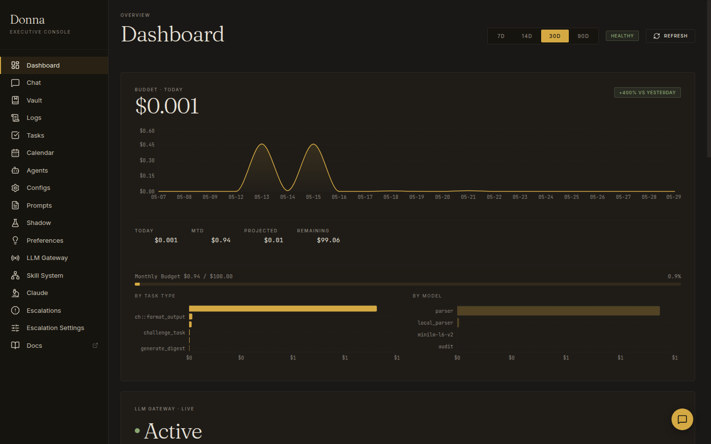
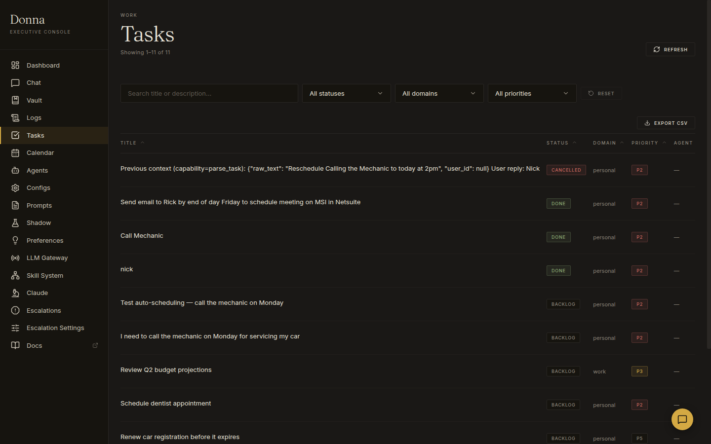
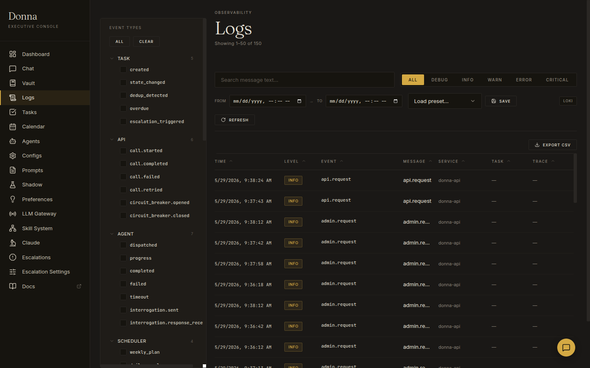
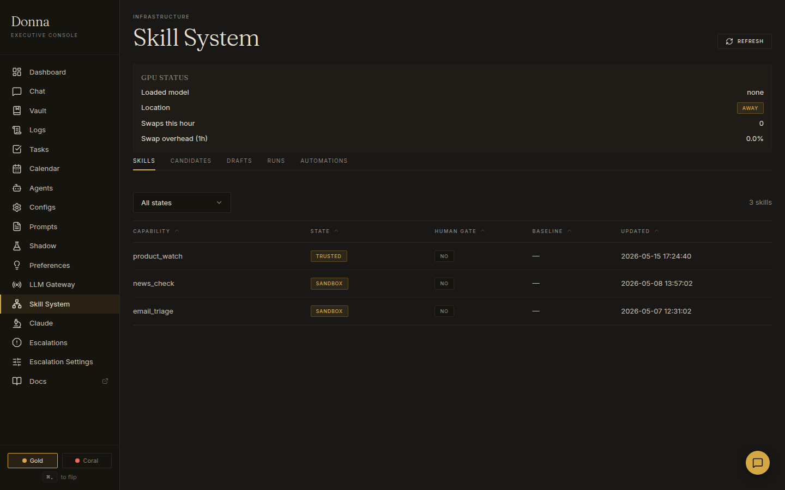

# Donna — AI Personal Assistant

Donna is a self-hosted AI assistant that manages tasks, schedules, and reminders — and pursues you until things get done. Named after Donna Paulsen from *Suits*: sharp, proactive, never lets anything slip.

Built solo over 10 weeks (1,000+ commits). The system runs 10 Docker containers on a homelab server, routes work between a cloud LLM (Claude) and a local LLM (Ollama on an RTX 3090), and exposes a full admin console for observability and control.



## Why This Exists

Staying on top of writing, scheduling, and keeping track of tasks can be hard. Most productivity tools are passive — they wait for you to open them. Donna is the opposite: she escalates through Discord, SMS, and phone calls until you respond. She reschedules when you miss deadlines, prepares research before meetings, and learns your preferences from corrections over time.

## What's Running

The system is **live in production** on a homelab Linux server. Here's what's built:

### Core Engine (~61,000 lines Python)

- **Natural language task capture** — say "call the mechanic Monday" via Discord or SMS, and Donna parses it into a structured task with deadline, priority, and domain
- **Config-driven state machine** — 22 YAML config files control task types, state transitions, model routing, escalation rules, and agent behavior. Zero hardcoded business logic
- **4-tier notification escalation** — Discord DM → SMS → automated phone call (Twilio TTS) → human escalation. Configurable cadence and cooldowns
- **Hybrid LLM routing** — cloud model (Claude Sonnet) for reasoning-heavy work, local model (Qwen 32B on RTX 3090) for classification and parsing. Config-driven routing with automatic fallback
- **Shadow mode evaluation** — run a secondary model in parallel on production traffic, compare outputs with Claude-as-judge, track win/loss rates before promoting a model
- **Skill system with trust progression** — capabilities start in sandbox, graduate to trusted after passing quality gates. Automations run on cron schedules (e.g., daily product price watches)
- **Agent framework** — PM Agent triages and routes work, Scheduler Agent manages the calendar, Prep Agent does research before deadlines, Challenger Agent stress-tests plans
- **Preference learning** — corrections logged and surfaced as rules ("Nick prefers morning slots for deep work"), applied to future task scheduling

### Admin Console (~18,000 lines TypeScript/React)

A 16-page operations dashboard with a dark gold/black theme:

| Page | What It Does |
|------|-------------|
| **Dashboard** | Budget tracking (daily/monthly), cost breakdown by model and task type, LLM gateway health, parse accuracy, task throughput |
| **Chat** | Conversational interface to Donna with session management and quick-chat overlay |
| **Tasks** | Filterable task table with status, domain, priority, agent assignment, CSV export |
| **Calendar** | Weekly view merging Google Calendar events with Donna-scheduled tasks |
| **Logs** | Structured event viewer with 30+ event types organized by category, date range filters, Loki integration, trace correlation |
| **Agents** | Agent activity feed — dispatches, completions, failures, interrogation history |
| **Configs** | Live YAML editor for all 22 config files with validation and diff preview |
| **Prompts** | Browse, edit, and audit all 23 externalized LLM prompt templates with variable inspection |
| **Shadow** | Side-by-side model comparison dashboard — quality over time, cost savings, spot checks |
| **Skill System** | Capability registry with trust states, automation scheduler, run history, GPU status |
| **Claude Inspector** | Every Claude API call logged — cost per call, latency, token counts, prompt/response inspection |
| **Escalations** | Track notification escalation chains in progress and their outcomes |
| **Preferences** | Correction log and extracted preference rules with confidence scores |
| **LLM Gateway** | Queue depth, active requests, circuit breaker state, provider health |
| **Vault** | Encrypted credential store with commit history |







### Infrastructure

- **10 Docker containers** managed via multi-file Compose (core, API, UI, orchestrator, Ollama, monitoring stack, browser sidecar, reverse proxy)
- **Observability stack** — Grafana + Loki + Promtail for centralized logging; structured logs on every LLM call with cost, latency, and token tracking
- **51 Alembic migrations** — fully versioned schema evolution from day one
- **SQLite on NVMe** (WAL mode) as primary store + async write-through to Supabase Postgres
- **Caddy** reverse proxy with automatic HTTPS
- **415 test files** covering unit and integration tests

## Architecture

```
                    ┌─────────────────────────────────────────────┐
                    │              Admin Console (React)           │
                    │         localhost:8400 — 16 pages            │
                    └────────────────────┬────────────────────────┘
                                         │
                    ┌────────────────────▼────────────────────────┐
                    │            FastAPI REST Backend              │
                    │        localhost:8200 — auth, CRUD           │
                    └────────────────────┬────────────────────────┘
                                         │
       ┌─────────────────────────────────▼─────────────────────────────────┐
       │                        Orchestrator                                │
       │   Task routing · State machine · Agent dispatch · Scheduling       │
       │                     localhost:8100                                  │
       └──┬──────────┬──────────┬──────────┬──────────┬──────────┬─────────┘
          │          │          │          │          │          │
     ┌────▼───┐ ┌───▼────┐ ┌──▼───┐ ┌───▼────┐ ┌──▼───┐ ┌───▼────────┐
     │ Claude │ │ Ollama │ │ Dis- │ │ Twilio │ │Gmail │ │  Google    │
     │  API   │ │ RTX    │ │ cord │ │SMS/TTS │ │ API  │ │ Calendar   │
     │(Sonnet)│ │ 3090   │ │ Bot  │ │        │ │      │ │            │
     └────────┘ └────────┘ └──────┘ └────────┘ └──────┘ └────────────┘
```

Every LLM call goes through a model abstraction layer (`complete(prompt, schema, model_alias)`) that handles routing, fallback, structured output validation, and cost tracking. Models never call tools directly — the orchestrator validates and executes all tool proposals.

## Tech Stack

| Layer | Technology |
|-------|-----------|
| Backend | Python 3.12, asyncio, FastAPI, structlog |
| Frontend | TypeScript, React, Vite, Recharts |
| Cloud LLM | Claude API (Sonnet) |
| Local LLM | Ollama + Qwen 32B (RTX 3090, Q6_K quantization) |
| Database | SQLite (WAL mode, NVMe) + Supabase Postgres replica |
| Migrations | Alembic + SQLAlchemy |
| Messaging | Discord.py, Twilio (SMS + Voice), Gmail API |
| Observability | Grafana, Loki, Promtail, structured logging |
| Deployment | Docker Compose (multi-file), Caddy |
| Testing | pytest (415 test files) |
| Docs | MkDocs + mkdocstrings (auto-generated API reference) |

## Project Stats

| Metric | Value |
|--------|-------|
| Python source | 61,000 lines across 305 modules |
| TypeScript/React | 18,000 lines across 161 files |
| Test code | 64,000 lines across 415 files |
| Commits | 1,000+ over ~10 weeks |
| DB migrations | 51 Alembic versions |
| Config files | 22 YAML configs |
| Prompt templates | 23 externalized prompts |
| JSON schemas | 28 structured output schemas |
| Docker services | 10 containers |
| Admin console pages | 16 |

## Key Design Decisions

**Config over code.** Model routing, task types, state transitions, escalation rules, and prompt templates are all externalized to YAML/JSON. The application reads config at startup; changing behavior means editing a config file, not deploying code.

**Safety-first agent autonomy.** Agents start with minimal permissions. Email is draft-only. Code goes to feature branches only. Trust is earned through a sandbox → trusted progression with quality gates.

**Structured logging on every model call.** Every LLM invocation logs task type, model, latency, tokens, cost, and output. The Claude Inspector page makes this queryable. Budget tracking is real-time with daily and monthly thresholds.

**Hybrid local/cloud routing.** Classification and parsing run on the local RTX 3090 to minimize API costs. Reasoning-heavy tasks (agent work, decomposition, scheduling) route to Claude. Shadow mode lets you validate a model swap on live traffic before committing.

## Running It

```bash
# Clone and bootstrap
git clone <repo-url> donna && cd donna
./scripts/bootstrap.sh

# Or step by step
./scripts/bootstrap.sh --no-setup
source .venv/bin/activate
donna setup --phase 1

# Dev mode
donna run --dev

# Docker (production)
./scripts/donna-up.sh --with-monitoring
```

## Documentation

Full documentation site: **[nfeuer.github.io/donna](https://nfeuer.github.io/donna/)**

Built from `docs/` via MkDocs with auto-generated API reference. Deployed on every push to `main`.
