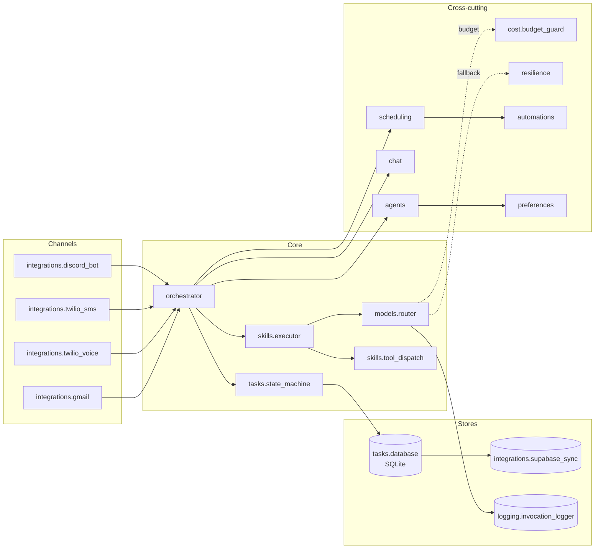

# Component Map

Top-level modules under `src/donna/`. See
[`spec_v3.md` §3.3 Component Map](../reference-specs/spec-v3.md) for the
design narrative. Each package below links to its auto-generated reference.

## Package-by-Package

| Package | Responsibility |
|---|---|
| [`donna.orchestrator`](../reference/donna/orchestrator/index.md) | Route inbound events to skills / agents |
| [`donna.models`](../reference/donna/models/index.md) | `ModelRouter`, providers, quality spot-checks, token accounting |
| [`donna.skills`](../reference/donna/skills/index.md) | Multi-step skill executor, tool dispatcher, validation |
| [`donna.agents`](../reference/donna/agents/index.md) | PM, scheduler, challenger, decomposition, prep agents |
| [`donna.tasks`](../reference/donna/tasks/index.md) | Task database, domain models, state machine |
| [`donna.scheduling`](../reference/donna/scheduling/index.md) | Priority engine, calendar sync, weekly planner |
| [`donna.integrations`](../reference/donna/integrations/index.md) | Discord, Twilio, Gmail, Supabase |
| [`donna.automations`](../reference/donna/automations/index.md) | Cron dispatch, cadence policy, lifecycle |
| [`donna.chat`](../reference/donna/chat/index.md) | Intent routing, context management |
| [`donna.preferences`](../reference/donna/preferences/index.md) | Correction logging, rule extraction |
| [`donna.cost`](../reference/donna/cost/index.md) | Budget guard, cost tracker |
| [`donna.logging`](../reference/donna/logging/index.md) | Structured invocation logging |
| [`donna.resilience`](../reference/donna/resilience/index.md) | Retries, circuit breaker, backup, health |
| [`donna.api`](../reference/donna/api/index.md) | REST API and auth for the Flutter client |
| [`donna.capabilities`](../reference/donna/capabilities/index.md) | Capability metadata, embeddings |
| [`donna.notifications`](../reference/donna/notifications/index.md) | Channel abstractions, escalation |
| [`donna.llm`](../reference/donna/llm/index.md) | Rate limiter, alerter |
| [`donna.memory`](../reference/donna/memory/index.md) | `MemoryStore` (sqlite-vec), embedding provider, chunkers, and the `Vault` / `Chat` / `Task` / `Correction` sources that feed the semantic index (slices 13–14) |
