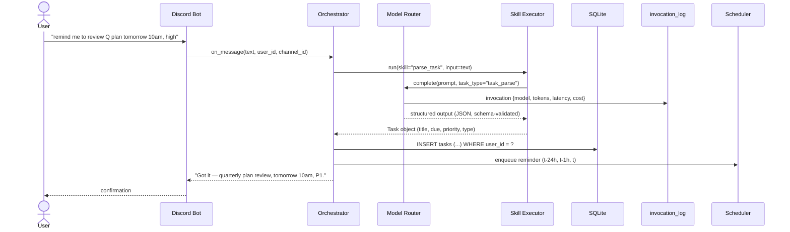

# Data Flow

A single Discord message becomes a persisted, scheduled, routed task.
See [`spec_v3.md` §3.4 Data Flow](../reference-specs/spec-v3.md) for the
authoritative narrative.

## Happy Path

## Key Invariants

- Every row is user-scoped (`user_id`) even for the single-user deployment.
- Every LLM call is routed through
  [`donna.models.router.ModelRouter`](../reference/donna/models/router.md)
  — no direct provider calls.
- Every call appends to `invocation_log` before returning.
- Every structured output is validated against a schema in
  [`schemas/`](../schemas/) before being trusted.
- Every state change goes through the machine in
  [`config/task_states.yaml`](../config/task_states.md).

## Failure Paths

- **LLM timeout or 5xx:** retried per
  [`spec_v3.md` §3.6.1 Retry Policies](../reference-specs/spec-v3.md);
  escalates to degraded mode after repeated failures.
- **Schema validation fails:** the call is re-run with a corrective
  reprompt; after N failures it is logged and user-surfaced.
- **Budget breach:** see
  [Workflows → Handle Budget Breach](../workflows/handle-budget-breach.md).
