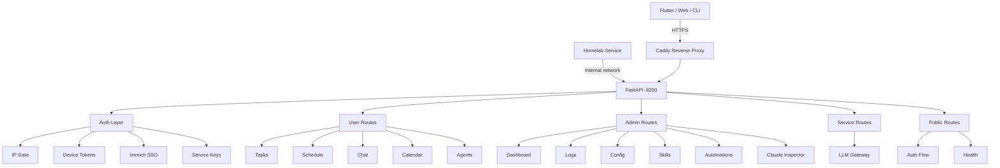
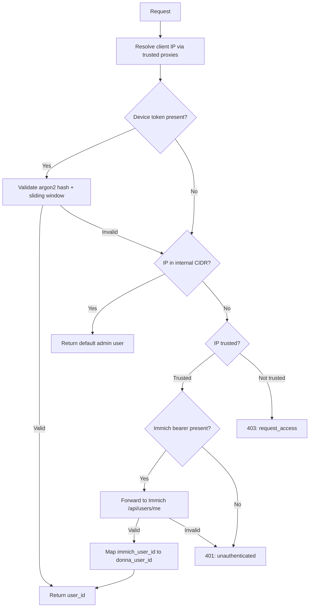

# API Layer

The REST API is Donna's external surface for the Flutter app, management GUI, CLI, and inter-service communication, protected by a layered authentication stack that federates identity through Immich SSO.

> Realizes: `spec_v3.md §27` (Admin API & Dashboard), `spec_v3.md §28` (Authentication & Access Control)

## Overview

The API is a FastAPI application running on port 8200 under `src/donna/api/`. It wraps the orchestrator's internal capabilities for external consumption by the Flutter client, web dashboard, and homelab services. Every route is mounted through one of five auth-gated router factories, enforcing a deny-by-default posture at the structural level rather than relying on per-endpoint decorators.

Authentication combines three mechanisms: an IP gate with trust durations for network-level access, device tokens with sliding+absolute windows for persistent client sessions, and Immich SSO for identity resolution. The email allowlist syncs from Immich every 15 minutes, and a verification-token flow handles self-service onboarding for new devices or networks.

The application lifecycle (managed via FastAPI's `lifespan` context) initializes the database, state machine, LLM queue worker, chat engine, calendar client, payload writer, eviction loop, and auth context. CORS is explicitly configured -- wildcard origins are forbidden when auth cookies are in use.

## Key Concepts

| Concept | Description |
|---------|-------------|
| Router factory | Pre-bound auth dependency on every `APIRouter`; routes declare their auth class by choosing `user_router()`, `admin_router()`, `service_router()`, or `public_auth_router()`. |
| IP gate | Per-IP trust with configurable durations (24h, 7d, 30d, 90d). Actions: `allow`, `challenge`, `block`. Internal CIDRs bypass challenge. |
| Device tokens | Long-lived client tokens hashed with argon2id. Sliding window refreshes on each use, capped by an absolute max from creation. |
| Immich SSO | Identity federation with the homelab Immich photo server. Bearer tokens forwarded to `/api/users/me`; 60-second LRU cache. |
| Email allowlist | Only Immich-provisioned users can request access. Synced from Immich admin API on startup and every 15 minutes. Empty-response protection prevents lockout. |
| Verification tokens | Single-use magic-link tokens bound to the requesting IP. SHA-256 stored; 15-minute expiry. |
| Service keys | Argon2-hashed shared secrets for inter-service calls (e.g., Ollama container). Requires internal CIDR source and no `X-Forwarded-Host`. |
| Trusted proxies | Safe `X-Forwarded-For` parsing. Returns the rightmost non-proxy entry, matching Caddy's append behavior. |

## Architecture

### Auth Resolution Flow

### Route Surface

The API is organized into four auth tiers:

| Tier | Prefix | Auth | Routes |
|------|--------|------|--------|
| Public | `/health`, `/auth/*` | None | Health check, request-access, verify, status, logout |
| User | `/tasks`, `/schedule`, `/calendar`, `/chat`, `/agents` | Device token or Immich SSO | Task CRUD, schedule view, calendar week, chat sessions, agent listing |
| Admin | `/admin/*` | Admin role + IP gate | Dashboard KPIs, log search, invocation analytics, Claude Inspector, config, skills, automations, escalations, vault, access management |
| Service | `/llm/*` | Service key + internal CIDR | LLM gateway completions (priority queue, streaming) |

### Admin Route Modules

| Module | Endpoints | Purpose |
|--------|-----------|---------|
| `admin_dashboard` | `/admin/dashboard/*` | Parse accuracy, agent performance, task throughput, cost analytics |
| `admin_claude` | `/admin/claude/*` | Claude Inspector: call browser, payload retrieval, insights |
| `admin_logs` | `/admin/logs/*` | Structured log search across Loki + invocation_log |
| `admin_invocations` | `/admin/invocations/*` | Per-call analytics with queue wait, chain, caller drill-down |
| `admin_tasks` | `/admin/tasks/*` | Task management CRUD |
| `admin_agents` | `/admin/agents/*` | Agent enable/disable/inspect |
| `admin_config` | `/admin/config/*` | Live config inspection |
| `admin_preferences` | `/admin/preferences/*` | Preference rule management |
| `admin_health` | `/admin/health/*` | Deep health check |
| `admin_access` | `/admin/access/*` | IP trust management |
| `admin_shadow` | `/admin/shadow/*` | Shadow evaluation inspection |
| `admin_escalations` | `/admin/escalations/*` | Manual escalation queue |
| `admin_escalation_settings` | `/admin/escalation-settings/*` | Per-task-type escalation config |
| `admin_vault` | `/admin/vault/*` | Memory vault inspection |
| `admin_llm` | `/admin/llm/*` | LLM queue status (read-only) |
| `skills` | `/admin/skills/*` | Skill registry |
| `skill_candidates` | `/admin/skill-candidates/*` | Candidate promotion pipeline |
| `skill_drafts` | `/admin/skill-drafts/*` | Auto-drafter outputs |
| `skill_runs` | `/admin/skill-runs/*` | Skill execution history |
| `automations` | `/admin/automations/*` | Automation scheduling |
| `capabilities` | `/admin/capabilities/*` | Capability registry |

## Configuration

All auth behavior is driven by `config/auth.yaml`:

| Section | Controls |
|---------|----------|
| `ip_gate` | Default trust duration, allowed durations, rate limits per IP (request_access: 5/hour, verify: 10/10min) |
| `trusted_proxies` | CIDR list for X-Forwarded-For parsing (default: `172.20.0.0/16` Docker network) |
| `internal_cidrs` | Networks that bypass IP gate challenge (same Docker network) |
| `immich` | Internal/external URLs, admin API key env var, cache TTL (60s), sync interval (900s) |
| `device_tokens` | Sliding window (90 days), absolute max (365 days), max per user (10) |
| `email` | From address, subject line, verify URL base, token expiry (15 min) |
| `bootstrap` | Admin email env var for initial provisioning |

Environment variables: `DONNA_CORS_ORIGINS` (comma-separated, no wildcard), `DONNA_DEFAULT_USER_ID`, `DONNA_LOG_LEVEL`, `DONNA_DEV_MODE`.

See also: [Config: auth.yaml](../config/auth.md)

## API

| Interface | Module | Description |
|-----------|--------|-------------|
| `create_app()` | `donna.api` | Builds the FastAPI application with all middleware and routes |
| `lifespan()` | `donna.api` | Async context manager for startup/shutdown of DB, queue, chat, auth, eviction |
| `AuthContext` | `donna.api.auth.dependencies` | Dataclass bundling DB connection, auth config, and Immich client |
| `CurrentUser` | `donna.api.auth.router_factory` | FastAPI dependency annotation resolving the authenticated user ID |
| `CurrentAdmin` | `donna.api.auth.router_factory` | FastAPI dependency annotation requiring admin role |
| `CurrentServiceCaller` | `donna.api.auth.router_factory` | FastAPI dependency annotation for service-key auth |
| `user_router()` | `donna.api.auth.router_factory` | Factory for user-authenticated routers |
| `admin_router()` | `donna.api.auth.router_factory` | Factory for admin-authenticated routers |
| `service_router()` | `donna.api.auth.router_factory` | Factory for service-key-authenticated routers |
| `check_ip_access()` | `donna.api.auth.ip_gate` | Core IP gate check returning `{action, reason, ip_record}` |
| `device_tokens.issue()` | `donna.api.auth.device_tokens` | Issue a new device token (returns raw token once) |
| `device_tokens.validate()` | `donna.api.auth.device_tokens` | Validate and refresh a device token's sliding window |
| `ImmichClient.resolve()` | `donna.api.auth.immich` | Resolve a bearer token to an `ImmichUser` via Immich API |
| `compute_insights()` | `donna.insights.engine` | Cost/quality analytics surfaced at `/admin/claude/insights` |

See also: [API Reference: donna.api](../reference/donna/api/)

## See Also

- [Domain: Management GUI](management-gui/index.md)
- [Domain: Observability](observability.md)
- [Domain: Insights Engine](insights.md)
- [Start Here: Install](../start-here/install.md)
