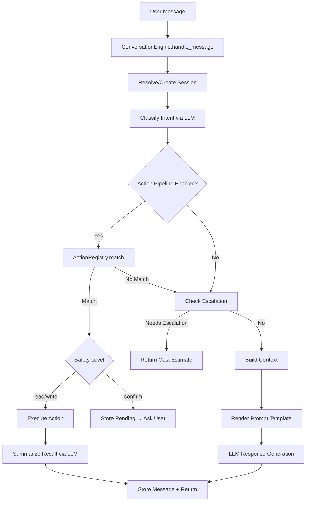

# Chat Subsystem

The conversational engine handles all freeform chat interactions between the user and Donna, routing through intent classification, action execution, and session management regardless of frontend channel.

> Realizes: `spec_v3.md §24`

## Overview

The chat subsystem (`src/donna/chat/`) provides a unified conversational interface that works across Discord, the dashboard, and any future frontend. Every message flows through the `ConversationEngine`, which classifies intent via the local LLM, attempts to match a structured action from the `ActionRegistry`, and falls back to freeform LLM response generation when no action fits.

The subsystem is designed around cost discipline: all classification and response generation runs on the local Ollama model by default. When the local model cannot handle a request (complex reasoning, multi-step analysis), it proposes an escalation to Claude with an estimated cost. The user must explicitly approve the escalation before any cloud spend occurs.

Sessions are ephemeral, TTL-based conversation contexts stored in SQLite. A session can be pinned to a task, giving the LLM access to that task's details for context-aware responses. Sessions auto-expire after the configured TTL (default 120 minutes) and optionally generate a summary on close.

## Key Concepts

| Concept | Description |
|---------|-------------|
| ConversationEngine | Central entry point. Receives all messages, orchestrates intent classification, action dispatch, and LLM response generation. |
| ChatIntent | Enum of classified intents: `task_query`, `task_action`, `agent_output_query`, `planning`, `freeform`, `escalation_request`. |
| ActionRegistry | Config-driven registry of structured actions. Loaded from `config/chat_actions.yaml`. Matches intents to executable handlers. |
| ActionDefinition | A single action entry: name, description, domain, safety level (`read`/`write`/`confirm`), handler path, and parameter schema. |
| ChatSession | TTL-based conversation context. Tracks messages, optional pinned task, and pending confirmation state. |
| Escalation | When the local LLM determines it cannot handle a request, it flags `needs_escalation` with a reason and cost estimate. The user approves or declines. |
| Persona | Configurable response personality. `donna` mode uses the in-character prompt; `neutral` mode uses a generic assistant prompt. |
| Dashboard Context | Optional context from the UI indicating what page/item the user is viewing, enabling context-aware parameter extraction. |

## Architecture



### Message Flow

1. **Session resolution.** The engine looks up an existing session by ID or finds the active session for the user+channel pair. If none exists, a new session is created with the configured TTL.

2. **Intent classification.** The user's message is sent to the local LLM via the `classify_chat_intent` task type. The LLM returns an intent, optional domain, action hint, and escalation flag.

3. **Action pipeline.** If actions are enabled and the classifier returned a domain or action hint, the `ActionRegistry` attempts a match. A matched action goes through parameter extraction (LLM-assisted, with dashboard context if available), required-field validation, and safety gating. Actions with `safety: confirm` are stored as pending and require a follow-up confirmation.

4. **Freeform response.** When no action matches, the engine builds a full prompt from session history, pinned task context, intent-specific context (active tasks, schedule summary), and the persona template. The local LLM generates the response.

5. **Escalation.** At either the classification or response stage, if the LLM flags `needs_escalation`, the engine returns the escalation reason and cost estimate. Approval triggers `handle_escalation`, which sends the full context to Claude.

### Action Domains

The action registry groups handlers by domain:

| Domain | Module | Handlers |
|--------|--------|----------|
| Tasks | `actions/tasks.py` | `query_tasks`, `get_task`, `create_task`, `update_task`, `reschedule_task` |
| Automations | `actions/automations.py` | `create_automation`, `list_automations` |
| Skills | `actions/skills.py` | `execute_skill`, `list_skills`, `create_skill_draft` |
| Vault | `actions/vault.py` | `read_vault_file`, `create_vault_note`, `list_vault_files` |
| Debug | `actions/debug.py` | `get_debug_data`, `get_agent_status` |

### Context Assembly

The `context.py` module builds two context blocks injected into prompts:

- **Session context** (`build_session_context`): Conversation history and pinned task details, rendered as markdown sections.
- **Intent context** (`build_intent_context`): Intent-specific data. For `task_query`/`task_action`/`planning` intents, this includes the user's active tasks. For `planning`, it adds schedule summaries and open task counts.

The `render_chat_prompt` function handles template variable substitution, injecting current date/time in the configured timezone, user name, and all context blocks.

## Configuration

**Primary config:** [`config/chat.yaml`](../config/chat.yaml)

```yaml
chat:
  persona:
    mode: donna          # donna | neutral
  sessions:
    ttl_minutes: 120
    context_budget_tokens: 24000
    summary_on_close: true
  escalation:
    enabled: true
    auto_approve_under_usd: 0.0
    daily_budget_usd: 2.00
  intents:
    classify_model: local_parser
  actions:
    enabled: true
```

**Action definitions:** [`config/chat_actions.yaml`](../config/chat_actions.yaml) — YAML registry of all available actions with parameter schemas, safety levels, and handler paths.

**Prompt templates:** `prompts/chat/` — `chat_system.md` (Donna persona), `chat_system_neutral.md` (neutral persona), `classify_intent.md`, `chat_respond.md`, `extract_action_params.md`, `summarize_action_result.md`, `chat_summarize.md`.

The config supports hot-reload with a 5-second TTL cache via `get_chat_config()`, so dashboard edits to `chat.yaml` take effect within seconds.

## API

| Class / Function | Module | Description |
|-----------------|--------|-------------|
| `ConversationEngine` | `engine.py` | Main entry point. `handle_message()`, `handle_escalation()`, `handle_confirm()`, `pin_session()`, `close_session()`. |
| `ActionRegistry` | `actions/__init__.py` | Loads actions from YAML, matches intents to handlers, executes with parameter injection. |
| `ChatConfig` | `config.py` | Pydantic model tree: `PersonaConfig`, `SessionsConfig`, `EscalationConfig`, `IntentsConfig`, `ActionsConfig`. |
| `build_session_context` | `context.py` | Assembles conversation history and pinned task into a prompt block. |
| `build_intent_context` | `context.py` | Assembles intent-specific context (tasks, schedule) into a prompt block. |
| `render_chat_prompt` | `context.py` | Template variable substitution with timezone-aware date/time. |
| `ChatResponse` | `types.py` | Frozen dataclass returned by the engine. Carries text, session ID, escalation state, suggested actions. |

## See Also

- [Domain: Task Management](task-system.md) — task schema and state machine used by task actions
- [Domain: Skill System](skill-system.md) — skill execution triggered by chat actions
- [Domain: Memory Vault](memory-vault.md) — vault operations exposed through chat
- [Workflow: Scheduling](scheduling.md) — calendar integration context loaded for planning intents
