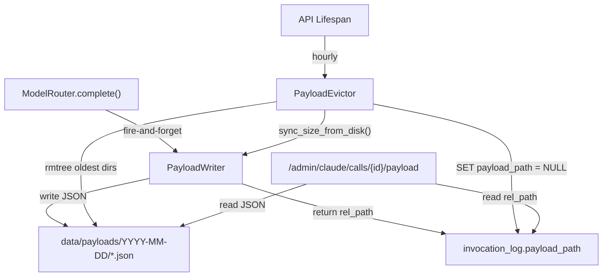

# Payload Collection

The collection subsystem captures full LLM request/response payloads to disk for forensic inspection via the Claude Inspector, with automatic eviction to enforce a configurable disk budget.

> Realizes: `spec_v3.md §9` (forensics tooling)

## Overview

Every LLM call routed through the `ModelRouter` can have its complete request and response JSON written to disk by the `PayloadWriter`. Files are stored in date-partitioned directories (`data/payloads/YYYY-MM-DD/invocation_id.json`) and linked back to the `invocation_log` table via the `payload_path` column. This gives operators full prompt-level visibility into what was sent to and received from Claude or Ollama, without bloating the SQLite database.

The `PayloadEvictor` runs on an hourly background loop during the API's lifespan. When accumulated payload size exceeds the configured budget (default 1 GiB), it deletes the oldest date directories first and nullifies the corresponding `payload_path` entries in `invocation_log`. The target after eviction is 90% of the budget, providing headroom before the next cycle.

The writer is designed fire-and-forget: it never raises on I/O failure, logging a warning instead. This ensures payload capture cannot disrupt the LLM call path. The in-memory byte counter is reconciled with actual disk usage on startup and before each eviction cycle via `sync_size_from_disk()`.

## Key Concepts

| Concept | Description |
|---------|-------------|
| Payload file | JSON file containing `{"request": {...}, "response": {...}}` for a single LLM invocation. |
| Date partitioning | Files are organized into `YYYY-MM-DD/` directories under `base_dir`, enabling oldest-first eviction and human browsability. |
| Disk budget | Maximum total bytes allowed on disk (`max_bytes`, default 1 GiB). Writer refuses new writes when budget is exceeded. |
| Budget target | Eviction removes directories until usage drops below `target_pct * max_bytes` (default 90%), avoiding thrashing. |
| Invocation linkage | The `invocation_log.payload_path` column stores the relative path (`YYYY-MM-DD/id.json`). Set to NULL after eviction. |
| Fire-and-forget | Writer catches all `OSError` exceptions, logs warnings, and returns `None`. Never disrupts the calling code path. |

## Architecture

### PayloadWriter

Writes one JSON file per LLM invocation. Tracks cumulative bytes via an in-memory counter. Refuses writes (returns `None`) when `current_bytes >= max_bytes`.

| Method | Description |
|--------|-------------|
| `write(invocation_id, request, response, for_date=None)` | Write a payload to the date partition. Returns relative path on success, `None` on failure or budget exceeded. |
| `sync_size_from_disk()` | Walk `base_dir` to recalculate actual disk usage. Called on startup and before each eviction cycle. |

### PayloadEvictor

Deletes oldest date directories when the writer exceeds its budget. Updates the database to nullify evicted paths.

| Method | Description |
|--------|-------------|
| `evict()` | Run one eviction pass. Returns list of evicted date strings. Empty if no eviction needed or on error. |

The eviction algorithm:

1. Check if `current_bytes > max_bytes`. Exit if within budget.
2. Compute `target_bytes = target_pct * max_bytes`.
3. List date directories sorted oldest first (by directory name, which is ISO date).
4. For each directory until `current_bytes <= target_bytes`:
   a. Calculate directory size.
   b. Delete directory with `shutil.rmtree()`.
   c. Execute `UPDATE invocation_log SET payload_path = NULL WHERE payload_path LIKE '{date}/%'`.
   d. Subtract freed bytes from the writer's counter.
5. Commit all DB changes in a single transaction.

## Configuration

The collection subsystem is configured via environment variables and constructor arguments:

| Setting | Source | Default | Description |
|---------|--------|---------|-------------|
| `DONNA_PAYLOAD_DIR` | Environment variable | `data/payloads` | Root directory for payload storage |
| `max_bytes` | `PayloadWriter` constructor | 1,073,741,824 (1 GiB) | Maximum total bytes on disk |
| `target_pct` | `PayloadEvictor` constructor | 0.9 | Fraction of budget to target after eviction |
| Eviction interval | API lifespan loop | 3600 seconds | How often the eviction loop runs |

No YAML config file exists for this subsystem -- it is wired directly in the API lifespan.

## API

| Interface | Module | Description |
|-----------|--------|-------------|
| `PayloadWriter(base_dir, max_bytes)` | `donna.collection.payload_writer` | Fire-and-forget JSON writer with disk budget tracking |
| `PayloadWriter.write()` | `donna.collection.payload_writer` | Write a single invocation's payload to disk |
| `PayloadWriter.sync_size_from_disk()` | `donna.collection.payload_writer` | Reconcile in-memory counter with actual disk usage |
| `PayloadEvictor(writer, db, target_pct)` | `donna.collection.payload_evictor` | Oldest-first directory eviction with DB cleanup |
| `PayloadEvictor.evict()` | `donna.collection.payload_evictor` | Run one eviction pass, returning evicted date strings |
| `GET /admin/claude/calls/{id}/payload` | `donna.api.routes.admin_claude` | Retrieve full request/response JSON for an invocation |

See also: [API Reference: donna.collection](../reference/donna/collection/)

## See Also

- [Domain: Insights Engine](insights.md) -- analytics computed over the same `invocation_log` data
- [Domain: Observability](observability.md) -- structured logging and invocation tracking
- [Domain: API Layer](api.md) -- the Admin API that surfaces payload data via Claude Inspector endpoints
