# Cost & Escalation Subsystem

The cost subsystem enforces API budget limits, gates expensive operations through a user-facing decision tree, validates manually-built branches, surfaces missing tool gaps, and provides runtime dashboard overrides for all cost-related controls.

> Realizes: `spec_v3.md §13`, `docs/superpowers/specs/manual-escalation.md`

## Overview

Donna operates under a $100/month hard cap on Claude API spend with a $20/day pause threshold. The cost subsystem (`src/donna/cost/`) is the enforcement layer: every LLM call passes through `BudgetGuard` pre-flight, and any operation that would exceed the daily budget or the per-task approval threshold triggers the `EscalationGate` to present the user with a decision.

The subsystem has grown across slices 17--24 into a substantial module (20+ files) covering five major concerns: cost tracking and aggregation, budget enforcement, the escalation decision tree (Approve/Manual/Pause/Cancel), the claude_code validation pipeline for manually-built branches, and tool-gap detection with surfacing. All runtime controls are overridable through the dashboard via the `DashboardSettingResolver`, which reads `dashboard_setting` rows with YAML defaults as fallback.

The design philosophy is "safety first, dial back later": autonomous spend is gated by default, budget extensions require explicit user clicks, and tool builds require human merge. Every decision point writes audit events for traceability.

## Key Concepts

| Concept | Description |
|---------|-------------|
| CostTracker | Queries `invocation_log` for daily/monthly cost aggregations by task type or model. Foundation for all budget checks. |
| BudgetGuard | Pre-call gate injected into ModelRouter. Enforces **both** the daily pause threshold (plus any approved extensions) **and** the `$100` monthly hard cap, and fires the 90% monthly warning. Raises `BudgetPausedError` (with `period` = `daily` or `monthly`) on breach. |
| BudgetPausedError | Exception that halts all autonomous LLM work. Caught by the orchestrator to transition tasks to paused state. |
| EscalationGate | Estimate-driven gate. When a task's pre-flight cost estimate exceeds budget or the per-task threshold, it creates an `escalation_request` row, posts a Discord view with buttons, and awaits resolution. |
| GateOutcome | Result of `fire_and_wait`: indicates whether the caller should proceed (`api_extended`), park the task (`pause`/`cancel`), or hand off to the user (`chat`/`claude_code`). |
| EscalationRepository | aiosqlite CRUD for `escalation_request` and `dashboard_setting` tables. Supports idempotent resolution, optimistic-lock writes, and status lifecycle queries. |
| BudgetExtensionRepository | Manages `daily_budget_extension` rows. Idempotent grant with daily and monthly ceiling enforcement. |
| DashboardSettingResolver | Resolution layer: `dashboard_setting` table overrides -> YAML defaults. Supports legacy key aliases from pre-unification slices. |
| ClaudeCodePoller | Background coroutine (60s tick) that validates submitted `claude_code` branches: branch existence, SHA pin (force-push protection), diff scope check, skill/tool validation. |
| DiffValidator | Validates that a branch only touches files within the declared `target_paths` globs. |
| ManualValidationRouter | Routes validated branches to skill ingestion or tool lint depending on the task type. |
| ToolGap | Value object representing a missing tool. Carries severity (`high`/`speculative`), detection point, proposed signature. |
| ToolGapSurfacer | Routes `ToolGap` records to the `tool_request` table with dedup, promotes severity on re-emission, and triggers Discord pings for high-severity gaps. |
| ToolLint | AST-based lint pipeline for tool builds: anthropic import check, import-time I/O check, secrets scan, metadata validation, allowlist check, inert-test check. |

## Architecture

```mermaid
flowchart TD
    subgraph PreCall["Pre-Call Budget Enforcement"]
        A[ModelRouter.complete] --> B[BudgetGuard.check_pre_call]
        B -->|Under limit| C[Proceed with LLM call]
        B -->|Over limit| D[BudgetPausedError]
    end

    subgraph Gate["Escalation Decision Tree"]
        E[Agent estimates cost] --> F[EscalationGate.fire_and_wait]
        F -->|Under threshold| G[Proceed]
        F -->|Over threshold| H[Create escalation_request]
        H --> I[Post Discord View]
        I --> J{User Choice}
        J -->|Approve $X| K[grant_budget_extension]
        J -->|Manual chat| L[Render prompt, park task]
        J -->|Manual claude_code| M[Render spec, park task]
        J -->|Pause| N[Task → paused]
        J -->|Cancel| O[Task → cancelled]
    end

    subgraph Poller["Claude Code Validation"]
        P[ClaudeCodePoller.tick_once] --> Q[List submitted rows]
        Q --> R[Branch exists?]
        R -->|Yes| S[SHA pin check]
        S --> T[DiffValidator scope check]
        T --> U[ManualValidationRouter.validate]
        U -->|Pass| V[status → validated]
        U -->|Fail| W[status → failed]
        W --> X{Iteration cap?}
        X -->|Yes| Y[status → cancelled, human_review]
        X -->|No| Z[User re-submits]
    end

    subgraph ToolGaps["Tool Gap Surfacing"]
        TG1[Detection Point] --> TG2[ToolGapSurfacer.surface]
        TG2 --> TG3[Upsert tool_request]
        TG3 -->|high severity| TG4[Discord ping]
        TG3 -->|speculative| TG5[Morning digest]
        TG4 -->|File request click| TG6[open_tool_build_escalation]
        TG6 --> TG7[Render spec + validation]
    end
```

### Budget Enforcement Flow

`BudgetGuard.check_pre_call()` runs before every LLM API call. It queries today's spend from `invocation_log` (excluding zero-cost audit rows like `escalation_lifecycle` and `tool_gap_lifecycle`), factors in any approved `daily_budget_extension` rows to raise the effective cap, and raises `BudgetPausedError(period="daily")` if spend exceeds the limit. It then checks **monthly** spend against the `$100` hard cap and raises `BudgetPausedError(period="monthly")` on breach; below the cap, the 90% monthly warning fires (once per calendar month). Both caps are enforced regardless of the escalation-gate posture below.

### Gate posture (shadow vs enforce)

`config/manual_escalation.yaml` → `gate.mode` selects the escalation-gate posture:

- **`shadow`** (deployed default): the gate is consulted on *every* LLM call — the router derives a deterministic cost floor (`cost.estimate_output_tokens` × output rate + prompt-token input cost) when a caller supplies no `estimate_usd`, so the gate is never dark — but it only *logs* calls that would escalate (`escalation_shadow_would_fire`). No rows, no Discord prompts, no blocking. Used to calibrate estimate accuracy.
- **`enforce`**: runs the full interactive Approve/Manual/Pause/Cancel decision tree described below.

> Prior to 2026-06-11 the gate fired only when a caller passed `estimate_usd` — and no production caller did, so the decision tree was unreachable and the monthly cap unenforced. See [`2026-06-11-cost-escalation-fable-critique-design.md`](../superpowers/specs/2026-06-11-cost-escalation-fable-critique-design.md).

### Escalation Modes

The gate dynamically builds the set of offered modes based on configuration and preconditions:

| Mode | Preconditions | Effect |
|------|--------------|--------|
| `api_extended` | Budget extension enabled, daily/monthly headroom available | Grants a budget extension for the estimated amount. Caller proceeds with API call. |
| `chat` | Task type declares `manual_escalation.mode: chat`, prompt builder wired, original prompt supplied | Renders the prompt to disk + DB. User pastes into Claude manually. |
| `claude_code` | Task type declares `manual_escalation.mode: claude_code`, host repo mounted, spec builder wired | Renders a spec with worktree command, acceptance criteria. User builds in a git worktree. |
| `pause` | Always available | Task transitions to paused. No spend. |
| `cancel` | Always available | Task transitions to cancelled. No spend. |

Slice 23 added per-task-type override controls (`force_api`, `force_manual`, `disabled`) that filter the offered modes after precondition checks.

### Tool Gap Detection Points

Five sites feed through `ToolGapSurfacer`:

| Site | Severity | When |
|------|----------|------|
| Boot capability check | speculative | `pending_review` capability declares an unregistered tool |
| AutomationDispatcher | high | Skill path about to run; required tool missing |
| Discord automation creation | high | User creates an automation backed by a capability needing an unregistered tool |
| AutoDrafter pre-flight | speculative | Drafted skill YAML references unregistered tool |
| SkillExecutor runtime | high | Mid-run dispatch against unregistered tool name |

### Tool Lint Pipeline

When a tool build branch is submitted, `ManualValidationRouter._validate_tool` runs six AST/regex checks:

1. `anthropic_import` -- reject `import anthropic` outside `src/donna/llm/`
2. `import_io` -- reject module-level network/disk I/O
3. `secrets` -- curated regex for API keys, PEM headers, vault-key patterns
4. `metadata` -- require `requires_rebuild: bool` + `default_timeout_seconds: int`
5. `allowlist` -- diff must touch a config allowlist file with the tool name
6. `inert_test` -- branch must include `tests/skills/tools/test_<name>.py` calling `is_inert_at_import`

## Configuration

**Primary config:** [`config/manual_escalation.yaml`](../config/manual_escalation.md)

Key sections:

- `enabled` -- global kill switch
- `modes.chat.enabled` / `modes.claude_code.enabled` -- per-mode toggles
- `budget_extension.max_daily_extension_usd` / `budget_extension.hard_monthly_ceiling_usd` -- extension limits
- `triggers.task_approval_threshold_usd` -- estimate threshold that triggers escalation
- `triggers.manual_iteration_limit` -- max resubmissions before routing to human review
- `tool_gap.*` -- reping cooldowns, Discord channels, lint defaults

**Budget thresholds:** [`config/donna_models.yaml`](../config/donna_models.md) under `cost`:

- `daily_pause_threshold_usd: 20.0`
- `monthly_budget_usd: 100.0`
- `monthly_warning_pct: 0.90`

**Dashboard overrides:** All settings in `manual_escalation.yaml` can be overridden at runtime via `dashboard_setting` rows. The `DashboardSettingResolver` checks the DB first, falls back to YAML. Slice 23 added optimistic-lock writes (`set_dashboard_setting_with_lock`) so concurrent dashboard edits do not silently clobber each other.

## API

| Class / Function | Module | Description |
|-----------------|--------|-------------|
| `CostTracker` | `tracker.py` | `get_daily_cost()`, `get_monthly_cost()`, `get_projected_monthly_spend()`, `get_cost_by_task_type()`, `get_cost_by_agent()` |
| `BudgetGuard` | `budget.py` | `check_pre_call()` (raises `BudgetPausedError`), `check_monthly_warning()` |
| `EscalationGate` | `escalation_gate.py` | `fire_and_wait()`, `record_user_resolution()`, `grant_budget_extension()`, `record_manual_handoff()`, `open_tool_build_escalation()` |
| `EscalationRepository` | `escalation_repository.py` | CRUD for `escalation_request` + `dashboard_setting`. Supports idempotent resolve, optimistic-lock writes, lifecycle queries. |
| `DashboardSettingResolver` | `dashboard_setting.py` | `get(key, default)` -- resolves overrides with legacy alias support. |
| `ClaudeCodePoller` | `claude_code_poller.py` | `run()` (background loop), `tick_once()` (single pass for tests). |
| `DiffValidator` | `diff_validator.py` | `validate(diff_paths, target_paths)` -- scope check returning matched/out-of-scope files. |
| `ManualValidationRouter` | `manual_validation_router.py` | `validate(row, branch, diff_paths)` -- routes to skill ingestion or tool lint. |
| `ToolGapSurfacer` | `tool_gap_surfacer.py` | `surface(gap)` -- dedup-aware upsert + Discord ping for high severity. |
| `lint_tool_branch` | `tool_lint/__init__.py` | Runs all six lint rules against a branch's diff. Returns `LintResult` with failures/warnings. |

## See Also

- [Domain: Task Management](task-system.md) -- manual escalation terminal and task state transitions
- [Domain: Skill System](skill-system/index.md) -- skill lifecycle states, auto-drafting, evolution
- [Domain: Orchestrator](orchestrator.md) -- dispatches tasks that may trigger escalation
- [Domain: Observability](observability.md) -- `invocation_log` table that feeds cost tracking
