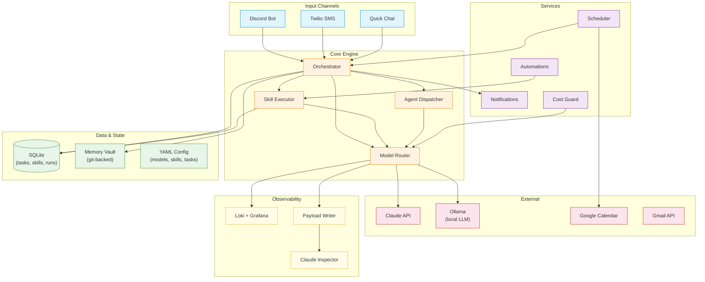

# Domain

Per-subsystem specs, split out of
[`spec_v3.md`](../reference-specs/spec-v3.md). Each page here is the
working reference for that subsystem; the canonical spec is always the
ultimate source of truth.

## Architecture at a Glance

## Start Here

New to the codebase? Read these in order for a complete mental model:

1. **[Architecture Overview](../architecture/overview.md)** — Docker topology, component map, storage layout. Start here for the physical picture.
2. **[Data Flow](../architecture/data-flow.md)** — How a Discord message becomes a persisted, scheduled, routed task. The happy path end-to-end.
3. **[Task System](task-system.md)** — Task lifecycle, state machine, deduplication. The central data model everything else revolves around.
4. **[Model Layer](model-layer.md)** — How LLM calls are routed, structured, and logged. Every AI interaction flows through here.
5. **[Skill System](skill-system/index.md)** — YAML-defined skills, execution pipeline, lifecycle, evolution. The capability layer on top of the model layer.
6. **[Scheduling](scheduling.md)** — Time windows, conflict resolution, calendar sync. How tasks get placed on the calendar.
7. **[Cost](cost.md)** — Budget enforcement, escalation gates, manual fallbacks. Critical for understanding Donna's safety posture.

After these seven, branch into whichever subsystem is relevant to your work.

## Subsystems

| Subsystem | Spec section |
|---|---|
| [Task System](task-system.md) | `spec_v3.md §5` |
| [Orchestrator](orchestrator.md) | Central dispatch and intent routing |
| [Model Layer](model-layer.md) | `spec_v3.md §4` |
| [LLM Gateway](llm.md) | Priority queue, rate limiting, GPU tracking |
| [Skill System](skill-system/index.md) | YAML-defined skills, execution pipeline, lifecycle, evolution |
| [Agents](agents.md) | Agent hierarchy, safety, tool progression |
| [Chat](chat.md) | Conversational engine, action handlers, sessions |
| [Replies](replies.md) | Universal reply classification and routing |
| [Scheduling](scheduling.md) | `spec_v3.md §6` |
| [Integrations](integrations.md) | `spec_v3.md §3.2` (hybrid MCP/API) |
| [Memory Vault](memory-vault/index.md) | Git-backed knowledge store with embeddings |
| [Notifications](notifications.md) | Channels, escalation, conversation context |
| [Preferences](preferences.md) | Correction logging, rule extraction |
| [Cost](cost.md) | Budget enforcement, escalation gate, tool gap surfacing |
| [Collection](collection.md) | LLM payload capture for forensics |
| [Insights](insights.md) | SQL-based analytics for Claude Inspector |
| [Observability](observability.md) | Logging, dashboards, alerting |
| [Resilience](resilience.md) | `spec_v3.md §3.6` retries, circuit breaker, backup |
| [API & Auth](api.md) | REST API, authentication, authorization |
| [Setup](setup.md) | Interactive bootstrapping wizard |
| [Management GUI](management-gui/index.md) | Admin and inspection surfaces |
