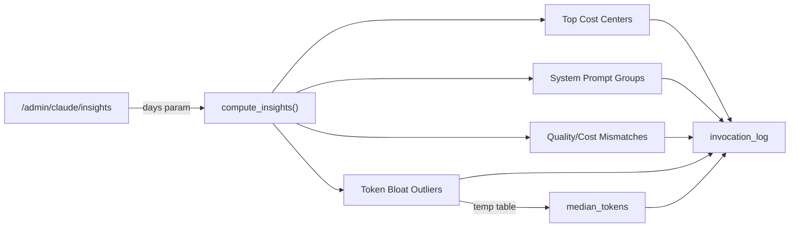

# Insights Engine

The insights engine runs SQL analytics over the `invocation_log` table to surface cost centers, prompt group patterns, quality/cost mismatches, and token-bloat outliers for the Claude Inspector dashboard.

> Realizes: `spec_v3.md §27` (Admin API -- cost analytics), budget reporting requirements from `spec_v3.md §13`

## Overview

The insights engine (`src/donna/insights/engine.py`) is a pure analytics module with no persistent state of its own. It accepts an open aiosqlite connection and a configurable look-back window, then executes four SQL queries against `invocation_log` to produce structured insight categories. Results are served at `GET /admin/claude/insights` and rendered in the management GUI's Claude Inspector panel.

All queries exclude shadow invocations (`is_shadow = 0`) so that evaluation/comparison runs do not distort production cost analysis. The engine uses window functions and temporary tables for the bloat-detection pass, computing per-task-type medians and then joining back to find individual calls that exceed twice the median token count. System-prompt grouping uses the `input_hash` column to deduplicate semantically identical prompts and extrapolate observed cost to weekly estimates.

The module is designed to be stateless and re-entrant. Each call computes results from scratch over the requested window. No caching or materialized views are used -- the `invocation_log` table is small enough (SQLite on NVMe) for real-time computation over typical look-back windows (1--90 days).

## Key Concepts

| Concept | Description |
|---------|-------------|
| Cost center | A `task_type` value (e.g., `parse_task`, `challenger`, `prep_work`) aggregated by total cost, call count, and average tokens. |
| System-prompt group | A cluster of invocations sharing the same `input_hash` (SHA of the system prompt). Identifies expensive repeated prompts. |
| Quality/cost mismatch | A task type whose average cost exceeds the global average but whose average `quality_score` falls below 0.5. Candidates for model downgrade or prompt rewrite. |
| Token-bloat outlier | An individual invocation whose `tokens_in` exceeds twice the median for its task type. Flags runaway context or prompt injection. |
| Look-back window | Number of days to analyze (default 7, max 90). Applied as `WHERE timestamp >= ?`. |
| Shadow exclusion | All queries filter `is_shadow = 0` to analyze only production traffic. |

## Architecture

### Insight Categories

**Top Cost Centers** -- The 10 most expensive task types in the window, ranked by total USD spend.

| Field | Description |
|-------|-------------|
| `task_type` | The task type identifier |
| `total_cost` | Sum of `cost_usd` for this type |
| `call_count` | Number of invocations |
| `avg_tokens_in` | Average input tokens |
| `avg_tokens_out` | Average output tokens |

**System Prompt Groups** -- The 10 most expensive prompt patterns, grouped by `input_hash` with a minimum of 5 occurrences. Weekly cost is extrapolated from the observed window.

| Field | Description |
|-------|-------------|
| `hash` | The `input_hash` value |
| `call_count` | Number of invocations with this hash |
| `avg_tokens_in` | Average input tokens per call |
| `estimated_weekly_cost` | Extrapolated weekly cost based on observed window |
| `sample_invocation_id` | One example invocation ID for drill-down |

**Quality/Cost Mismatches** -- Task types that are both above-average cost and below 0.5 quality score, indicating poor value.

| Field | Description |
|-------|-------------|
| `task_type` | The task type identifier |
| `avg_cost` | Average cost per call |
| `avg_quality_score` | Average quality score (0.0--1.0) |
| `call_count` | Number of scored invocations |

**Token Bloat Outliers** -- The 10 most expensive individual invocations where `tokens_in` exceeds twice the median for that task type.

| Field | Description |
|-------|-------------|
| `invocation_id` | The specific invocation |
| `task_type` | Task type of this call |
| `tokens_in` | Actual input tokens |
| `median_for_type` | Median input tokens for this task type |
| `ratio` | `tokens_in / median_for_type` |
| `cost_usd` | Cost of this specific call |

### Bloat Detection Algorithm

The token-bloat query uses a two-step approach because SQLite lacks a built-in `MEDIAN()` aggregate:

1. **Median computation**: A temporary table `median_tokens` is created using `ROW_NUMBER()` window function partitioned by `task_type`, picking the middle row (`rn = (cnt + 1) / 2`).
2. **Outlier join**: The main query joins `invocation_log` back to `median_tokens` and filters for rows where `tokens_in > 2 * median_tokens_in`.
3. **Cleanup**: The temporary table is dropped after the query completes.

## Configuration

The insights engine has no dedicated config file. Its behavior is controlled by:

| Parameter | Source | Default | Description |
|-----------|--------|---------|-------------|
| `days` | Query parameter on `/admin/claude/insights` | 7 | Look-back window in days (1--90) |
| `payload_dir` | `app.state.payload_dir` | `data/payloads` | Reserved for future payload-level analysis |

The engine depends on the `invocation_log` table schema, which includes `task_type`, `cost_usd`, `tokens_in`, `tokens_out`, `quality_score`, `input_hash`, `is_shadow`, `timestamp`, and `payload_path` columns.

## API

| Interface | Module | Description |
|-----------|--------|-------------|
| `compute_insights(conn, payload_dir, days)` | `donna.insights.engine` | Compute all four insight categories. Returns a dict with keys `top_cost_centers`, `system_prompt_groups`, `quality_cost_mismatches`, `token_bloat_outliers`. |
| `GET /admin/claude/insights?days=N` | `donna.api.routes.admin_claude` | REST endpoint exposing insights to the management GUI |

See also: [API Reference: donna.insights](../reference/donna/insights/)

## See Also

- [Domain: Payload Collection](collection.md) -- the subsystem that captures the payloads analyzed here
- [Domain: Observability](observability.md) -- broader logging and dashboard infrastructure
- [Domain: Model Layer](model-layer.md) -- model routing decisions that produce the invocation data
- [Domain: Management GUI](management-gui.md) -- the Claude Inspector UI that renders these insights
