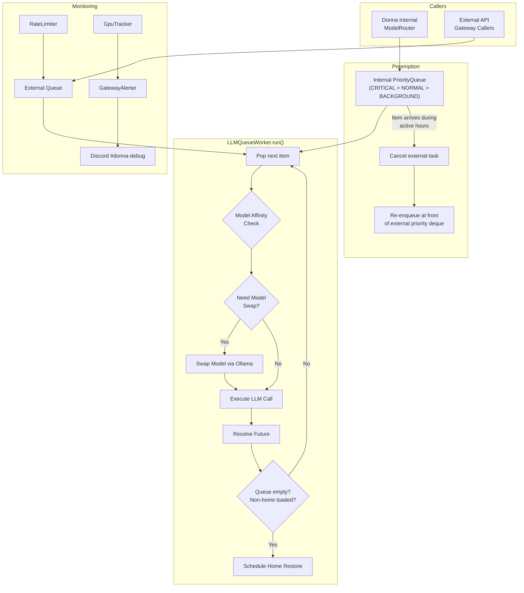

# LLM Gateway

The LLM gateway is a priority queue system that mediates all outbound model calls, managing GPU model state on the local RTX 3090, rate-limiting external callers, and alerting on operational anomalies.

> Realizes: `spec_v3.md §26`

## Overview

The LLM gateway (`src/donna/llm/`) sits between the model router and the actual Ollama/Claude backends. All local model calls funnel through a two-queue worker (`LLMQueueWorker`) where Donna's internal tasks always take priority over external API gateway requests. During active hours, running external requests can be preempted mid-inference to service internal work.

The gateway solves a specific hardware constraint: a single RTX 3090 running Ollama can only serve one model at a time. Loading a new model (e.g., switching from `qwen2.5:32b-instruct-q6_K` to a smaller model for a different task) requires unloading the current model and loading the new one, which takes 30--120 seconds. The `GpuTracker` monitors model swap frequency, latency, and overhead percentage, triggering alerts when swaps consume too much queue time.

The gateway also provides per-caller rate limiting via sliding windows, debounced Discord alerts for operational events (queue depth, rate limiting, starvation, budget), and a status endpoint that exposes the full queue state including GPU metrics. Configuration is hot-reloadable: changes to `config/llm_gateway.yaml` take effect without restarting the worker.

## Key Concepts

| Concept | Description |
|---------|-------------|
| LLMQueueWorker | Core worker loop. Maintains an internal `PriorityQueue` for Donna tasks and a standard `Queue` for external requests. Processes one item at a time, handling model swaps as needed. |
| Priority | Three levels: `CRITICAL` (0), `NORMAL` (1), `BACKGROUND` (2). Task types map to priorities via `config/llm_gateway.yaml`. Parse and challenge tasks are critical; nudges and reminders are background. |
| QueueItem | A single queued LLM call. Carries prompt, model, max tokens, JSON mode flag, an `asyncio.Future` for the result, priority, caller identity, and preemption state. |
| GpuTracker | Tracks which model is loaded on the GPU, rolling swap metrics (count, duration, overhead percentage), and alert thresholds. Single-worker access, not thread-safe. |
| RateLimiter | Per-caller sliding window limiter. Tracks request timestamps per caller with minute and hour windows. Counters survive hot-reload. |
| GatewayAlerter | Debounced Discord notifications for gateway events. Each (alert_type, caller) pair is debounced independently to prevent notification storms. |
| GatewayConfig | Parsed configuration dataclass. Covers scheduling (active hours), queue limits, rate limits, budget, cloud fallback, priority map, and GPU config. |
| Model Affinity | Within the same priority band, the worker prefers items that match the currently loaded GPU model, avoiding unnecessary swaps. |
| Preemption | During active hours, if an internal item arrives while an external request is running, the external request is cancelled, re-enqueued at the front of the external priority deque, and the internal item runs. |
| Home Model | The default GPU model (`qwen2.5:32b-instruct-q6_K`). After non-home work completes and no more non-home items are queued, the worker schedules a delayed restore to the home model. |

## Architecture



### Queue Priority and Selection

The worker's `_pop_next()` method implements a three-tier selection:

1. **Internal queue first.** Items are popped from the `asyncio.PriorityQueue`, which sorts by `(priority, sequence)`. Within the same priority band, model affinity breaks ties: items matching the currently loaded GPU model are preferred over items that would require a swap.

2. **External priority deque.** Interrupted/continuation items that were preempted are placed at the front of this deque and served before new external items.

3. **External queue.** Standard FIFO for new external requests.

### Preemption Protocol

When an internal item arrives while the worker is processing an external request during active hours:

1. The current external `asyncio.Task` is cancelled.
2. The `QueueItem` is marked as interrupted (`interrupt_count++`).
3. If the interrupt count exceeds `max_interrupt_count`, a starvation alert fires.
4. The interrupted item is placed at the front of the external priority deque.
5. The internal item is processed next.

### GPU Model Management

The `GpuTracker` maintains state about the currently loaded Ollama model:

- **Swap recording.** Each model swap records from-model, to-model, start time, and duration. The last 200 swaps are kept in a deque for rolling metrics.
- **Execution recording.** Each LLM execution records its duration. The last 500 are kept for overhead calculation.
- **Overhead metric.** `swap_overhead_pct_1h` = (total swap time) / (total swap time + execution time) over the last hour. High overhead means too many model switches.
- **Home restore.** After non-home work completes, the worker checks if any remaining queued items require a non-home model. If not, it schedules a delayed restore (default 30s) to the home model.

### Alert Thresholds

| Alert | Trigger | Debounce |
|-------|---------|----------|
| Rate limited | Caller exceeds RPM or RPH | Per-caller, configurable |
| Queue depth | External queue exceeds `queue_depth_warning` (default 10) | Global |
| Queue full | External queue at `max_external_depth` (default 20) | Per-caller |
| Starvation | External request interrupted `max_interrupt_count`+ times | Per-caller |
| GPU swap frequency | More than `swaps_per_hour_warning` (default 4) swaps/hour | Per-alert-type |
| GPU swap latency | Last swap exceeded `swap_wait_ms_warning` (default 60s) | Per-alert-type |
| GPU swap overhead | Overhead exceeds `swap_overhead_pct_warning` (default 25%) | Per-alert-type |

All alerts route through `GatewayAlerter`, which sends to Discord `#donna-debug` with per-(type, caller) debouncing (default 10 minutes).

### Rate Limiting

The `RateLimiter` implements per-caller sliding window rate limiting:

- **Minute window.** Configurable RPM per caller (default 10). Timestamps older than 60s are pruned on each check.
- **Hour window.** Configurable RPH per caller (default 100). Timestamps older than 3600s are pruned.
- **Startup rebuild.** `rebuild_from_records()` creates synthetic timestamps from `invocation_log` call counts to restore approximate state after restart.
- **Hot-reload.** `update_limits()` changes limits without clearing counters.

## Configuration

**Primary config:** [`config/llm_gateway.yaml`](../config/llm_gateway.md)

```yaml
scheduling:
  active_hours: "06:00-22:00"
  schedule_drain_minutes: 2

queue:
  max_external_depth: 20
  max_interrupt_count: 3

priority_map:
  parse_task: critical
  challenge_task: critical
  generate_digest: normal
  generate_nudge: background
  generate_reminder: background

rate_limits:
  default:
    requests_per_minute: 10
    requests_per_hour: 100
  callers: {}

budget:
  daily_external_usd: 5.00
  alert_pct: 80

gpu:
  home_model: "qwen2.5:32b-instruct-q6_K"
  swap_timeout_s: 120
  restore_home_delay_s: 30
  alerts:
    swaps_per_hour_warning: 4
    swap_wait_ms_warning: 60000
    swap_overhead_pct_warning: 25
```

The config is hot-reloadable via `LLMQueueWorker.reload_config()`. Queue contents and counters are preserved across reloads.

## API

| Class / Function | Module | Description |
|-----------------|--------|-------------|
| `LLMQueueWorker` | `queue.py` | `enqueue_internal()`, `enqueue_external()` (return `asyncio.Future`), `process_one()`, `run()`, `stop()`, `get_status()`, `get_item()`, `reload_config()`, `preempt_external()`. |
| `GpuTracker` | `gpu_tracker.py` | `record_loaded()`, `record_swap_started()`, `record_swap_completed()`, `record_execution_time()`, `get_metrics()`, `check_alerts()`. Properties: `loaded_model`, `is_home`, `home_model`, `swaps_this_hour`. |
| `RateLimiter` | `rate_limiter.py` | `check(caller)` (returns bool), `get_usage(caller)`, `get_all_usage()`, `rebuild_from_records()`, `update_limits()`. |
| `GatewayAlerter` | `alerter.py` | `alert_rate_limited()`, `alert_queue_depth()`, `alert_queue_full()`, `alert_starvation()`, `alert_budget()`, `send_alert()`. |
| `GatewayConfig` | `types.py` | `priority_for_task_type()`, `is_active_hours()`, `rpm_for_caller()`, `rph_for_caller()`. |
| `load_gateway_config` | `types.py` | Parses `config/llm_gateway.yaml` into `GatewayConfig`. |
| `Priority` | `types.py` | IntEnum: `CRITICAL(0)`, `NORMAL(1)`, `BACKGROUND(2)`. |
| `QueueItem` | `types.py` | Dataclass with `__lt__` for PriorityQueue ordering. |

### Status Endpoint

`get_status()` returns a dict suitable for the `/llm/queue/status` API:

```json
{
  "current_request": { "sequence": 42, "type": "internal", "model": "...", ... },
  "internal_queue": { "pending": 2, "next_items": [...] },
  "external_queue": { "pending": 5, "next_items": [...] },
  "stats_24h": { "internal_completed": 150, "external_completed": 30, "external_interrupted": 2 },
  "rate_limits": { "caller_a": { "minute": "3/10", "hour": "45/100" } },
  "mode": "active",
  "gpu": { "loaded_model": "qwen2.5:32b-instruct-q6_K", "is_home": true, "swaps_this_hour": 1, ... }
}
```

## See Also

- [Domain: Model Layer](model-layer.md) -- `ModelRouter` that enqueues calls into this gateway
- [Domain: Cost & Escalation](cost.md) -- budget enforcement that runs before enqueue
- [Domain: Observability](observability.md) -- `invocation_log` entries written after each completion
- [Domain: Notifications](notifications.md) -- Discord alerts for gateway events
