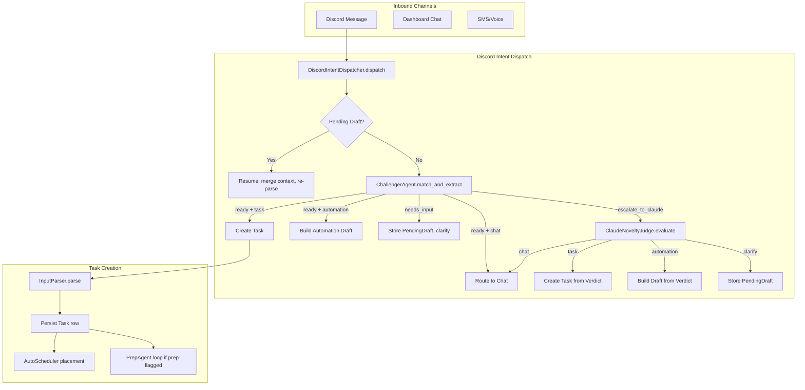

# Orchestrator

The orchestrator is the central routing layer that receives all inbound user messages and tasks, classifies intent, and dispatches work to the appropriate agent, skill, or subsystem.

> Realizes: `spec_v3.md §7.1`, `spec_v3.md §23.2`

## Overview

The orchestrator (`src/donna/orchestrator/`) sits between the user-facing channels (Discord, dashboard, SMS) and the agent/skill execution layer. The **live** entry point is `DiscordIntentDispatcher`, which routes free-text messages and determines whether a user message is a task, an automation request, a chat interaction, or something novel that requires Claude escalation.

> **History (2026-06-17):** the v3.1 task-level `AgentDispatcher` — which routed tasks through a `PMAgent` → `SchedulerAgent`/Prep hierarchy over a uniform `Agent` dispatch contract — was **removed** (resolution: keep-the-ideas, drop-the-framework). It was built and unit-tested but never constructed in production. `DecompositionService` is retained for a future direct-service slice (R2); the tool-validation seam hardening is tracked (R3); `config/agents.yaml` remains the live allowlist registry (challenger/research) behind the tool-lint safety check and admin UI. See `spec_v3.md §7.2` and [`2026-06-17-subagent-72-resolution-design.md`](../superpowers/specs/2026-06-17-subagent-72-resolution-design.md).

The live task path is: `DiscordIntentDispatcher` → `ChallengerAgent.match_and_extract` → (on `escalate_to_claude`) `ClaudeNoveltyJudge`; time-bound placement is handled by the event-driven `AutoScheduler` (a scheduling-subsystem component, not an agent); prep research runs as the `PrepAgent` background loop.

The orchestrator enforces a strict principle from the spec: models propose, the orchestrator validates and executes. No agent or skill calls tools directly. For Discord messages, it first runs the Challenger Agent for capability matching, then the Claude Novelty Judge for unmatched patterns, and builds automation drafts with cadence-policy awareness.

The `InputParser` handles the specific case of natural language task capture: rendering the parse template, calling the model, validating the output schema, applying learned preferences, and running deduplication.

## Key Concepts

| Concept | Description |
|---------|-------------|
| DiscordIntentDispatcher | Routes free-text Discord messages to task creation, automation drafting, chat, or Claude escalation based on Challenger Agent matching. |
| InputParser | Parses natural language into structured `TaskParseResult` via template rendering, model call, schema validation, preference application, and deduplication. |
| DispatchResult | Return type from `DiscordIntentDispatcher.dispatch()`: indicates the routing outcome (`task_created`, `automation_confirmation_needed`, `clarification_posted`, `chat`, `no_action`). |
| DraftAutomation | Proposed automation built from the Challenger's extraction, before user confirmation. Carries schedule, alert conditions, cadence policy adjustments. |
| PendingDraft | Multi-turn conversation state for messages that need clarification. Stored in a `PendingDraftRegistry` keyed by thread/DM. |

## Architecture

### Task Placement & Prep

Once a task is created, time-bound **placement** is handled by the event-driven `AutoScheduler` (not an agent) via `Scheduler.find_next_slot` / `Scheduler.negotiate_placement` (the propose-and-confirm negotiation loop). **Prep** research runs as the `PrepAgent` background loop, which picks up tasks carrying `prep_work_flag` once they fall inside the configured lead-time window. Neither path runs through a task-level dispatcher.

### DiscordIntentDispatcher Flow

The Discord dispatcher handles the nuanced classification of free-text messages:

1. **Thread resume.** Checks if the message is in a thread with a `PendingDraft`. If so, merges the reply with the existing partial context and re-runs the Challenger.

2. **Challenger matching.** The Challenger Agent classifies intent (`task`/`automation`/`chat`/`question`) and extracts structured inputs. Returns a confidence level and match status.

3. **Needs-input path.** For ambiguous or incomplete messages, the dispatcher creates a `PendingDraft` and returns a clarifying question. The next message in the same thread resumes this draft.

4. **Escalation path.** When the Challenger cannot match a capability (`escalate_to_claude`), the Claude Novelty Judge evaluates whether this represents a genuinely new pattern. If it is a skill candidate, the reasoning is recorded for the nightly `SkillCandidateDetector`. If not, a `claude_native_registered` fingerprint is written so the detector skips this pattern.

5. **Automation drafting.** Automation-intent messages produce a `DraftAutomation` with the target schedule, alert conditions, and cadence-policy-adjusted active schedule. The `CadencePolicy` clamps the schedule based on the matched capability's lifecycle state (e.g., `claude_native` capabilities run at lower frequency than `trusted` skills).

### InputParser Pipeline

The `InputParser` is a standalone pipeline for the specific `parse_task` task type:

1. Load and render the prompt template with current date/time and user input.
2. Call `ModelRouter.complete()` with `task_type="parse_task"`.
3. Validate the response against the `parse_task` JSON schema.
4. Apply learned preferences via `PreferenceApplier` (post-parse, pre-database).
5. Run deduplication check via `Deduplicator` (raises `DuplicateDetectedError` on match).
6. Return a typed `TaskParseResult` with title, description, domain, priority, deadline, estimated duration, tags, and confidence score.

## Configuration

The orchestrator itself has minimal config -- it relies on the configurations of the subsystems it orchestrates:

- **Agent definitions:** [`config/agents.yaml`](../config/agents.md) -- agent names, timeout seconds, model assignments.
- **Task types:** [`config/task_types.yaml`](../config/task_types.md) -- prompt templates, output schemas, model routing, tool dependencies. The `manual_escalation` block per task type controls which escalation modes are available.
- **Capabilities:** [`config/capabilities.yaml`](../config/capabilities.md) -- capability registry for the Challenger Agent.
- **Skills:** [`config/skills.yaml`](../config/skills.md) -- `enabled` flag controls whether the skill shadow path runs.
- **Prompt templates:** `prompts/parse_task.md` -- Jinja2 template for task parsing.
- **Output schemas:** `schemas/task_parse_output_v2.json` -- JSON Schema for parse result validation.

## API

| Class / Function | Module | Description |
|-----------------|--------|-------------|
| `DiscordIntentDispatcher` | `discord_intent_dispatcher.py` | `dispatch(msg)` -- returns `DispatchResult`. Constructor takes `ChallengerAgent`, `ClaudeNoveltyJudge`, `PendingDraftRegistry`, `CadencePolicy`. |
| `DispatchResult` | `discord_intent_dispatcher.py` | Dataclass: `kind`, `task_id`, `draft_automation`, `clarifying_question`. |
| `DraftAutomation` | `discord_intent_dispatcher.py` | Dataclass: `capability_name`, `inputs`, `schedule_cron`, `alert_conditions`, `target_cadence_cron`, `active_cadence_cron`, `skill_candidate`, `notification_channels`. |
| `InputParser` | `input_parser.py` | `parse(raw_text, user_id, channel)` -- returns `TaskParseResult`. |
| `TaskParseResult` | `input_parser.py` | Frozen dataclass: `title`, `description`, `domain`, `priority`, `deadline`, `estimated_duration`, `tags`, `confidence`, etc. |

## See Also

- [Domain: Agents](agents.md) -- Challenger Agent, Novelty Judge, Prep Agent
- [Domain: Skill System](skill-system/index.md) -- skill executor, capability matching, shadow evaluation
- [Domain: Task Management](task-system.md) -- task schema, state machine, deduplication
- [Domain: Cost & Escalation](cost.md) -- budget enforcement that intersects with dispatch
- [Domain: Chat](chat.md) -- chat routing for `intent_kind: chat` messages
