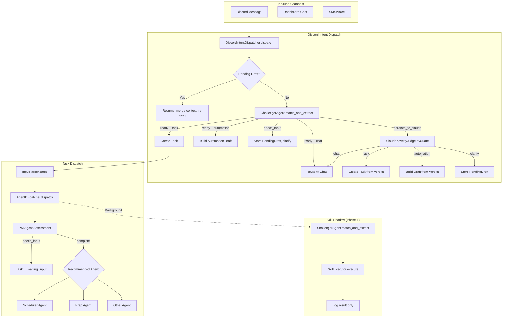

# Orchestrator

The orchestrator is the central routing layer that receives all inbound user messages and tasks, classifies intent, and dispatches work to the appropriate agent, skill, or subsystem.

> Realizes: `spec_v3.md §7.1`, `spec_v3.md §23.2`

## Overview

The orchestrator (`src/donna/orchestrator/`) sits between the user-facing channels (Discord, dashboard, SMS) and the agent/skill execution layer. It has two main entry points: `AgentDispatcher` for task-level dispatch through the PM Agent hierarchy, and `DiscordIntentDispatcher` for free-text message routing that determines whether a user message is a task, an automation request, a chat interaction, or something novel that requires Claude escalation.

The orchestrator enforces a strict principle from the spec: models propose, the orchestrator validates and executes. No agent or skill calls tools directly. The orchestrator resolves which agent handles a task, applies timeouts, manages the skill shadow path (Phase 1), and notifies activity listeners. For Discord messages, it first runs the Challenger Agent for capability matching, then the Claude Novelty Judge for unmatched patterns, and builds automation drafts with cadence-policy awareness.

The `InputParser` handles the specific case of natural language task capture: rendering the parse template, calling the model, validating the output schema, applying learned preferences, and running deduplication.

## Key Concepts

| Concept | Description |
|---------|-------------|
| AgentDispatcher | Routes tasks through PM assessment, then to the recommended execution agent. Manages agent timeouts and the skill shadow path. |
| DiscordIntentDispatcher | Routes free-text Discord messages to task creation, automation drafting, chat, or Claude escalation based on Challenger Agent matching. |
| InputParser | Parses natural language into structured `TaskParseResult` via template rendering, model call, schema validation, preference application, and deduplication. |
| AgentActivityListener | Protocol for receiving agent lifecycle events (start, complete, failure). Used by the notification subsystem to track work in progress. |
| DispatchResult | Return type from `DiscordIntentDispatcher.dispatch()`: indicates the routing outcome (`task_created`, `automation_confirmation_needed`, `clarification_posted`, `chat`, `no_action`). |
| DraftAutomation | Proposed automation built from the Challenger's extraction, before user confirmation. Carries schedule, alert conditions, cadence policy adjustments. |
| PendingDraft | Multi-turn conversation state for messages that need clarification. Stored in a `PendingDraftRegistry` keyed by thread/DM. |
| Skill Shadow | Phase 1 skill system integration. The dispatcher runs the skill path in parallel for logging without affecting the user-facing response. |

## Architecture

### AgentDispatcher Flow

1. **Build context.** Creates an `AgentContext` with the model router, database, user ID, project root, and tool registry.

2. **Skill shadow (background).** If `skill_routing_enabled` is true, the dispatcher runs the Challenger Agent against the task title. On a match, it looks up the corresponding skill and version from the `SkillDatabase`, executes via `SkillExecutor`, and logs the result. This path never affects the user-facing response -- it produces observability data for evaluating skill readiness.

3. **PM assessment.** The PM Agent evaluates task completeness. If the task needs more information, it returns `needs_input` with questions. If assessment fails, the error propagates.

4. **Challenger assessment.** If a Challenger Agent is registered, it runs after PM to evaluate the task against the capability registry.

5. **Execution dispatch.** The PM's recommended agent (typically `scheduler`) is resolved from the agents dict. If unavailable, the dispatcher falls back to the scheduler. The chosen agent executes with a configured timeout via `asyncio.wait_for`.

6. **Activity notification.** On completion or failure, the `AgentActivityListener` is notified so downstream systems (notifications, dashboard) can update.

### DiscordIntentDispatcher Flow

The Discord dispatcher handles the nuanced classification of free-text messages:

1. **Thread resume.** Checks if the message is in a thread with a `PendingDraft`. If so, merges the reply with the existing partial context and re-runs the Challenger.

2. **Challenger matching.** The Challenger Agent classifies intent (`task`/`automation`/`chat`/`question`) and extracts structured inputs. Returns a confidence level and match status.

3. **Needs-input path.** For ambiguous or incomplete messages, the dispatcher creates a `PendingDraft` and returns a clarifying question. The next message in the same thread resumes this draft.

4. **Escalation path.** When the Challenger cannot match a capability (`escalate_to_claude`), the Claude Novelty Judge evaluates whether this represents a genuinely new pattern. If it is a skill candidate, the reasoning is recorded for the nightly `SkillCandidateDetector`. If not, a `claude_native_registered` fingerprint is written so the detector skips this pattern.

5. **Automation drafting.** Automation-intent messages produce a `DraftAutomation` with the target schedule, alert conditions, and cadence-policy-adjusted active schedule. The `CadencePolicy` clamps the schedule based on the matched capability's lifecycle state (e.g., `claude_native` capabilities run at lower frequency than `trusted` skills).

### InputParser Pipeline

The `InputParser` is a standalone pipeline for the specific `parse_task` task type:

1. Load and render the prompt template with current date/time and user input.
2. Call `ModelRouter.complete()` with `task_type="parse_task"`.
3. Validate the response against the `parse_task` JSON schema.
4. Apply learned preferences via `PreferenceApplier` (post-parse, pre-database).
5. Run deduplication check via `Deduplicator` (raises `DuplicateDetectedError` on match).
6. Return a typed `TaskParseResult` with title, description, domain, priority, deadline, estimated duration, tags, and confidence score.

## Configuration

The orchestrator itself has minimal config -- it relies on the configurations of the subsystems it orchestrates:

- **Agent definitions:** [`config/agents.yaml`](../config/agents.md) -- agent names, timeout seconds, model assignments.
- **Task types:** [`config/task_types.yaml`](../config/task_types.md) -- prompt templates, output schemas, model routing, tool dependencies. The `manual_escalation` block per task type controls which escalation modes are available.
- **Capabilities:** [`config/capabilities.yaml`](../config/capabilities.md) -- capability registry for the Challenger Agent.
- **Skills:** [`config/skills.yaml`](../config/skills.md) -- `enabled` flag controls whether the skill shadow path runs.
- **Prompt templates:** `prompts/parse_task.md` -- Jinja2 template for task parsing.
- **Output schemas:** `schemas/task_parse_output_v2.json` -- JSON Schema for parse result validation.

## API

| Class / Function | Module | Description |
|-----------------|--------|-------------|
| `AgentDispatcher` | `dispatcher.py` | `dispatch(task, user_id)` -- PM assessment + execution agent routing. Constructor takes `skill_executor`, `skill_database`, `skill_routing_enabled` for Phase 1 shadow. |
| `AgentActivityListener` | `dispatcher.py` | Protocol: `on_agent_start()`, `on_agent_complete()`, `on_agent_failure()`. |
| `DiscordIntentDispatcher` | `discord_intent_dispatcher.py` | `dispatch(msg)` -- returns `DispatchResult`. Constructor takes `ChallengerAgent`, `ClaudeNoveltyJudge`, `PendingDraftRegistry`, `CadencePolicy`. |
| `DispatchResult` | `discord_intent_dispatcher.py` | Dataclass: `kind`, `task_id`, `draft_automation`, `clarifying_question`. |
| `DraftAutomation` | `discord_intent_dispatcher.py` | Dataclass: `capability_name`, `inputs`, `schedule_cron`, `alert_conditions`, `target_cadence_cron`, `active_cadence_cron`, `skill_candidate`, `notification_channels`. |
| `InputParser` | `input_parser.py` | `parse(raw_text, user_id, channel)` -- returns `TaskParseResult`. |
| `TaskParseResult` | `input_parser.py` | Frozen dataclass: `title`, `description`, `domain`, `priority`, `deadline`, `estimated_duration`, `tags`, `confidence`, etc. |

## See Also

- [Domain: Agents](agents.md) -- PM Agent, Challenger Agent, execution agents
- [Domain: Skill System](skill-system/index.md) -- skill executor, capability matching, shadow evaluation
- [Domain: Task Management](task-system.md) -- task schema, state machine, deduplication
- [Domain: Cost & Escalation](cost.md) -- budget enforcement that intersects with dispatch
- [Domain: Chat](chat.md) -- chat routing for `intent_kind: chat` messages
