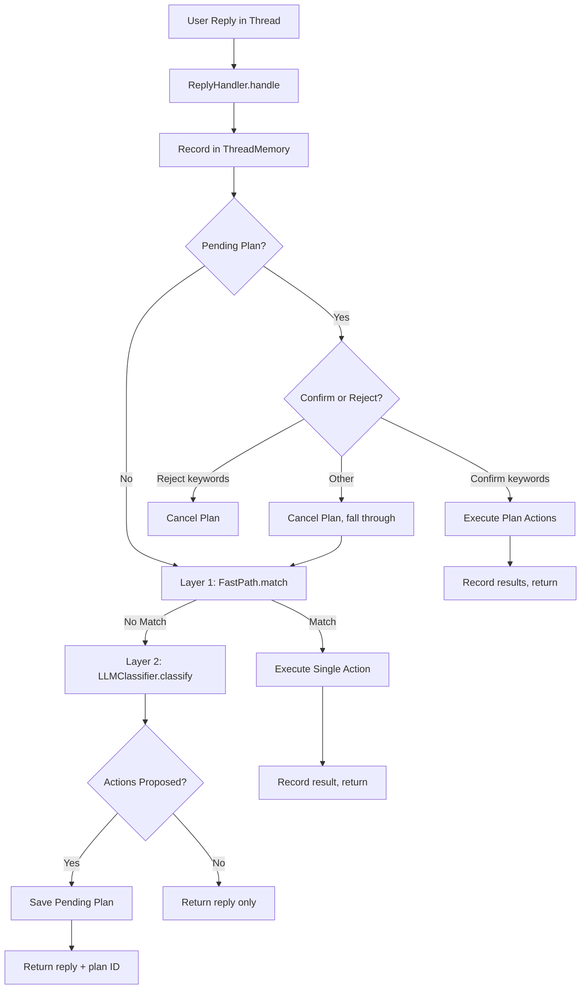

# Universal Reply Handler

The reply handler is a confidence-gated pipeline that classifies and routes user replies to Donna's proactive nudges, executing task actions through a two-layer system of keyword matching and LLM classification with plan-and-confirm safety.

> Related spec: `docs/superpowers/specs/2026-05-12-universal-reply-handler-design.md`

## Overview

When Donna sends proactive nudges (overdue task reminders, scheduled task check-ins, completion prompts), the user replies in the same Discord thread. The reply handler (`src/donna/replies/`) processes these replies through a two-layer classification pipeline. Layer 1 (FastPath) uses config-driven keyword matching with a complexity gate to handle simple, unambiguous replies instantly. Layer 2 sends complex or multi-intent replies to the local LLM with full conversation context for classification.

A core safety mechanism is the plan-and-confirm pattern: when the LLM proposes actions (especially destructive ones like task cancellation or rescheduling), these are persisted as pending plans that the user must explicitly confirm before execution. This prevents the LLM from silently taking actions the user did not intend.

The handler maintains per-thread conversation memory in SQLite, giving the LLM a rolling window of recent exchanges for context. An action registry validates LLM-proposed actions against a config-driven schema, injects context parameters (like the current task ID), and dynamically renders action descriptions into the LLM prompt so the model knows what operations are available.

## Key Concepts

| Concept | Description |
|---------|-------------|
| ReplyHandler | Entry point. Orchestrates the FastPath, LLM classifier, pending plans, and action execution. |
| FastPath | Layer 1 classification. Keyword matching with a complexity gate that rejects multi-intent replies (contains "but", "and also", etc.) and long messages. Only fires when exactly one intent matches. |
| LLMClassifier | Layer 2 classification. Sends the user's reply with task context, conversation history, and available actions to the local LLM. Returns proposed actions and a response in Donna's persona. |
| PendingPlans | Persistence layer for LLM-proposed action plans. Plans auto-expire after a configurable timeout (default 60 minutes). Thread-scoped: one pending plan per thread. |
| ActionRegistry | Config-driven registry of executable actions. Validates LLM output against parameter schemas, injects context-derived parameters, and renders action descriptions for the LLM prompt. |
| ThreadMemory | Rolling conversation window stored in SQLite. Records both user messages and Donna's responses. Used by the LLM classifier for context and pruned on a configurable retention schedule. |
| FastPathResult | Match result from Layer 1: intent name, action to execute, and whether confirmation is required. |
| ReplyResult | Final result: `path` (fast/llm/plan_confirmed/plan_rejected), optional actions, reply text, pending plan ID, execution results. |

## Architecture



### Layer 1: FastPath

The FastPath applies a complexity gate before attempting keyword matching:

1. **Length check.** Messages longer than `max_length` (default 60 chars) are too complex for keyword matching.
2. **Multi-intent signals.** If the message contains phrases like "but", "and also", "however", or "although", it likely contains multiple intents.
3. **Comma check.** More than two comma-separated clauses suggest complexity.
4. **Single-intent constraint.** The message must match keywords from exactly one intent definition. Two or more matches fail the gate.

Only when all checks pass does the FastPath return a match. The action is executed immediately (no confirmation step for FastPath actions like "done" or "reschedule").

### Layer 2: LLM Classification

When FastPath does not match, the LLM classifier builds a prompt with:

- **Task context.** Title, status, domain, priority, scheduled start, estimated duration.
- **Conversation history.** Last N messages from `ThreadMemory` (default window: 10).
- **User's new reply.** The message being classified.
- **Available actions.** Rendered from the `ActionRegistry` config, including parameter types, required/optional status, and enum constraints.

The LLM returns:

- `actions`: A list of proposed actions with parameters.
- `reply_to_user`: A natural-language response in Donna's persona.
- `reasoning`: Internal reasoning (logged, not shown to user).

The action list is validated against the registry: unknown actions are stripped, missing required parameters are flagged. Context-derived parameters (like `task_id`) are injected automatically.

### Plan-and-Confirm

When the LLM proposes actions, the pipeline does not execute them immediately:

1. **Save.** Actions are serialized to `pending_action_plan` with a TTL (default 60 minutes). Any existing pending plan on the same thread is auto-rejected.
2. **Present.** The user sees Donna's reply plus a clear indication that actions are proposed.
3. **Confirm.** On the user's next message, the handler checks for confirmation keywords ("yes", "go ahead", "sure") or rejection keywords ("no", "cancel", "nevermind").
4. **Execute.** On confirmation, each action is resolved through the registry, its handler is dynamically imported and called with the database and context.
5. **Expire.** Unconfirmed plans auto-expire after the TTL.

### Action Execution

Actions are executed by dynamically importing the handler function from the dotted path in the config:

```yaml
mark_done:
  handler: donna.replies.actions.task_actions.mark_done
  params:
    task_id: { type: string, from_context: true }
```

Each handler follows the signature `async def handler(db, context, params) -> str`, returning a summary message. The context dict carries the current task ID and references to the scheduler and calendar client for actions that need them.

### Available Actions

| Action | Handler | Description |
|--------|---------|-------------|
| `mark_done` | `task_actions.mark_done` | Transitions task through `in_progress` to `done`. Sets `completed_at`. |
| `reschedule` | `task_actions.reschedule_task` | Moves task to `scheduled`, optionally finds a new calendar slot via the scheduler. |
| `create_task` | `task_actions.create_task` | Creates a new task with title, domain, priority. |
| `rename_task` | `task_actions.rename_task` | Updates a task's title. |
| `snooze` | `task_actions.snooze_task` | Suppresses notifications for the task for a configurable duration. |

## Configuration

**Intent keywords:** [`config/reply_intents.yaml`](../config/reply_intents.yaml)

```yaml
fast_path:
  max_length: 60
  multi_intent_signals: [" but ", " and also ", " however ", " although "]
  confirm_keywords: ["yes", "go ahead", "do it", "ok", "sounds good"]
  reject_keywords: ["no", "cancel", "nevermind", "nah", "stop"]

intents:
  mark_done:
    keywords: ["done", "finished", "complete", "completed", "did it", "yes"]
    action: mark_done
    confirm: false
  reschedule:
    keywords: ["reschedule", "tomorrow", "later", "push", "move"]
    action: reschedule
    confirm: false
  busy:
    keywords: ["busy", "not now", "snooze"]
    action: snooze
    confirm: false
```

**Action registry:** [`config/reply_actions.yaml`](../config/reply_actions.yaml)

```yaml
memory:
  window_size: 10
  retention_days: 7
plan:
  expiry_minutes: 60
actions:
  mark_done:
    description: "Mark a task as completed"
    handler: donna.replies.actions.task_actions.mark_done
    params:
      task_id: { type: string, from_context: true }
    risk: low
  # ... additional actions
```

Key configuration concepts:

- `from_context: true` parameters are injected by the registry from the execution context, not extracted by the LLM.
- `risk: low|medium|high` is informational; the plan-and-confirm gate applies to all LLM-proposed actions regardless of risk level.
- `optional: true` or `default: <value>` makes a parameter non-required.

## API

| Class / Function | Module | Description |
|-----------------|--------|-------------|
| `ReplyHandler` | `handler.py` | `handle(thread_id, reply, task, context_type)` -- main entry point. Returns `ReplyResult`. |
| `FastPath` | `handler.py` | `match(reply)` -- returns `FastPathResult` or `None`. `is_simple(reply)` -- complexity gate. `is_plan_confirm(reply)` / `is_plan_reject(reply)` -- confirmation detection. |
| `LLMClassifier` | `llm_classifier.py` | `classify(thread_id, user_reply, task, context_type)` -- returns dict with `actions`, `reply_to_user`, `reasoning`. |
| `PendingPlans` | `pending_plans.py` | `save(thread_id, actions, reply_text)`, `get_pending(thread_id)`, `confirm(thread_id)`, `reject(thread_id)`, `expire_stale()`. |
| `ActionRegistry` | `action_registry.py` | `validate_actions(actions)`, `inject_context(action, context)`, `render_for_llm()`, `get_action_def(name)`. |
| `ThreadMemory` | `memory.py` | `record(thread_id, context_type, task_id, role, content)`, `retrieve(thread_id)`, `prune(retention_days)`. |
| `ReplyResult` | `handler.py` | Dataclass: `path`, `action`, `actions`, `reply_to_user`, `pending_plan_id`, `execution_results`. |

## See Also

- [Domain: Task Management](task-system.md) -- task state transitions executed by reply actions
- [Domain: Scheduling](scheduling.md) -- scheduler integration for the reschedule action
- [Domain: Notifications](notifications.md) -- proactive nudges that trigger user replies
- [Domain: Chat](chat.md) -- the dashboard chat interface (separate from thread-based replies)
