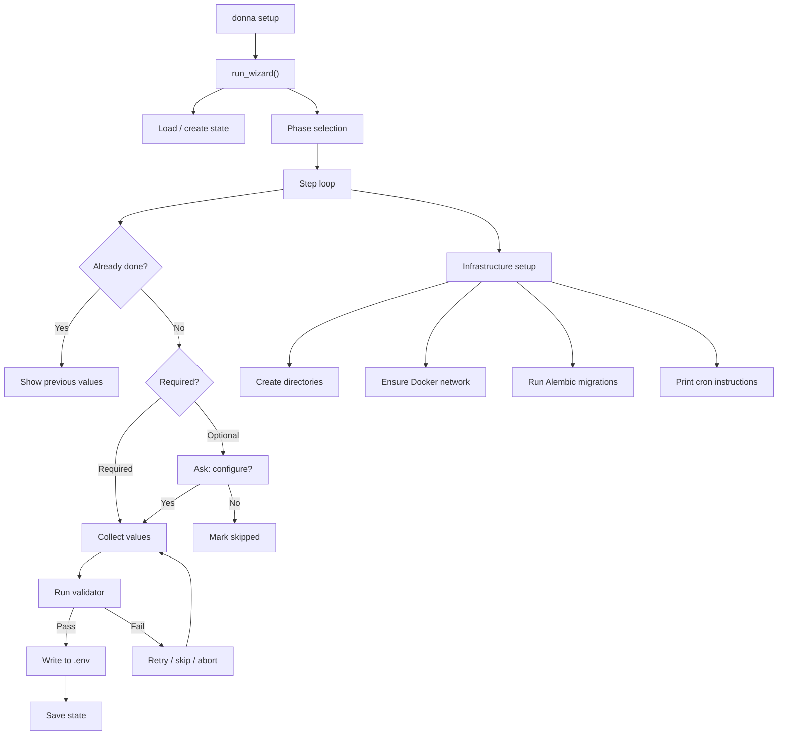

# Setup Wizard

The setup wizard is an interactive CLI tool that bootstraps a new Donna deployment by walking the operator through credential validation, service configuration, and infrastructure provisioning across four deployment phases.

> Realizes: `spec_v3.md §29` (Setup Wizard)

## Overview

Running `donna setup` launches a guided wizard (`src/donna/setup/wizard.py`) that collects environment variables, validates them against live services (Anthropic, Discord, Twilio, Google, Supabase), persists progress to a state file, and provisions infrastructure (directories, Docker network, Alembic migrations). The wizard is resumable: if interrupted, re-running it picks up where it left off. Individual steps can be reconfigured with `--reconfigure <step_id>`.

Steps are declared as frozen dataclasses in `phases.py`, each specifying its prompts, validator function, phase, and dependencies. Validators in `validators.py` are async functions that make real API calls to confirm credentials work (e.g., posting a minimal message to Anthropic, fetching the Discord bot user, testing Twilio auth). This catches misconfiguration at setup time rather than at first runtime.

The wizard is orthogonal to runtime behavior. It writes to `docker/.env` (preserving structure from `.env.example`), creates a `docker/.setup-state.json` for resume tracking, and runs one-time infrastructure tasks. It is designed to run on the host machine, not inside Docker, and warns if it detects a container environment.

## Key Concepts

| Concept | Description |
|---------|-------------|
| Phase | A deployment stage grouping related steps. Phase 1 (Core) is required; later phases add optional integrations. |
| SetupStep | A frozen dataclass defining one configuration unit: ID, name, phase, prompts, validator, help text, dependencies. |
| StepPrompt | A single input prompt within a step, specifying the env var, label, whether it is secret, default value, and required flag. |
| Validator | An async function that receives collected env vars and returns a `ValidatorResult(success, message, details)`. Makes live API calls. |
| State file | JSON at `docker/.setup-state.json` tracking completed/skipped steps, current phase, and timestamps. Enables resume. |
| .env management | Reads from and writes to `docker/.env`, preserving ordering and comments from `.env.example`. Creates timestamped backups before modification. |

## Architecture

### Deployment Phases

| Phase | Name | Steps | Required |
|-------|------|-------|----------|
| 1 | Core (Claude + Discord) | Anthropic API, Discord bot/guild/channels, storage paths, budget, Grafana | All required |
| 2 | Notifications | Twilio SMS/Voice, Google OAuth, Google Calendar IDs + token, Supabase, Vault | All optional |
| 3 | Local LLM (Ollama) | Ollama GPU assignment | Optional |
| 4 | Mobile App | (Immich-gated access -- steps defined in auth layer) | -- |

### Step Registry

| Step ID | Phase | Required | Validator | Env Vars |
|---------|-------|----------|-----------|----------|
| `anthropic_api` | 1 | Yes | `validate_anthropic` | `ANTHROPIC_API_KEY` |
| `discord_bot` | 1 | Yes | `validate_discord_token` | `DISCORD_BOT_TOKEN` |
| `discord_guild` | 1 | Yes | `validate_discord_guild` | `DISCORD_GUILD_ID` |
| `discord_channels` | 1 | Yes | `validate_discord_channels` | `DISCORD_TASKS_CHANNEL_ID`, `DISCORD_DIGEST_CHANNEL_ID`, `DISCORD_AGENTS_CHANNEL_ID`, `DISCORD_DEBUG_CHANNEL_ID` |
| `storage_paths` | 1 | Yes | `validate_paths` | `DONNA_DATA_PATH`, `DONNA_DB_PATH`, `DONNA_WORKSPACE_PATH`, `DONNA_BACKUP_PATH`, `DONNA_LOG_PATH` |
| `budget` | 1 | Yes | `validate_budget` | `DONNA_MONTHLY_BUDGET_USD`, `DONNA_DAILY_PAUSE_THRESHOLD_USD` |
| `grafana` | 1 | Yes | `validate_grafana_password` | `GRAFANA_ADMIN_PASSWORD` |
| `twilio` | 2 | No | `validate_twilio` | `TWILIO_ACCOUNT_SID`, `TWILIO_AUTH_TOKEN`, `TWILIO_PHONE_NUMBER`, `DONNA_USER_PHONE` |
| `google_oauth` | 2 | No | `validate_google_creds_file` | `GOOGLE_CREDENTIALS_PATH` |
| `google_calendars` | 2 | No | `validate_calendar_ids` | `GOOGLE_CALENDAR_PERSONAL_ID`, `GOOGLE_CALENDAR_WORK_ID`, `GOOGLE_CALENDAR_FAMILY_ID` |
| `google_calendar_token` | 2 | No | `validate_google_calendar_token` | *(runs OAuth flow, no direct env var)* |
| `supabase` | 2 | No | `validate_supabase` | `SUPABASE_URL`, `SUPABASE_ANON_KEY`, `SUPABASE_SERVICE_ROLE_KEY` |
| `vault` | 2 | No | `validate_vault` | `DONNA_VAULT_PATH`, `CADDY_VAULT_USER`, `CADDY_VAULT_PASSWORD_HASH` |
| `ollama_gpu` | 3 | No | `validate_nvidia_gpu` | `DONNA_OLLAMA_GPU_ID` |

### Validators

Each validator makes a real API call or system check. Validators never mutate state beyond what they verify.

| Validator | What It Checks |
|-----------|----------------|
| `validate_anthropic` | POST to Anthropic messages API with a 1-token request |
| `validate_discord_token` | GET Discord `/users/@me` to confirm bot token |
| `validate_discord_guild` | GET Discord `/guilds/{id}` to confirm bot membership |
| `validate_discord_channels` | GET Discord `/channels/{id}` for each configured channel |
| `validate_paths` | Absolute path format check (creation deferred to infra) |
| `validate_budget` | Positive numeric values |
| `validate_grafana_password` | Non-empty; warns on default `changeme` |
| `validate_twilio` | GET Twilio account endpoint with basic auth |
| `validate_google_creds_file` | JSON file exists with `client_id` key |
| `validate_calendar_ids` | Non-empty personal calendar ID |
| `validate_google_calendar_token` | Runs Google OAuth consent flow via `InstalledAppFlow` |
| `validate_supabase` | GET Supabase REST endpoint with anon key |
| `validate_vault` | Absolute path + bcrypt hash format check |
| `validate_nvidia_gpu` | `nvidia-smi` query for specified GPU index |

## Configuration

The wizard itself has no YAML config file. It reads from and writes to:

| File | Purpose |
|------|---------|
| `docker/.env` | Target file for all collected environment variables |
| `docker/.env.example` | Template preserving comment structure and variable ordering |
| `docker/.setup-state.json` | Resume state: version, phase, completed/skipped steps, timestamps |

Infrastructure provisioning creates directories for the path env vars and ensures the `homelab` Docker network exists.

## API

| Interface | Module | Description |
|-----------|--------|-------------|
| `run_wizard(project_root, phase, reconfigure, dry_run)` | `donna.setup.wizard` | Main entry point. Returns `True` on success. |
| `PHASES` | `donna.setup.phases` | `dict[int, str]` mapping phase number to description |
| `steps_for_phase(phase)` | `donna.setup.phases` | Returns all steps up to and including the given phase |
| `ALL_STEPS` | `donna.setup.phases` | Ordered list of all `SetupStep` definitions |
| `VALIDATORS` | `donna.setup.validators` | Registry mapping validator name to async function |
| `ValidatorResult` | `donna.setup.validators` | Dataclass with `success`, `message`, `details` |
| `load_state(path)` / `save_state(state, path)` | `donna.setup.state` | Atomic state persistence with version checking |
| `create_directories(env)` | `donna.setup.infra` | Create storage directories from env var paths |
| `ensure_docker_network(name)` | `donna.setup.infra` | Create Docker network if it does not exist |
| `run_alembic_migrations(project_root)` | `donna.setup.infra` | Run `alembic upgrade head` |

See also: [API Reference: donna.setup](../reference/donna/setup/)

## See Also

- [Domain: Observability](observability.md) -- Grafana dashboard configured in setup Phase 1
- [Domain: Integrations](integrations.md) -- services validated during setup (Discord, Twilio, Google, Supabase)
- [Domain: Memory Vault](memory-vault/index.md) -- vault path configured in setup Phase 2
