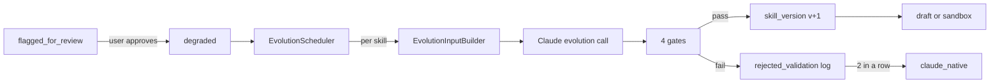

# Skill System Phase 4 — Evolution Loop, Correction Clustering, Production Wiring

> **For agentic workers:** REQUIRED SUB-SKILL: Use superpowers:subagent-driven-development (recommended) or superpowers:executing-plans to implement this plan task-by-task. Steps use checkbox (`- [ ]`) syntax for tracking.

**Goal:** Close the autonomous-improvement loop. Add the evolution pipeline (Claude re-generates degraded skills, 4-gate validation, persist-or-reject), correction clustering (fast-path degradation from ground-truth user corrections), dashboard actions for flagged skills, 2-failure demotion, and — as identified in the Phase 3 final review — the startup wiring that makes the entire Phase 3 + Phase 4 machinery actually run in production.

**Architecture:**
- `Evolver` orchestrates a single evolution attempt: assemble input package from divergence cases + correction log + fixture library, call Claude, parse output, run the four validation gates, persist the new `skill_version` on success or log rejection on failure.
- `EvolutionInputBuilder` collects the package (current version + divergences + corrections + stats + prior evolution log + fixtures) the spec §6.6 requires.
- `EvolutionGates` encapsulates the four validation checks: structural, targeted-case, fixture regression, recent-success.
- `EvolutionScheduler` iterates `degraded` skills (approved by user action), runs `Evolver` against each within the remaining budget, writes `skill_evolution_log` rows.
- `CorrectionClusterDetector` monitors `correction_log` for ≥ 2 corrections in last 10 runs of a skill, fires urgent notification and moves the skill to `flagged_for_review` via the lifecycle manager.
- Consecutive-failure tracking: `Evolver` reads the last two `skill_evolution_log` rows for a skill; if both have `outcome='rejected_validation'`, the lifecycle manager transitions the skill to `claude_native` (spec §6.6 AS-4.4).
- "Save (reset baseline)" behavior: the existing `POST /admin/skills/{id}/state` route gains a side-effect branch — when transitioning `flagged_for_review → trusted` with `reason=human_approval`, recompute and store the fresh baseline from the recent divergence window.
- The nightly cron gains an evolution step **before** auto-drafting (spec §6.5 budget ordering: evolution is prioritized over speculative drafting).
- A new `startup_wiring.py` module assembles all Phase 3 + 4 components and is invoked from `src/donna/api/__init__.py` lifespan. The nightly cron is scheduled via an `asyncio` loop that fires at `config.nightly_run_hour_utc` and honors `config.enabled`.

**Tech Stack:** Python 3.12 async, SQLAlchemy 2.x + Alembic, aiosqlite, existing Claude client via `ModelRouter`, `asyncio`-based scheduler, FastAPI, structlog.

**Spec alignment:** Implements §6.6 evolution loop in full, R26 (flagged_for_review actions), R27 (correction clustering), R28 (4-gate validation), R29 (2-failure demotion). Closes the Phase 3 final-review gap on startup wiring.

**Dependencies from Phase 3:** `SkillLifecycleManager`, `ShadowSampler`, `EquivalenceJudge`, `SkillCandidateDetector`, `AutoDrafter`, `DegradationDetector`, `SkillDivergenceRepository`, `SkillCandidateRepository`, `SkillSystemConfig`, `run_nightly_tasks`, `skill_evolution_log` table (already created in Phase 3 Task 1 migration).

**Phase 4 invariants (must hold after every task):**
- `skill.state` is still never mutated outside `SkillLifecycleManager`.
- Evolution respects `BudgetGuard` — per-call check via `check_pre_call`, plus an outer budget cap in `EvolutionScheduler`.
- Evolution runs **before** auto-drafting in the nightly order.
- Evolution never runs unless the skill is in `degraded` state (user has explicitly approved evolution via the dashboard).
- `requires_human_gate` skills: evolved versions land in `draft`, not `sandbox`.
- Two consecutive `rejected_validation` outcomes trigger the `degraded → claude_native` transition with `reason='evolution_failed'`.
- The startup wiring respects `config.enabled = false` — if false, no background tasks are scheduled; the lifespan logs "skill_system_disabled" and proceeds without registering components.

**Out of scope for Phase 4 (explicitly deferred):**
- Automation subsystem (Phase 5).
- Dashboard UI (visual) updates — only JSON routes land here.
- Per-capability challenger runbooks (OOS-2).
- Step-level shadow comparison (OOS-4).
- Changes to the challenger flow for automation detection.

---

## File Structure

### New files

```
src/donna/skills/
  evolution.py                     -- Evolver: single-skill evolution attempt orchestrator
  evolution_input.py               -- EvolutionInputBuilder: assembles the Claude input package
  evolution_gates.py               -- EvolutionGates: 4 validation gates
  evolution_scheduler.py           -- EvolutionScheduler: iterates degraded skills in nightly batch
  evolution_log.py                 -- SkillEvolutionLogRepository: reads/writes skill_evolution_log rows
  correction_cluster.py            -- CorrectionClusterDetector: fast-path degradation from corrections
  startup_wiring.py                -- assemble_skill_system_components: lifespan helper

src/donna/skills/crons/
  scheduler.py                     -- AsyncCronScheduler: fire run_nightly_tasks daily

prompts/
  skill_evolution.md               -- evolution prompt template (reference doc)

schemas/
  skill_evolution_output.json      -- JSON Schema for Claude's evolution response

tests/unit/test_skills_evolution.py
tests/unit/test_skills_evolution_input.py
tests/unit/test_skills_evolution_gates.py
tests/unit/test_skills_evolution_scheduler.py
tests/unit/test_skills_evolution_log_repo.py
tests/unit/test_skills_correction_cluster.py
tests/unit/test_skills_startup_wiring.py
tests/unit/test_skills_cron_scheduler.py
tests/integration/test_skill_system_phase_4_e2e.py
```

### Modified files

```
src/donna/config.py                -- add Phase 4 knobs to SkillSystemConfig
config/skills.yaml                 -- add Phase 4 knob defaults
config/task_types.yaml             -- register skill_evolution task_type
config/donna_models.yaml           -- route skill_evolution to reasoner
src/donna/skills/crons/nightly.py  -- add evolution step between detector and auto-drafter
src/donna/skills/crons/__init__.py -- export AsyncCronScheduler
src/donna/api/routes/skills.py     -- add baseline reset side-effect on flagged_for_review→trusted
src/donna/api/__init__.py          -- invoke startup_wiring in lifespan
src/donna/notifications/eod_digest.py -- add evolved/evolution-failed lines to skill-system section
docs/phase-1-skill-system-setup.md -- Phase 4 setup notes
docs/superpowers/specs/2026-04-15-skill-system-and-challenger-refactor-design.md -- tick R26-R29 and drift log
donna-diagrams.html                -- add evolution pipeline diagram panel
```

---

## Task 1: Config knobs + task_type registration

**Files:**
- Modify: `src/donna/config.py`
- Modify: `config/skills.yaml`
- Modify: `config/task_types.yaml`
- Modify: `config/donna_models.yaml`
- Create: `prompts/skill_evolution.md`
- Create: `schemas/skill_evolution_output.json`
- Create: `tests/unit/test_config_skill_system_phase4.py`

- [ ] **Step 1: Extend `SkillSystemConfig`** in `src/donna/config.py`. Add the following fields to the existing class (keep the existing fields unchanged):

```python
# Phase 4 — evolution loop
evolution_min_divergence_cases: int = 15
evolution_max_divergence_cases: int = 30
evolution_targeted_case_pass_rate: float = 0.80
evolution_fixture_regression_pass_rate: float = 0.95
evolution_recent_success_count: int = 20
evolution_recent_success_window_days: int = 30
evolution_max_consecutive_failures: int = 2
evolution_estimated_cost_usd: float = 0.75
evolution_daily_cap: int = 10

# Phase 4 — correction clustering
correction_cluster_window_runs: int = 10
correction_cluster_threshold: int = 2
```

- [ ] **Step 2: Add the knobs to `config/skills.yaml`**. Append a new commented block:

```yaml
# Phase 4 — evolution loop
evolution_min_divergence_cases: 15
evolution_max_divergence_cases: 30
evolution_targeted_case_pass_rate: 0.80
evolution_fixture_regression_pass_rate: 0.95
evolution_recent_success_count: 20
evolution_recent_success_window_days: 30
evolution_max_consecutive_failures: 2      # Rejected_validation streak before → claude_native
evolution_estimated_cost_usd: 0.75         # Per-call budget estimate
evolution_daily_cap: 10                    # Max evolution attempts per nightly run

# Phase 4 — correction clustering
correction_cluster_window_runs: 10
correction_cluster_threshold: 2
```

- [ ] **Step 3: Register the `skill_evolution` task_type** in `config/task_types.yaml`. Append after `skill_auto_draft`:

```yaml
  skill_evolution:
    description: "Claude regenerates a degraded skill with divergence case studies + correction log"
    model: reasoner
    prompt_template: prompts/skill_evolution.md
    output_schema: schemas/skill_evolution_output.json
    tools: []
```

- [ ] **Step 4: Route `skill_evolution`** to `reasoner` in `config/donna_models.yaml` under `routing:`:

```yaml
  skill_evolution:
    model: reasoner
```

- [ ] **Step 5: Create `prompts/skill_evolution.md`** (reference documentation; the runtime prompt is built programmatically in Task 2). Contents:

```markdown
# Skill Evolution Prompt

Input: current skill version, divergence cases, correction log, statistical
summary, prior evolution attempts, fixture library.

Output (strict JSON matching `schemas/skill_evolution_output.json`):

```json
{
  "diagnosis": {
    "identified_failure_step": "<step_name>",
    "failure_pattern": "<short description>",
    "confidence": 0.8
  },
  "new_skill_version": {
    "yaml_backbone": "<YAML string>",
    "step_content": {"<step_name>": "<prompt markdown>"},
    "output_schemas": {"<step_name>": {"<JSON schema>"}}
  },
  "changelog": "<short summary of changes>",
  "targeted_failure_cases": ["<run_id>", ...],
  "expected_improvement": "<one sentence>"
}
```

The executor validates this output against four gates before replacing the
current version. See `src/donna/skills/evolution_gates.py`.
```

- [ ] **Step 6: Create `schemas/skill_evolution_output.json`**:

```json
{
  "$schema": "http://json-schema.org/draft-07/schema#",
  "title": "SkillEvolutionOutput",
  "type": "object",
  "required": ["diagnosis", "new_skill_version", "changelog", "targeted_failure_cases"],
  "additionalProperties": false,
  "properties": {
    "diagnosis": {
      "type": "object",
      "required": ["identified_failure_step", "failure_pattern", "confidence"],
      "properties": {
        "identified_failure_step": {"type": "string"},
        "failure_pattern": {"type": "string"},
        "confidence": {"type": "number", "minimum": 0.0, "maximum": 1.0}
      }
    },
    "new_skill_version": {
      "type": "object",
      "required": ["yaml_backbone", "step_content", "output_schemas"],
      "properties": {
        "yaml_backbone": {"type": "string"},
        "step_content": {
          "type": "object",
          "additionalProperties": {"type": "string"}
        },
        "output_schemas": {
          "type": "object",
          "additionalProperties": {"type": "object"}
        }
      }
    },
    "changelog": {"type": "string"},
    "targeted_failure_cases": {
      "type": "array",
      "items": {"type": "string"}
    },
    "expected_improvement": {"type": "string"}
  }
}
```

- [ ] **Step 7: Write config test** at `tests/unit/test_config_skill_system_phase4.py`:

```python
from pathlib import Path

import pytest

from donna.config import SkillSystemConfig, load_skill_system_config


def test_phase4_defaults_on_config():
    cfg = SkillSystemConfig()
    assert cfg.evolution_min_divergence_cases == 15
    assert cfg.evolution_max_divergence_cases == 30
    assert cfg.evolution_targeted_case_pass_rate == 0.80
    assert cfg.evolution_fixture_regression_pass_rate == 0.95
    assert cfg.evolution_recent_success_count == 20
    assert cfg.evolution_max_consecutive_failures == 2
    assert cfg.correction_cluster_window_runs == 10
    assert cfg.correction_cluster_threshold == 2


def test_load_skills_yaml_includes_phase4_keys(tmp_path: Path):
    yaml_path = tmp_path / "skills.yaml"
    yaml_path.write_text(
        "enabled: true\n"
        "evolution_daily_cap: 3\n"
        "correction_cluster_threshold: 5\n"
    )
    cfg = load_skill_system_config(tmp_path)
    assert cfg.enabled is True
    assert cfg.evolution_daily_cap == 3
    assert cfg.correction_cluster_threshold == 5
    # Defaults for unspecified fields.
    assert cfg.evolution_min_divergence_cases == 15
```

- [ ] **Step 8: Run the test and commit**

```bash
pytest tests/unit/test_config_skill_system_phase4.py -v
# Expected: 2 passed.

git add src/donna/config.py config/skills.yaml config/task_types.yaml \
        config/donna_models.yaml prompts/skill_evolution.md \
        schemas/skill_evolution_output.json \
        tests/unit/test_config_skill_system_phase4.py
git commit -m "feat(config): add Phase 4 evolution + correction-clustering knobs"
```

---

## Task 2: `EvolutionInputBuilder` — assembles the package given to Claude

**Files:**
- Create: `src/donna/skills/evolution_input.py`
- Create: `tests/unit/test_skills_evolution_input.py`

**Purpose:** Deterministically build the dict that gets passed to the LLM. Spec §6.6 defines the seven pieces: capability definition, current skill version, divergence case studies, correction log entries, statistical summary, prior evolution log, fixture library.

- [ ] **Step 1: Write the failing test** at `tests/unit/test_skills_evolution_input.py`:

```python
import json
from datetime import datetime, timedelta, timezone
from pathlib import Path

import aiosqlite
import pytest

from donna.config import SkillSystemConfig
from donna.skills.evolution_input import EvolutionInputBuilder


@pytest.fixture
async def db(tmp_path: Path):
    conn = await aiosqlite.connect(str(tmp_path / "test.db"))
    await conn.executescript("""
        CREATE TABLE capability (
            id TEXT PRIMARY KEY, name TEXT NOT NULL UNIQUE,
            description TEXT, input_schema TEXT, trigger_type TEXT,
            status TEXT NOT NULL, created_at TEXT NOT NULL,
            created_by TEXT NOT NULL, embedding BLOB
        );
        CREATE TABLE skill (
            id TEXT PRIMARY KEY, capability_name TEXT NOT NULL UNIQUE,
            current_version_id TEXT, state TEXT NOT NULL,
            requires_human_gate INTEGER NOT NULL DEFAULT 0,
            baseline_agreement REAL, created_at TEXT NOT NULL,
            updated_at TEXT NOT NULL
        );
        CREATE TABLE skill_version (
            id TEXT PRIMARY KEY, skill_id TEXT NOT NULL,
            version_number INTEGER NOT NULL, yaml_backbone TEXT NOT NULL,
            step_content TEXT NOT NULL, output_schemas TEXT NOT NULL,
            created_by TEXT NOT NULL, changelog TEXT, created_at TEXT NOT NULL
        );
        CREATE TABLE skill_run (
            id TEXT PRIMARY KEY, skill_id TEXT NOT NULL,
            skill_version_id TEXT, task_id TEXT, automation_run_id TEXT,
            status TEXT NOT NULL, total_latency_ms INTEGER,
            total_cost_usd REAL, state_object TEXT NOT NULL,
            tool_result_cache TEXT, final_output TEXT,
            escalation_reason TEXT, error TEXT, user_id TEXT NOT NULL,
            started_at TEXT NOT NULL, finished_at TEXT
        );
        CREATE TABLE skill_divergence (
            id TEXT PRIMARY KEY, skill_run_id TEXT NOT NULL,
            shadow_invocation_id TEXT NOT NULL,
            overall_agreement REAL NOT NULL,
            diff_summary TEXT, flagged_for_evolution INTEGER NOT NULL DEFAULT 0,
            created_at TEXT NOT NULL
        );
        CREATE TABLE skill_fixture (
            id TEXT PRIMARY KEY, skill_id TEXT NOT NULL,
            case_name TEXT NOT NULL, input TEXT NOT NULL,
            expected_output_shape TEXT, source TEXT NOT NULL,
            captured_run_id TEXT, created_at TEXT NOT NULL
        );
        CREATE TABLE skill_evolution_log (
            id TEXT PRIMARY KEY, skill_id TEXT NOT NULL,
            from_version_id TEXT NOT NULL, to_version_id TEXT,
            triggered_by TEXT NOT NULL, claude_invocation_id TEXT,
            diagnosis TEXT, targeted_case_ids TEXT,
            validation_results TEXT, outcome TEXT NOT NULL,
            at TEXT NOT NULL
        );
        CREATE TABLE correction_log (
            id TEXT PRIMARY KEY, timestamp TEXT NOT NULL,
            user_id TEXT NOT NULL, task_type TEXT NOT NULL,
            task_id TEXT NOT NULL, input_text TEXT NOT NULL,
            field_corrected TEXT NOT NULL, original_value TEXT NOT NULL,
            corrected_value TEXT NOT NULL, rule_extracted TEXT
        );
    """)
    await conn.commit()
    yield conn
    await conn.close()


async def _seed_minimal_skill(db):
    now = datetime.now(timezone.utc).isoformat()
    await db.execute(
        "INSERT INTO capability (id, name, description, input_schema, "
        "trigger_type, status, created_at, created_by) VALUES "
        "('c1', 'parse_task', 'Parse a task', '{}', 'on_message', "
        "'active', ?, 'seed')",
        (now,),
    )
    await db.execute(
        "INSERT INTO skill (id, capability_name, current_version_id, state, "
        "requires_human_gate, baseline_agreement, created_at, updated_at) "
        "VALUES ('s1', 'parse_task', 'v1', 'degraded', 0, 0.9, ?, ?)",
        (now, now),
    )
    await db.execute(
        "INSERT INTO skill_version (id, skill_id, version_number, "
        "yaml_backbone, step_content, output_schemas, created_by, "
        "changelog, created_at) VALUES "
        "('v1', 's1', 1, 'capability_name: parse_task\\nversion: 1\\nsteps: []\\n', "
        "'{}', '{}', 'seed', 'v1', ?)",
        (now,),
    )
    await db.commit()


async def test_builder_assembles_all_sections(db):
    await _seed_minimal_skill(db)
    # Seed one skill_run + one divergence.
    now = datetime.now(timezone.utc).isoformat()
    await db.execute(
        "INSERT INTO skill_run (id, skill_id, skill_version_id, status, "
        "state_object, user_id, started_at) VALUES "
        "('r1', 's1', 'v1', 'succeeded', '{}', 'nick', ?)",
        (now,),
    )
    await db.execute(
        "INSERT INTO skill_divergence (id, skill_run_id, shadow_invocation_id, "
        "overall_agreement, diff_summary, created_at) VALUES "
        "('d1', 'r1', 'inv1', 0.4, '{\"diff\": \"mismatch\"}', ?)",
        (now,),
    )
    await db.commit()

    config = SkillSystemConfig()
    builder = EvolutionInputBuilder(db, config)
    package = await builder.build(skill_id="s1")

    assert package["capability"]["name"] == "parse_task"
    assert package["current_version"]["id"] == "v1"
    assert len(package["divergence_cases"]) == 1
    assert package["divergence_cases"][0]["agreement"] == 0.4
    assert package["correction_log"] == []
    assert package["prior_evolution_log"] == []
    assert package["fixture_library"] == []
    assert "stats" in package
    assert package["stats"]["baseline_agreement"] == 0.9


async def test_builder_caps_divergence_cases_at_max(db):
    await _seed_minimal_skill(db)
    now = datetime.now(timezone.utc).isoformat()
    # Insert one skill_run and 40 divergences.
    await db.execute(
        "INSERT INTO skill_run (id, skill_id, skill_version_id, status, "
        "state_object, user_id, started_at) VALUES "
        "('r1', 's1', 'v1', 'succeeded', '{}', 'nick', ?)",
        (now,),
    )
    for i in range(40):
        await db.execute(
            "INSERT INTO skill_divergence (id, skill_run_id, shadow_invocation_id, "
            "overall_agreement, diff_summary, created_at) VALUES "
            "(?, 'r1', ?, 0.3, '{}', ?)",
            (f"d{i}", f"inv{i}", now),
        )
    await db.commit()

    config = SkillSystemConfig(evolution_max_divergence_cases=30)
    builder = EvolutionInputBuilder(db, config)
    package = await builder.build(skill_id="s1")
    assert len(package["divergence_cases"]) == 30


async def test_builder_raises_when_insufficient_divergence(db):
    await _seed_minimal_skill(db)
    # No divergence rows.
    config = SkillSystemConfig(evolution_min_divergence_cases=5)
    builder = EvolutionInputBuilder(db, config)
    with pytest.raises(ValueError, match="insufficient divergence"):
        await builder.build(skill_id="s1")


async def test_builder_skill_not_found(db):
    config = SkillSystemConfig()
    builder = EvolutionInputBuilder(db, config)
    with pytest.raises(LookupError, match="skill not found"):
        await builder.build(skill_id="missing")


async def test_builder_includes_correction_log_rows(db):
    await _seed_minimal_skill(db)
    now = datetime.now(timezone.utc).isoformat()
    await db.execute(
        "INSERT INTO skill_run (id, skill_id, skill_version_id, status, "
        "state_object, user_id, started_at) VALUES "
        "('r1', 's1', 'v1', 'succeeded', '{}', 'nick', ?)",
        (now,),
    )
    for i in range(20):
        await db.execute(
            "INSERT INTO skill_divergence (id, skill_run_id, shadow_invocation_id, "
            "overall_agreement, diff_summary, created_at) VALUES "
            "(?, 'r1', ?, 0.3, '{}', ?)",
            (f"d{i}", f"inv{i}", now),
        )
    for i in range(3):
        await db.execute(
            "INSERT INTO correction_log (id, timestamp, user_id, task_type, "
            "task_id, input_text, field_corrected, original_value, "
            "corrected_value) VALUES (?, ?, 'nick', 'parse_task', "
            "?, 'input', 'title', 'x', 'y')",
            (f"c{i}", now, f"t{i}"),
        )
    await db.commit()

    config = SkillSystemConfig()
    builder = EvolutionInputBuilder(db, config)
    package = await builder.build(skill_id="s1")
    assert len(package["correction_log"]) == 3
    assert package["correction_log"][0]["field_corrected"] == "title"
```

Run: `pytest tests/unit/test_skills_evolution_input.py -v`
Expected: FAIL — `EvolutionInputBuilder` does not exist yet.

- [ ] **Step 2: Implement `src/donna/skills/evolution_input.py`**:

```python
"""EvolutionInputBuilder — assembles the Claude input package for a degraded skill.

Spec §6.6 lists the 7 sections: capability definition, current skill version,
divergence case studies, correction log, statistical summary, prior evolution
log, fixture library.
"""

from __future__ import annotations

import json
from typing import Any

import aiosqlite
import structlog

from donna.config import SkillSystemConfig

logger = structlog.get_logger()


class EvolutionInputBuilder:
    def __init__(
        self,
        connection: aiosqlite.Connection,
        config: SkillSystemConfig,
    ) -> None:
        self._conn = connection
        self._config = config

    async def build(self, skill_id: str) -> dict[str, Any]:
        """Assemble the evolution input package.

        Raises:
            LookupError: If the skill row is missing.
            ValueError: If fewer than evolution_min_divergence_cases
                        divergence rows exist (not enough signal).
        """
        skill = await self._fetch_skill(skill_id)
        if skill is None:
            raise LookupError(f"skill not found: {skill_id!r}")

        capability = await self._fetch_capability(skill["capability_name"])
        current_version = await self._fetch_version(skill["current_version_id"])

        divergences = await self._fetch_divergences(
            skill_id=skill_id,
            limit=self._config.evolution_max_divergence_cases,
        )
        if len(divergences) < self._config.evolution_min_divergence_cases:
            raise ValueError(
                f"insufficient divergence data for skill {skill_id!r}: "
                f"{len(divergences)} < {self._config.evolution_min_divergence_cases}"
            )

        corrections = await self._fetch_correction_log(skill["capability_name"])
        prior_log = await self._fetch_prior_evolution_log(skill_id)
        fixtures = await self._fetch_fixtures(skill_id)
        stats = await self._fetch_stats(skill_id, skill["baseline_agreement"])

        return {
            "capability": capability,
            "current_version": current_version,
            "divergence_cases": divergences,
            "correction_log": corrections,
            "prior_evolution_log": prior_log,
            "fixture_library": fixtures,
            "stats": stats,
        }

    async def _fetch_skill(self, skill_id: str) -> dict | None:
        cursor = await self._conn.execute(
            "SELECT id, capability_name, current_version_id, state, "
            "requires_human_gate, baseline_agreement "
            "FROM skill WHERE id = ?",
            (skill_id,),
        )
        row = await cursor.fetchone()
        if row is None:
            return None
        return {
            "id": row[0], "capability_name": row[1],
            "current_version_id": row[2], "state": row[3],
            "requires_human_gate": bool(row[4]),
            "baseline_agreement": row[5],
        }

    async def _fetch_capability(self, name: str) -> dict:
        cursor = await self._conn.execute(
            "SELECT id, name, description, input_schema, trigger_type "
            "FROM capability WHERE name = ?",
            (name,),
        )
        row = await cursor.fetchone()
        if row is None:
            return {"name": name, "description": "", "input_schema": {}}
        return {
            "id": row[0], "name": row[1], "description": row[2] or "",
            "input_schema": json.loads(row[3]) if row[3] else {},
            "trigger_type": row[4],
        }

    async def _fetch_version(self, version_id: str | None) -> dict | None:
        if not version_id:
            return None
        cursor = await self._conn.execute(
            "SELECT id, version_number, yaml_backbone, step_content, "
            "output_schemas FROM skill_version WHERE id = ?",
            (version_id,),
        )
        row = await cursor.fetchone()
        if row is None:
            return None
        return {
            "id": row[0], "version_number": row[1],
            "yaml_backbone": row[2],
            "step_content": json.loads(row[3]) if row[3] else {},
            "output_schemas": json.loads(row[4]) if row[4] else {},
        }

    async def _fetch_divergences(
        self, skill_id: str, limit: int,
    ) -> list[dict]:
        cursor = await self._conn.execute(
            """
            SELECT d.id, d.skill_run_id, d.overall_agreement,
                   d.diff_summary, d.created_at,
                   r.state_object, r.final_output
              FROM skill_divergence d
              JOIN skill_run r ON d.skill_run_id = r.id
             WHERE r.skill_id = ?
             ORDER BY d.created_at DESC
             LIMIT ?
            """,
            (skill_id, limit),
        )
        rows = await cursor.fetchall()
        result: list[dict] = []
        for row in rows:
            result.append({
                "divergence_id": row[0],
                "run_id": row[1],
                "agreement": row[2],
                "diff_summary": json.loads(row[3]) if row[3] else None,
                "created_at": row[4],
                "state_object": json.loads(row[5]) if row[5] else {},
                "final_output": json.loads(row[6]) if row[6] else None,
            })
        return result

    async def _fetch_correction_log(self, capability_name: str) -> list[dict]:
        cursor = await self._conn.execute(
            "SELECT id, timestamp, task_id, field_corrected, "
            "original_value, corrected_value "
            "FROM correction_log WHERE task_type = ? "
            "ORDER BY timestamp DESC LIMIT 50",
            (capability_name,),
        )
        rows = await cursor.fetchall()
        return [
            {
                "id": r[0], "timestamp": r[1], "task_id": r[2],
                "field_corrected": r[3], "original_value": r[4],
                "corrected_value": r[5],
            }
            for r in rows
        ]

    async def _fetch_prior_evolution_log(self, skill_id: str) -> list[dict]:
        cursor = await self._conn.execute(
            "SELECT id, from_version_id, to_version_id, triggered_by, "
            "outcome, at FROM skill_evolution_log "
            "WHERE skill_id = ? ORDER BY at DESC LIMIT 10",
            (skill_id,),
        )
        rows = await cursor.fetchall()
        return [
            {
                "id": r[0], "from_version_id": r[1], "to_version_id": r[2],
                "triggered_by": r[3], "outcome": r[4], "at": r[5],
            }
            for r in rows
        ]

    async def _fetch_fixtures(self, skill_id: str) -> list[dict]:
        cursor = await self._conn.execute(
            "SELECT id, case_name, input, expected_output_shape, source "
            "FROM skill_fixture WHERE skill_id = ?",
            (skill_id,),
        )
        rows = await cursor.fetchall()
        return [
            {
                "id": r[0], "case_name": r[1],
                "input": json.loads(r[2]) if r[2] else {},
                "expected_output_shape": (
                    json.loads(r[3]) if r[3] else None
                ),
                "source": r[4],
            }
            for r in rows
        ]

    async def _fetch_stats(
        self, skill_id: str, baseline_agreement: float | None,
    ) -> dict:
        # Current rolling mean agreement.
        cursor = await self._conn.execute(
            """
            SELECT AVG(d.overall_agreement), COUNT(*)
              FROM skill_divergence d
              JOIN skill_run r ON d.skill_run_id = r.id
             WHERE r.skill_id = ?
            """,
            (skill_id,),
        )
        row = await cursor.fetchone()
        current_mean = float(row[0]) if row and row[0] is not None else 0.0
        total_samples = int(row[1]) if row and row[1] is not None else 0

        # Skill-run failure count.
        cursor = await self._conn.execute(
            "SELECT COUNT(*) FROM skill_run "
            "WHERE skill_id = ? AND status != 'succeeded'",
            (skill_id,),
        )
        row = await cursor.fetchone()
        failure_count = int(row[0]) if row else 0

        return {
            "baseline_agreement": baseline_agreement,
            "current_mean_agreement": current_mean,
            "total_divergence_samples": total_samples,
            "skill_run_failure_count": failure_count,
        }
```

- [ ] **Step 3: Run the tests**

Run: `pytest tests/unit/test_skills_evolution_input.py -v`
Expected: 5 passed.

- [ ] **Step 4: Commit**

```bash
git add src/donna/skills/evolution_input.py \
        tests/unit/test_skills_evolution_input.py
git commit -m "feat(skills): add EvolutionInputBuilder for evolution package assembly"
```

---

## Task 3: `SkillEvolutionLogRepository`

**Files:**
- Create: `src/donna/skills/evolution_log.py`
- Create: `tests/unit/test_skills_evolution_log_repo.py`

**Purpose:** Reads and writes `skill_evolution_log` rows. Used by `Evolver` to persist outcomes and by the consecutive-failure check to read history.

- [ ] **Step 1: Write the failing test** at `tests/unit/test_skills_evolution_log_repo.py`:

```python
from pathlib import Path

import aiosqlite
import pytest

from donna.skills.evolution_log import SkillEvolutionLogRepository


@pytest.fixture
async def db(tmp_path: Path):
    conn = await aiosqlite.connect(str(tmp_path / "test.db"))
    await conn.executescript("""
        CREATE TABLE skill_evolution_log (
            id TEXT PRIMARY KEY, skill_id TEXT NOT NULL,
            from_version_id TEXT NOT NULL, to_version_id TEXT,
            triggered_by TEXT NOT NULL, claude_invocation_id TEXT,
            diagnosis TEXT, targeted_case_ids TEXT,
            validation_results TEXT, outcome TEXT NOT NULL,
            at TEXT NOT NULL
        );
    """)
    await conn.commit()
    yield conn
    await conn.close()


async def test_record_success(db):
    repo = SkillEvolutionLogRepository(db)
    entry_id = await repo.record(
        skill_id="s1", from_version_id="v1", to_version_id="v2",
        triggered_by="statistical_degradation",
        claude_invocation_id="inv-1",
        diagnosis={"step": "extract", "pattern": "noise"},
        targeted_case_ids=["r1", "r2"],
        validation_results={"structural": True, "targeted": 1.0},
        outcome="success",
    )
    cursor = await db.execute(
        "SELECT skill_id, to_version_id, outcome, diagnosis "
        "FROM skill_evolution_log WHERE id = ?",
        (entry_id,),
    )
    row = await cursor.fetchone()
    assert row[0] == "s1"
    assert row[1] == "v2"
    assert row[2] == "success"
    import json
    assert json.loads(row[3]) == {"step": "extract", "pattern": "noise"}


async def test_record_rejected_validation_leaves_to_version_null(db):
    repo = SkillEvolutionLogRepository(db)
    entry_id = await repo.record(
        skill_id="s1", from_version_id="v1", to_version_id=None,
        triggered_by="correction_cluster",
        claude_invocation_id="inv-2",
        diagnosis=None, targeted_case_ids=None,
        validation_results={"fixture_regression": 0.7},
        outcome="rejected_validation",
    )
    cursor = await db.execute(
        "SELECT to_version_id, outcome FROM skill_evolution_log WHERE id = ?",
        (entry_id,),
    )
    row = await cursor.fetchone()
    assert row[0] is None
    assert row[1] == "rejected_validation"


async def test_last_n_outcomes_returns_newest_first(db):
    repo = SkillEvolutionLogRepository(db)
    for outcome in ["rejected_validation", "rejected_validation", "success"]:
        await repo.record(
            skill_id="s1", from_version_id="v1", to_version_id=None,
            triggered_by="test", claude_invocation_id=None,
            diagnosis=None, targeted_case_ids=None,
            validation_results=None, outcome=outcome,
        )

    outcomes = await repo.last_n_outcomes(skill_id="s1", n=2)
    assert outcomes == ["success", "rejected_validation"]


async def test_last_n_outcomes_empty_for_unknown_skill(db):
    repo = SkillEvolutionLogRepository(db)
    outcomes = await repo.last_n_outcomes(skill_id="never", n=5)
    assert outcomes == []
```

Run: `pytest tests/unit/test_skills_evolution_log_repo.py -v`
Expected: FAIL (ImportError).

- [ ] **Step 2: Implement `src/donna/skills/evolution_log.py`**:

```python
"""SkillEvolutionLogRepository — reads/writes skill_evolution_log rows."""

from __future__ import annotations

import json
from datetime import datetime, timezone

import aiosqlite
import structlog
import uuid6

logger = structlog.get_logger()


class SkillEvolutionLogRepository:
    def __init__(self, connection: aiosqlite.Connection) -> None:
        self._conn = connection

    async def record(
        self,
        skill_id: str,
        from_version_id: str,
        to_version_id: str | None,
        triggered_by: str,
        claude_invocation_id: str | None,
        diagnosis: dict | None,
        targeted_case_ids: list[str] | None,
        validation_results: dict | None,
        outcome: str,
    ) -> str:
        entry_id = str(uuid6.uuid7())
        now = datetime.now(timezone.utc).isoformat()
        await self._conn.execute(
            """
            INSERT INTO skill_evolution_log
                (id, skill_id, from_version_id, to_version_id,
                 triggered_by, claude_invocation_id,
                 diagnosis, targeted_case_ids, validation_results,
                 outcome, at)
            VALUES (?, ?, ?, ?, ?, ?, ?, ?, ?, ?, ?)
            """,
            (
                entry_id, skill_id, from_version_id, to_version_id,
                triggered_by, claude_invocation_id,
                json.dumps(diagnosis) if diagnosis is not None else None,
                json.dumps(targeted_case_ids) if targeted_case_ids is not None else None,
                json.dumps(validation_results) if validation_results is not None else None,
                outcome, now,
            ),
        )
        await self._conn.commit()
        return entry_id

    async def last_n_outcomes(self, skill_id: str, n: int) -> list[str]:
        """Return outcomes of the last *n* log entries, newest first."""
        cursor = await self._conn.execute(
            "SELECT outcome FROM skill_evolution_log "
            "WHERE skill_id = ? ORDER BY at DESC LIMIT ?",
            (skill_id, n),
        )
        rows = await cursor.fetchall()
        return [r[0] for r in rows]
```

- [ ] **Step 3: Run test and commit**

```bash
pytest tests/unit/test_skills_evolution_log_repo.py -v
# Expected: 4 passed.

git add src/donna/skills/evolution_log.py \
        tests/unit/test_skills_evolution_log_repo.py
git commit -m "feat(skills): add SkillEvolutionLogRepository"
```

---

## Task 4: `EvolutionGates` — the four validation gates

**Files:**
- Create: `src/donna/skills/evolution_gates.py`
- Create: `tests/unit/test_skills_evolution_gates.py`

**Purpose:** Apply the four gates from spec §6.6 to a proposed new version. Returns a structured result indicating which gates passed and which failed.

Gates:
1. **Structural validation.** YAML parses. Every `step.name` in the backbone has a corresponding entry in `step_content` and `output_schemas`. Each output_schema is a valid JSON Schema (draft-07). DSL primitives (`for_each`, `retry`, `escalate`) are recognized or absent.
2. **Targeted case improvement.** New version executed against the `targeted_failure_cases` (list of skill_run ids); ≥ `evolution_targeted_case_pass_rate` must produce schema-valid outputs without raising.
3. **Fixture regression.** New version executed against the full `skill_fixture` library; ≥ `evolution_fixture_regression_pass_rate` must pass.
4. **Recent-success sanity.** Last `evolution_recent_success_count` `status='succeeded'` runs (from the last `evolution_recent_success_window_days` days) replayed against the new version; all must produce schema-valid outputs.

Gates 2–4 require an executor. For v1 we accept a `SkillExecutor` instance; tests inject a mock.

- [ ] **Step 1: Write the failing tests** at `tests/unit/test_skills_evolution_gates.py`:

```python
import json
from pathlib import Path
from unittest.mock import AsyncMock, MagicMock

import aiosqlite
import pytest

from donna.config import SkillSystemConfig
from donna.skills.evolution_gates import (
    EvolutionGates,
    GateResult,
    run_structural_gate,
)


def _valid_new_version() -> dict:
    return {
        "yaml_backbone": (
            "capability_name: demo\n"
            "version: 2\n"
            "steps:\n"
            "  - name: extract\n"
            "    kind: llm\n"
            "    prompt: steps/extract.md\n"
            "    output_schema: schemas/extract_v1.json\n"
        ),
        "step_content": {"extract": "Extract: {{ inputs.text }}"},
        "output_schemas": {
            "extract": {
                "type": "object",
                "properties": {"title": {"type": "string"}},
                "required": ["title"],
                "additionalProperties": False,
            }
        },
    }


def test_structural_gate_passes_on_valid_version():
    result = run_structural_gate(_valid_new_version())
    assert result.passed is True
    assert result.details["yaml_parsed"] is True


def test_structural_gate_fails_on_missing_step_content():
    bad = _valid_new_version()
    del bad["step_content"]["extract"]
    result = run_structural_gate(bad)
    assert result.passed is False
    assert "missing step_content" in (result.failure_reason or "")


def test_structural_gate_fails_on_bad_yaml():
    bad = _valid_new_version()
    bad["yaml_backbone"] = "this: is: not: valid: yaml: ::::"
    result = run_structural_gate(bad)
    assert result.passed is False


def test_structural_gate_fails_on_missing_output_schema():
    bad = _valid_new_version()
    del bad["output_schemas"]["extract"]
    result = run_structural_gate(bad)
    assert result.passed is False


def test_structural_gate_fails_on_invalid_jsonschema():
    bad = _valid_new_version()
    bad["output_schemas"]["extract"] = {"type": "not-a-real-type"}
    result = run_structural_gate(bad)
    assert result.passed is False


@pytest.fixture
async def db(tmp_path: Path):
    conn = await aiosqlite.connect(str(tmp_path / "test.db"))
    await conn.executescript("""
        CREATE TABLE skill_run (
            id TEXT PRIMARY KEY, skill_id TEXT NOT NULL,
            skill_version_id TEXT, status TEXT NOT NULL,
            state_object TEXT NOT NULL, final_output TEXT,
            user_id TEXT NOT NULL, started_at TEXT NOT NULL,
            finished_at TEXT
        );
        CREATE TABLE skill_fixture (
            id TEXT PRIMARY KEY, skill_id TEXT NOT NULL,
            case_name TEXT NOT NULL, input TEXT NOT NULL,
            expected_output_shape TEXT, source TEXT NOT NULL,
            captured_run_id TEXT, created_at TEXT NOT NULL
        );
    """)
    await conn.commit()
    yield conn
    await conn.close()


async def test_targeted_gate_pass_rate_above_threshold(db):
    # Seed 5 skill_run rows to replay.
    for i in range(5):
        await db.execute(
            "INSERT INTO skill_run (id, skill_id, status, state_object, "
            "user_id, started_at) VALUES (?, 's1', 'succeeded', "
            "'{\"inputs\": {\"text\": \"x\"}}', 'u', '2026-01-01')",
            (f"r{i}",),
        )
    await db.commit()

    executor = MagicMock()
    # Four succeed, one escalated → 80% pass rate.
    results = [MagicMock(status="succeeded")] * 4 + [MagicMock(status="escalated")]
    executor.execute = AsyncMock(side_effect=results)

    config = SkillSystemConfig(evolution_targeted_case_pass_rate=0.80)
    gates = EvolutionGates(db, config, executor)

    result = await gates.run_targeted_case_gate(
        new_version=_valid_new_version(),
        skill_id="s1",
        targeted_case_ids=[f"r{i}" for i in range(5)],
    )
    assert result.passed is True
    assert result.details["pass_rate"] == 0.8


async def test_targeted_gate_fails_below_threshold(db):
    for i in range(5):
        await db.execute(
            "INSERT INTO skill_run (id, skill_id, status, state_object, "
            "user_id, started_at) VALUES (?, 's1', 'succeeded', '{}', "
            "'u', '2026-01-01')",
            (f"r{i}",),
        )
    await db.commit()

    executor = MagicMock()
    executor.execute = AsyncMock(
        side_effect=[MagicMock(status="succeeded")] * 2 + [MagicMock(status="failed")] * 3
    )

    config = SkillSystemConfig(evolution_targeted_case_pass_rate=0.80)
    gates = EvolutionGates(db, config, executor)

    result = await gates.run_targeted_case_gate(
        new_version=_valid_new_version(),
        skill_id="s1",
        targeted_case_ids=[f"r{i}" for i in range(5)],
    )
    assert result.passed is False
    assert result.details["pass_rate"] == 0.4


async def test_fixture_regression_gate(db):
    for i in range(10):
        await db.execute(
            "INSERT INTO skill_fixture (id, skill_id, case_name, input, "
            "expected_output_shape, source, created_at) VALUES "
            "(?, 's1', ?, '{\"x\": 1}', NULL, 'seed', '2026-01-01')",
            (f"f{i}", f"case{i}"),
        )
    await db.commit()

    executor = MagicMock()
    # 10 fixtures; 10 executes; 10 successes.
    executor.execute = AsyncMock(return_value=MagicMock(status="succeeded"))

    config = SkillSystemConfig(evolution_fixture_regression_pass_rate=0.95)
    gates = EvolutionGates(db, config, executor)
    result = await gates.run_fixture_regression_gate(
        new_version=_valid_new_version(),
        skill_id="s1",
    )
    assert result.passed is True
    assert result.details["pass_rate"] == 1.0


async def test_recent_success_gate_requires_all_succeed(db):
    # Seed 3 recent succeeded runs.
    for i in range(3):
        await db.execute(
            "INSERT INTO skill_run (id, skill_id, status, state_object, "
            "user_id, started_at) VALUES (?, 's1', 'succeeded', '{}', "
            "'u', '2026-04-01')",
            (f"r{i}",),
        )
    await db.commit()

    executor = MagicMock()
    executor.execute = AsyncMock(
        side_effect=[MagicMock(status="succeeded")] * 2 + [MagicMock(status="failed")]
    )

    config = SkillSystemConfig(evolution_recent_success_count=3)
    gates = EvolutionGates(db, config, executor)
    result = await gates.run_recent_success_gate(
        new_version=_valid_new_version(),
        skill_id="s1",
    )
    assert result.passed is False  # one failure → fails
    assert result.details["pass_rate"] < 1.0
```

Run: `pytest tests/unit/test_skills_evolution_gates.py -v`
Expected: FAIL (module does not exist).

- [ ] **Step 2: Implement `src/donna/skills/evolution_gates.py`**:

```python
"""EvolutionGates — four validation gates that a proposed new skill version
must pass before replacing the current version.

Spec §6.6:
  1. Structural validation.
  2. Targeted case improvement (≥ 80%).
  3. Fixture regression (≥ 95%).
  4. Recent-success sanity (all schema-valid).
"""

from __future__ import annotations

import json
from dataclasses import dataclass, field
from datetime import datetime, timedelta, timezone
from typing import Any

import aiosqlite
import jsonschema
import structlog
import yaml

from donna.config import SkillSystemConfig
from donna.skills.models import SkillRow, SkillVersionRow

logger = structlog.get_logger()


@dataclass(slots=True)
class GateResult:
    name: str
    passed: bool
    details: dict[str, Any] = field(default_factory=dict)
    failure_reason: str | None = None


def run_structural_gate(new_version: dict) -> GateResult:
    """Gate 1: YAML parses, step_content/output_schemas complete, JSON schemas valid."""
    yaml_backbone = new_version.get("yaml_backbone", "")
    step_content = new_version.get("step_content", {})
    output_schemas = new_version.get("output_schemas", {})

    try:
        parsed = yaml.safe_load(yaml_backbone)
    except yaml.YAMLError as exc:
        return GateResult(
            name="structural", passed=False,
            failure_reason=f"yaml parse failed: {exc}",
        )
    if not isinstance(parsed, dict):
        return GateResult(
            name="structural", passed=False,
            failure_reason="yaml backbone did not parse to a dict",
        )

    steps = parsed.get("steps") or []
    if not isinstance(steps, list):
        return GateResult(
            name="structural", passed=False,
            failure_reason="'steps' must be a list",
        )

    for step in steps:
        name = step.get("name")
        if not name:
            return GateResult(
                name="structural", passed=False,
                failure_reason="step missing name",
            )
        kind = step.get("kind", "llm")
        if kind == "llm" and name not in step_content:
            return GateResult(
                name="structural", passed=False,
                failure_reason=f"missing step_content for step {name!r}",
            )
        if kind == "llm" and name not in output_schemas:
            return GateResult(
                name="structural", passed=False,
                failure_reason=f"missing output_schema for step {name!r}",
            )

    # Validate each output schema is a legal JSON Schema.
    for step_name, schema in output_schemas.items():
        if not isinstance(schema, dict):
            return GateResult(
                name="structural", passed=False,
                failure_reason=f"schema for {step_name!r} is not a dict",
            )
        try:
            jsonschema.Draft7Validator.check_schema(schema)
        except jsonschema.exceptions.SchemaError as exc:
            return GateResult(
                name="structural", passed=False,
                failure_reason=f"invalid schema for {step_name!r}: {exc}",
            )

    return GateResult(
        name="structural", passed=True,
        details={"yaml_parsed": True, "step_count": len(steps)},
    )


class EvolutionGates:
    """Orchestrates the four validation gates against an injected executor."""

    def __init__(
        self,
        connection: aiosqlite.Connection,
        config: SkillSystemConfig,
        executor: Any,
    ) -> None:
        self._conn = connection
        self._config = config
        self._executor = executor

    def run_structural_gate(self, new_version: dict) -> GateResult:
        return run_structural_gate(new_version)

    async def run_targeted_case_gate(
        self,
        new_version: dict,
        skill_id: str,
        targeted_case_ids: list[str],
    ) -> GateResult:
        if not targeted_case_ids:
            return GateResult(
                name="targeted",
                passed=True,  # vacuous — no cases to regress
                details={"pass_rate": 1.0, "total": 0},
            )

        pass_count = 0
        total = len(targeted_case_ids)
        skill = _synthetic_skill(skill_id, new_version)
        version = _synthetic_version(skill_id, new_version)

        for run_id in targeted_case_ids:
            inputs = await self._load_inputs_for_run(run_id)
            if inputs is None:
                continue
            try:
                result = await self._executor.execute(
                    skill=skill, version=version,
                    inputs=inputs, user_id="evolution_harness",
                )
                if result.status == "succeeded":
                    pass_count += 1
            except Exception:
                logger.warning(
                    "evolution_targeted_case_raised",
                    skill_id=skill_id, run_id=run_id,
                )

        rate = pass_count / total
        return GateResult(
            name="targeted",
            passed=rate >= self._config.evolution_targeted_case_pass_rate,
            details={"pass_rate": rate, "total": total, "passed": pass_count},
        )

    async def run_fixture_regression_gate(
        self,
        new_version: dict,
        skill_id: str,
    ) -> GateResult:
        cursor = await self._conn.execute(
            "SELECT id, input FROM skill_fixture WHERE skill_id = ?",
            (skill_id,),
        )
        rows = await cursor.fetchall()
        if not rows:
            return GateResult(
                name="fixture_regression",
                passed=True,  # vacuous — no fixtures
                details={"pass_rate": 1.0, "total": 0},
            )

        pass_count = 0
        skill = _synthetic_skill(skill_id, new_version)
        version = _synthetic_version(skill_id, new_version)

        for row in rows:
            fixture_input = json.loads(row[1]) if row[1] else {}
            try:
                result = await self._executor.execute(
                    skill=skill, version=version,
                    inputs=fixture_input, user_id="evolution_harness",
                )
                if result.status == "succeeded":
                    pass_count += 1
            except Exception:
                logger.warning(
                    "evolution_fixture_raised",
                    skill_id=skill_id, fixture_id=row[0],
                )

        rate = pass_count / len(rows)
        return GateResult(
            name="fixture_regression",
            passed=rate >= self._config.evolution_fixture_regression_pass_rate,
            details={"pass_rate": rate, "total": len(rows), "passed": pass_count},
        )

    async def run_recent_success_gate(
        self,
        new_version: dict,
        skill_id: str,
    ) -> GateResult:
        window_start = (
            datetime.now(timezone.utc)
            - timedelta(days=self._config.evolution_recent_success_window_days)
        ).isoformat()
        cursor = await self._conn.execute(
            "SELECT id, state_object FROM skill_run "
            "WHERE skill_id = ? AND status = 'succeeded' "
            "AND started_at >= ? "
            "ORDER BY started_at DESC LIMIT ?",
            (skill_id, window_start, self._config.evolution_recent_success_count),
        )
        rows = await cursor.fetchall()
        if not rows:
            return GateResult(
                name="recent_success", passed=True,
                details={"pass_rate": 1.0, "total": 0},
            )

        pass_count = 0
        skill = _synthetic_skill(skill_id, new_version)
        version = _synthetic_version(skill_id, new_version)
        for row in rows:
            state = json.loads(row[1]) if row[1] else {}
            inputs = state.get("inputs", {}) if isinstance(state, dict) else {}
            try:
                result = await self._executor.execute(
                    skill=skill, version=version,
                    inputs=inputs, user_id="evolution_harness",
                )
                if result.status == "succeeded":
                    pass_count += 1
            except Exception:
                logger.warning(
                    "evolution_recent_success_raised",
                    skill_id=skill_id, run_id=row[0],
                )

        rate = pass_count / len(rows)
        return GateResult(
            name="recent_success",
            passed=rate == 1.0,  # spec says "all must produce schema-valid"
            details={"pass_rate": rate, "total": len(rows), "passed": pass_count},
        )

    async def _load_inputs_for_run(self, run_id: str) -> dict | None:
        cursor = await self._conn.execute(
            "SELECT state_object FROM skill_run WHERE id = ?",
            (run_id,),
        )
        row = await cursor.fetchone()
        if row is None:
            return None
        state = json.loads(row[0]) if row[0] else {}
        return state.get("inputs", {}) if isinstance(state, dict) else {}


def _synthetic_skill(skill_id: str, new_version: dict) -> SkillRow:
    """Build an in-memory SkillRow that points at the proposed new_version."""
    now = datetime.now(timezone.utc)
    return SkillRow(
        id=skill_id,
        capability_name="__evolution_harness__",
        current_version_id="v_proposed",
        state="degraded",
        requires_human_gate=False,
        baseline_agreement=None,
        created_at=now, updated_at=now,
    )


def _synthetic_version(skill_id: str, new_version: dict) -> SkillVersionRow:
    now = datetime.now(timezone.utc)
    return SkillVersionRow(
        id="v_proposed", skill_id=skill_id, version_number=999,
        yaml_backbone=new_version.get("yaml_backbone", ""),
        step_content=new_version.get("step_content", {}),
        output_schemas=new_version.get("output_schemas", {}),
        created_by="evolution", changelog="in-memory",
        created_at=now,
    )
```

- [ ] **Step 3: Run the tests**

Run: `pytest tests/unit/test_skills_evolution_gates.py -v`
Expected: 9 passed.

- [ ] **Step 4: Commit**

```bash
git add src/donna/skills/evolution_gates.py \
        tests/unit/test_skills_evolution_gates.py
git commit -m "feat(skills): add EvolutionGates (4 validation gates)"
```

---

## Task 5: `Evolver` — single-skill evolution orchestrator

**Files:**
- Create: `src/donna/skills/evolution.py`
- Create: `tests/unit/test_skills_evolution.py`

**Purpose:** Takes a `degraded` skill, builds the input package, calls Claude, parses output, runs the 4 gates, persists or rejects. Tracks consecutive failures; on 2 in a row, demotes to `claude_native`.

- [ ] **Step 1: Write the failing tests** at `tests/unit/test_skills_evolution.py`:

```python
import json
from datetime import datetime, timezone
from pathlib import Path
from unittest.mock import AsyncMock, MagicMock

import aiosqlite
import pytest

from donna.config import SkillSystemConfig
from donna.cost.budget import BudgetPausedError
from donna.skills.evolution import EvolutionReport, Evolver


@pytest.fixture
async def db(tmp_path: Path):
    conn = await aiosqlite.connect(str(tmp_path / "test.db"))
    await conn.executescript("""
        CREATE TABLE capability (
            id TEXT PRIMARY KEY, name TEXT NOT NULL UNIQUE,
            description TEXT, input_schema TEXT, trigger_type TEXT,
            status TEXT NOT NULL, created_at TEXT NOT NULL,
            created_by TEXT NOT NULL, embedding BLOB
        );
        CREATE TABLE skill (
            id TEXT PRIMARY KEY, capability_name TEXT NOT NULL UNIQUE,
            current_version_id TEXT, state TEXT NOT NULL,
            requires_human_gate INTEGER NOT NULL DEFAULT 0,
            baseline_agreement REAL, created_at TEXT NOT NULL,
            updated_at TEXT NOT NULL
        );
        CREATE TABLE skill_version (
            id TEXT PRIMARY KEY, skill_id TEXT NOT NULL,
            version_number INTEGER NOT NULL, yaml_backbone TEXT NOT NULL,
            step_content TEXT NOT NULL, output_schemas TEXT NOT NULL,
            created_by TEXT NOT NULL, changelog TEXT, created_at TEXT NOT NULL
        );
        CREATE TABLE skill_run (
            id TEXT PRIMARY KEY, skill_id TEXT NOT NULL,
            skill_version_id TEXT, task_id TEXT, automation_run_id TEXT,
            status TEXT NOT NULL, total_latency_ms INTEGER,
            total_cost_usd REAL, state_object TEXT NOT NULL,
            tool_result_cache TEXT, final_output TEXT,
            escalation_reason TEXT, error TEXT, user_id TEXT NOT NULL,
            started_at TEXT NOT NULL, finished_at TEXT
        );
        CREATE TABLE skill_divergence (
            id TEXT PRIMARY KEY, skill_run_id TEXT NOT NULL,
            shadow_invocation_id TEXT NOT NULL,
            overall_agreement REAL NOT NULL,
            diff_summary TEXT, flagged_for_evolution INTEGER NOT NULL DEFAULT 0,
            created_at TEXT NOT NULL
        );
        CREATE TABLE skill_fixture (
            id TEXT PRIMARY KEY, skill_id TEXT NOT NULL,
            case_name TEXT NOT NULL, input TEXT NOT NULL,
            expected_output_shape TEXT, source TEXT NOT NULL,
            captured_run_id TEXT, created_at TEXT NOT NULL
        );
        CREATE TABLE skill_evolution_log (
            id TEXT PRIMARY KEY, skill_id TEXT NOT NULL,
            from_version_id TEXT NOT NULL, to_version_id TEXT,
            triggered_by TEXT NOT NULL, claude_invocation_id TEXT,
            diagnosis TEXT, targeted_case_ids TEXT,
            validation_results TEXT, outcome TEXT NOT NULL,
            at TEXT NOT NULL
        );
        CREATE TABLE skill_state_transition (
            id TEXT PRIMARY KEY, skill_id TEXT NOT NULL,
            from_state TEXT NOT NULL, to_state TEXT NOT NULL,
            reason TEXT NOT NULL, actor TEXT NOT NULL,
            actor_id TEXT, at TEXT NOT NULL, notes TEXT
        );
        CREATE TABLE correction_log (
            id TEXT PRIMARY KEY, timestamp TEXT NOT NULL,
            user_id TEXT NOT NULL, task_type TEXT NOT NULL,
            task_id TEXT NOT NULL, input_text TEXT NOT NULL,
            field_corrected TEXT NOT NULL, original_value TEXT NOT NULL,
            corrected_value TEXT NOT NULL, rule_extracted TEXT
        );
    """)
    await conn.commit()
    yield conn
    await conn.close()


async def _seed_degraded_skill(
    db, *, skill_id="s1", n_divergences=20, requires_human_gate=False,
):
    now = datetime.now(timezone.utc).isoformat()
    await db.execute(
        "INSERT INTO capability (id, name, description, input_schema, "
        "trigger_type, status, created_at, created_by) VALUES "
        "('c1', 'demo', 'demo cap', '{}', 'on_message', 'active', ?, 'seed')",
        (now,),
    )
    await db.execute(
        "INSERT INTO skill (id, capability_name, current_version_id, state, "
        "requires_human_gate, baseline_agreement, created_at, updated_at) "
        "VALUES (?, 'demo', 'v1', 'degraded', ?, 0.9, ?, ?)",
        (skill_id, 1 if requires_human_gate else 0, now, now),
    )
    await db.execute(
        "INSERT INTO skill_version (id, skill_id, version_number, "
        "yaml_backbone, step_content, output_schemas, created_by, "
        "changelog, created_at) VALUES "
        "('v1', ?, 1, 'capability_name: demo\\nversion: 1\\nsteps: []\\n', "
        "'{}', '{}', 'seed', 'v1', ?)",
        (skill_id, now),
    )
    await db.execute(
        "INSERT INTO skill_run (id, skill_id, skill_version_id, status, "
        "state_object, user_id, started_at) VALUES "
        "('r1', ?, 'v1', 'succeeded', '{}', 'nick', ?)",
        (skill_id, now),
    )
    for i in range(n_divergences):
        await db.execute(
            "INSERT INTO skill_divergence (id, skill_run_id, shadow_invocation_id, "
            "overall_agreement, diff_summary, created_at) VALUES "
            "(?, 'r1', ?, 0.4, '{}', ?)",
            (f"d{i}", f"inv{i}", now),
        )
    await db.commit()


def _valid_llm_output() -> dict:
    return {
        "diagnosis": {
            "identified_failure_step": "extract",
            "failure_pattern": "missing title",
            "confidence": 0.85,
        },
        "new_skill_version": {
            "yaml_backbone": (
                "capability_name: demo\n"
                "version: 2\n"
                "steps:\n"
                "  - name: extract\n"
                "    kind: llm\n"
                "    prompt: steps/extract.md\n"
                "    output_schema: schemas/extract_v1.json\n"
            ),
            "step_content": {"extract": "Extract: {{ inputs.text }}"},
            "output_schemas": {
                "extract": {
                    "type": "object",
                    "properties": {"title": {"type": "string"}},
                    "required": ["title"],
                }
            },
        },
        "changelog": "clarify title extraction",
        "targeted_failure_cases": [],
        "expected_improvement": "↑ agreement on noisy inputs",
    }


def _mock_lifecycle():
    lifecycle = MagicMock()
    lifecycle.transition = AsyncMock()
    return lifecycle


def _mock_executor_always_succeeds():
    executor = MagicMock()
    executor.execute = AsyncMock(return_value=MagicMock(status="succeeded"))
    return executor


async def test_evolve_happy_path_persists_new_version(db):
    await _seed_degraded_skill(db)
    router = AsyncMock()
    router.complete.return_value = (_valid_llm_output(), MagicMock(invocation_id="inv-9"))
    budget_guard = AsyncMock()
    budget_guard.check_pre_call = AsyncMock()
    lifecycle = _mock_lifecycle()
    executor = _mock_executor_always_succeeds()

    evolver = Evolver(
        connection=db, model_router=router, budget_guard=budget_guard,
        lifecycle_manager=lifecycle, config=SkillSystemConfig(),
        executor_factory=lambda: executor,
    )

    report = await evolver.evolve_one(skill_id="s1", triggered_by="statistical_degradation")

    assert report.outcome == "success"
    assert report.new_version_id is not None
    # Log row written.
    cursor = await db.execute("SELECT outcome FROM skill_evolution_log WHERE skill_id = 's1'")
    rows = await cursor.fetchall()
    assert len(rows) == 1
    assert rows[0][0] == "success"
    # New version row exists.
    cursor = await db.execute("SELECT COUNT(*) FROM skill_version WHERE skill_id = 's1'")
    row = await cursor.fetchone()
    assert row[0] == 2
    # Lifecycle transitioned the skill (to draft or sandbox).
    assert lifecycle.transition.await_count >= 1


async def test_evolve_requires_human_gate_lands_in_draft(db):
    await _seed_degraded_skill(db, requires_human_gate=True)
    router = AsyncMock()
    router.complete.return_value = (_valid_llm_output(), MagicMock(invocation_id="inv-9"))
    budget_guard = AsyncMock()
    lifecycle = _mock_lifecycle()

    evolver = Evolver(
        connection=db, model_router=router, budget_guard=budget_guard,
        lifecycle_manager=lifecycle, config=SkillSystemConfig(),
        executor_factory=_mock_executor_always_succeeds,
    )

    report = await evolver.evolve_one(skill_id="s1", triggered_by="manual")
    assert report.outcome == "success"
    # Lifecycle was called with to_state=draft (gated skill) not sandbox.
    last_call = lifecycle.transition.await_args_list[-1]
    assert last_call.kwargs["to_state"].value == "draft"


async def test_evolve_malformed_output_marks_rejected(db):
    await _seed_degraded_skill(db)
    router = AsyncMock()
    router.complete.return_value = ({"foo": "bar"}, MagicMock(invocation_id="inv-x"))
    budget_guard = AsyncMock()
    lifecycle = _mock_lifecycle()

    evolver = Evolver(
        connection=db, model_router=router, budget_guard=budget_guard,
        lifecycle_manager=lifecycle, config=SkillSystemConfig(),
        executor_factory=_mock_executor_always_succeeds,
    )
    report = await evolver.evolve_one(skill_id="s1", triggered_by="manual")
    assert report.outcome == "rejected_validation"
    assert "malformed" in (report.rationale or "")


async def test_evolve_validation_failure_marks_rejected(db):
    await _seed_degraded_skill(db)
    # Seed 10 skill_fixture rows so fixture gate can meaningfully fail.
    now = datetime.now(timezone.utc).isoformat()
    for i in range(10):
        await db.execute(
            "INSERT INTO skill_fixture (id, skill_id, case_name, input, "
            "expected_output_shape, source, created_at) VALUES "
            "(?, 's1', ?, '{}', NULL, 'seed', ?)",
            (f"f{i}", f"case{i}", now),
        )
    await db.commit()

    router = AsyncMock()
    router.complete.return_value = (_valid_llm_output(), MagicMock(invocation_id="inv-x"))
    budget_guard = AsyncMock()
    lifecycle = _mock_lifecycle()

    # Executor that always fails → fixture pass rate = 0.
    executor = MagicMock()
    executor.execute = AsyncMock(return_value=MagicMock(status="failed"))

    evolver = Evolver(
        connection=db, model_router=router, budget_guard=budget_guard,
        lifecycle_manager=lifecycle, config=SkillSystemConfig(),
        executor_factory=lambda: executor,
    )

    report = await evolver.evolve_one(skill_id="s1", triggered_by="manual")
    assert report.outcome == "rejected_validation"
    # Skill should remain in degraded (no demotion on first rejection).
    cursor = await db.execute("SELECT state FROM skill WHERE id = 's1'")
    assert (await cursor.fetchone())[0] == "degraded"


async def test_two_consecutive_failures_demote_to_claude_native(db):
    await _seed_degraded_skill(db)
    # Pre-seed one rejected_validation in the log.
    import uuid6
    now = datetime.now(timezone.utc).isoformat()
    await db.execute(
        "INSERT INTO skill_evolution_log (id, skill_id, from_version_id, "
        "to_version_id, triggered_by, claude_invocation_id, diagnosis, "
        "targeted_case_ids, validation_results, outcome, at) VALUES "
        "(?, 's1', 'v1', NULL, 'statistical_degradation', NULL, NULL, "
        "NULL, NULL, 'rejected_validation', ?)",
        (str(uuid6.uuid7()), now),
    )
    await db.commit()

    router = AsyncMock()
    router.complete.return_value = (_valid_llm_output(), MagicMock(invocation_id="inv-x"))
    budget_guard = AsyncMock()
    lifecycle = _mock_lifecycle()
    # Executor that fails so the second evolution also rejects validation.
    executor = MagicMock()
    executor.execute = AsyncMock(return_value=MagicMock(status="failed"))
    # Seed one fixture so the fixture gate runs.
    await db.execute(
        "INSERT INTO skill_fixture (id, skill_id, case_name, input, "
        "expected_output_shape, source, created_at) VALUES "
        "('f1', 's1', 'c', '{}', NULL, 'seed', ?)",
        (now,),
    )
    await db.commit()

    evolver = Evolver(
        connection=db, model_router=router, budget_guard=budget_guard,
        lifecycle_manager=lifecycle, config=SkillSystemConfig(),
        executor_factory=lambda: executor,
    )

    report = await evolver.evolve_one(skill_id="s1", triggered_by="manual")
    assert report.outcome == "rejected_validation"
    # Should have called lifecycle.transition(... to=claude_native, reason=evolution_failed).
    transitions = lifecycle.transition.await_args_list
    demotion_calls = [
        c for c in transitions
        if c.kwargs.get("to_state").value == "claude_native"
        and c.kwargs.get("reason") == "evolution_failed"
    ]
    assert len(demotion_calls) == 1


async def test_evolve_budget_paused_returns_early(db):
    await _seed_degraded_skill(db)
    router = AsyncMock()
    budget_guard = AsyncMock()
    budget_guard.check_pre_call.side_effect = BudgetPausedError(daily_spent=30.0, daily_limit=20.0)
    lifecycle = _mock_lifecycle()

    evolver = Evolver(
        connection=db, model_router=router, budget_guard=budget_guard,
        lifecycle_manager=lifecycle, config=SkillSystemConfig(),
        executor_factory=_mock_executor_always_succeeds,
    )

    report = await evolver.evolve_one(skill_id="s1", triggered_by="manual")
    assert report.outcome == "budget_exhausted"
    # No log row, no transition.
    cursor = await db.execute("SELECT COUNT(*) FROM skill_evolution_log")
    assert (await cursor.fetchone())[0] == 0
    lifecycle.transition.assert_not_awaited()


async def test_evolve_skill_not_in_degraded_state_skips(db):
    await _seed_degraded_skill(db)
    # Flip to trusted.
    await db.execute("UPDATE skill SET state = 'trusted' WHERE id = 's1'")
    await db.commit()

    router = AsyncMock()
    budget_guard = AsyncMock()
    lifecycle = _mock_lifecycle()
    evolver = Evolver(
        connection=db, model_router=router, budget_guard=budget_guard,
        lifecycle_manager=lifecycle, config=SkillSystemConfig(),
        executor_factory=_mock_executor_always_succeeds,
    )
    report = await evolver.evolve_one(skill_id="s1", triggered_by="manual")
    assert report.outcome == "skipped"
    router.complete.assert_not_awaited()
```

Run: `pytest tests/unit/test_skills_evolution.py -v`
Expected: FAIL (module missing).

- [ ] **Step 2: Implement `src/donna/skills/evolution.py`**:

```python
"""Evolver — single-skill evolution attempt orchestrator.

Spec §6.6. Assembles the input package, calls Claude, parses output,
runs four validation gates, persists or rejects.
"""

from __future__ import annotations

import json
from dataclasses import dataclass
from datetime import datetime, timezone
from typing import Any, Callable

import aiosqlite
import structlog
import uuid6

from donna.config import SkillSystemConfig
from donna.cost.budget import BudgetPausedError
from donna.skills.evolution_gates import (
    EvolutionGates,
    GateResult,
    run_structural_gate,
)
from donna.skills.evolution_input import EvolutionInputBuilder
from donna.skills.evolution_log import SkillEvolutionLogRepository
from donna.skills.lifecycle import (
    IllegalTransitionError,
    SkillLifecycleManager,
)
from donna.tasks.db_models import SkillState

logger = structlog.get_logger()

TASK_TYPE = "skill_evolution"


@dataclass(slots=True)
class EvolutionReport:
    skill_id: str
    outcome: str        # success | rejected_validation | malformed_output | budget_exhausted | skipped | error
    new_version_id: str | None = None
    rationale: str | None = None


class Evolver:
    def __init__(
        self,
        connection: aiosqlite.Connection,
        model_router: Any,
        budget_guard: Any,
        lifecycle_manager: SkillLifecycleManager,
        config: SkillSystemConfig,
        executor_factory: Callable[[], Any],
    ) -> None:
        self._conn = connection
        self._router = model_router
        self._budget_guard = budget_guard
        self._lifecycle = lifecycle_manager
        self._config = config
        self._executor_factory = executor_factory
        self._input_builder = EvolutionInputBuilder(connection, config)
        self._log_repo = SkillEvolutionLogRepository(connection)

    async def evolve_one(
        self, skill_id: str, triggered_by: str,
    ) -> EvolutionReport:
        skill = await self._fetch_skill(skill_id)
        if skill is None:
            return EvolutionReport(
                skill_id=skill_id, outcome="skipped",
                rationale="skill not found",
            )
        if skill["state"] != "degraded":
            return EvolutionReport(
                skill_id=skill_id, outcome="skipped",
                rationale=f"skill state is {skill['state']!r}, not 'degraded'",
            )

        # Budget check.
        try:
            if self._budget_guard is not None:
                await self._budget_guard.check_pre_call(user_id="system")
        except BudgetPausedError:
            return EvolutionReport(
                skill_id=skill_id, outcome="budget_exhausted",
            )

        # Assemble input package.
        try:
            package = await self._input_builder.build(skill_id=skill_id)
        except (LookupError, ValueError) as exc:
            logger.warning(
                "skill_evolution_input_failed",
                skill_id=skill_id, error=str(exc),
            )
            return EvolutionReport(
                skill_id=skill_id, outcome="error",
                rationale=str(exc),
            )

        # Call Claude.
        try:
            parsed, metadata = await self._router.complete(
                prompt=self._build_prompt(package),
                task_type=TASK_TYPE,
                task_id=None,
                user_id="system",
            )
        except BudgetPausedError:
            return EvolutionReport(
                skill_id=skill_id, outcome="budget_exhausted",
            )
        except Exception as exc:
            logger.warning(
                "skill_evolution_llm_failed",
                skill_id=skill_id, error=str(exc),
            )
            return EvolutionReport(
                skill_id=skill_id, outcome="error",
                rationale=f"llm call failed: {exc}",
            )

        invocation_id = getattr(metadata, "invocation_id", None)

        # Validate output shape.
        required_keys = ("diagnosis", "new_skill_version", "changelog", "targeted_failure_cases")
        if not (isinstance(parsed, dict) and all(k in parsed for k in required_keys)):
            await self._log_repo.record(
                skill_id=skill_id, from_version_id=skill["current_version_id"],
                to_version_id=None, triggered_by=triggered_by,
                claude_invocation_id=invocation_id,
                diagnosis=None, targeted_case_ids=None,
                validation_results={"malformed_output": True},
                outcome="rejected_validation",
            )
            await self._maybe_demote_after_failure(skill_id)
            return EvolutionReport(
                skill_id=skill_id, outcome="rejected_validation",
                rationale="malformed llm output",
            )

        new_version = parsed["new_skill_version"]
        targeted = parsed["targeted_failure_cases"] or []
        diagnosis = parsed.get("diagnosis")

        # Run the four gates.
        executor = self._executor_factory()
        gates = EvolutionGates(self._conn, self._config, executor)

        gate_results: dict[str, GateResult] = {}
        structural = run_structural_gate(new_version)
        gate_results["structural"] = structural
        if not structural.passed:
            return await self._record_rejection(
                skill_id=skill_id, from_version_id=skill["current_version_id"],
                triggered_by=triggered_by, invocation_id=invocation_id,
                diagnosis=diagnosis, targeted=targeted,
                gate_results=gate_results,
                rationale=f"structural gate failed: {structural.failure_reason}",
            )

        targeted_result = await gates.run_targeted_case_gate(
            new_version=new_version, skill_id=skill_id,
            targeted_case_ids=targeted,
        )
        gate_results["targeted"] = targeted_result
        if not targeted_result.passed:
            return await self._record_rejection(
                skill_id=skill_id, from_version_id=skill["current_version_id"],
                triggered_by=triggered_by, invocation_id=invocation_id,
                diagnosis=diagnosis, targeted=targeted,
                gate_results=gate_results,
                rationale="targeted case gate failed",
            )

        fixture_result = await gates.run_fixture_regression_gate(
            new_version=new_version, skill_id=skill_id,
        )
        gate_results["fixture_regression"] = fixture_result
        if not fixture_result.passed:
            return await self._record_rejection(
                skill_id=skill_id, from_version_id=skill["current_version_id"],
                triggered_by=triggered_by, invocation_id=invocation_id,
                diagnosis=diagnosis, targeted=targeted,
                gate_results=gate_results,
                rationale="fixture regression gate failed",
            )

        recent_result = await gates.run_recent_success_gate(
            new_version=new_version, skill_id=skill_id,
        )
        gate_results["recent_success"] = recent_result
        if not recent_result.passed:
            return await self._record_rejection(
                skill_id=skill_id, from_version_id=skill["current_version_id"],
                triggered_by=triggered_by, invocation_id=invocation_id,
                diagnosis=diagnosis, targeted=targeted,
                gate_results=gate_results,
                rationale="recent success gate failed",
            )

        # All gates passed: persist new version + transition.
        new_version_id = await self._persist_new_version(
            skill_id=skill_id,
            current_version_id=skill["current_version_id"],
            new_version=new_version,
            changelog=parsed.get("changelog", ""),
        )

        # Destination state: sandbox unless requires_human_gate → draft.
        to_state = (
            SkillState.DRAFT if skill["requires_human_gate"]
            else SkillState.SANDBOX
        )

        # Two-hop: degraded → draft (evolution creates a draft),
        # then (if not requires_human_gate) draft → sandbox human_approval.
        # But spec says degraded → draft with reason=gate_passed.
        await self._lifecycle.transition(
            skill_id=skill_id, to_state=SkillState.DRAFT,
            reason="gate_passed", actor="system",
            notes=f"evolution {new_version_id}",
        )
        if to_state == SkillState.SANDBOX:
            # For non-gated skills, also flip draft → sandbox.
            try:
                await self._lifecycle.transition(
                    skill_id=skill_id, to_state=SkillState.SANDBOX,
                    reason="gate_passed", actor="system",
                    notes=f"evolution {new_version_id}",
                )
            except IllegalTransitionError:
                # draft → sandbox requires human_approval in the table.
                # For automated evolution path, we accept the skill staying in draft.
                pass

        await self._log_repo.record(
            skill_id=skill_id,
            from_version_id=skill["current_version_id"],
            to_version_id=new_version_id,
            triggered_by=triggered_by,
            claude_invocation_id=invocation_id,
            diagnosis=diagnosis,
            targeted_case_ids=targeted,
            validation_results={
                name: {"passed": g.passed, **g.details}
                for name, g in gate_results.items()
            },
            outcome="success",
        )

        return EvolutionReport(
            skill_id=skill_id, outcome="success",
            new_version_id=new_version_id,
            rationale="all 4 gates passed",
        )

    async def _record_rejection(
        self,
        skill_id: str,
        from_version_id: str,
        triggered_by: str,
        invocation_id: str | None,
        diagnosis: Any,
        targeted: list[str],
        gate_results: dict[str, GateResult],
        rationale: str,
    ) -> EvolutionReport:
        await self._log_repo.record(
            skill_id=skill_id,
            from_version_id=from_version_id,
            to_version_id=None,
            triggered_by=triggered_by,
            claude_invocation_id=invocation_id,
            diagnosis=diagnosis,
            targeted_case_ids=targeted,
            validation_results={
                name: {"passed": g.passed, **g.details}
                for name, g in gate_results.items()
            },
            outcome="rejected_validation",
        )
        await self._maybe_demote_after_failure(skill_id)
        return EvolutionReport(
            skill_id=skill_id, outcome="rejected_validation",
            rationale=rationale,
        )

    async def _maybe_demote_after_failure(self, skill_id: str) -> None:
        """If the last N consecutive attempts are rejected_validation, demote."""
        n = self._config.evolution_max_consecutive_failures
        outcomes = await self._log_repo.last_n_outcomes(skill_id=skill_id, n=n)
        if len(outcomes) < n:
            return
        if all(o == "rejected_validation" for o in outcomes):
            try:
                await self._lifecycle.transition(
                    skill_id=skill_id,
                    to_state=SkillState.CLAUDE_NATIVE,
                    reason="evolution_failed",
                    actor="system",
                    notes=f"{n} consecutive rejected evolution attempts",
                )
            except IllegalTransitionError as exc:
                logger.warning(
                    "skill_evolution_demotion_failed",
                    skill_id=skill_id, error=str(exc),
                )

    async def _fetch_skill(self, skill_id: str) -> dict | None:
        cursor = await self._conn.execute(
            "SELECT id, capability_name, current_version_id, state, "
            "requires_human_gate FROM skill WHERE id = ?",
            (skill_id,),
        )
        row = await cursor.fetchone()
        if row is None:
            return None
        return {
            "id": row[0], "capability_name": row[1],
            "current_version_id": row[2], "state": row[3],
            "requires_human_gate": bool(row[4]),
        }

    async def _persist_new_version(
        self,
        skill_id: str,
        current_version_id: str,
        new_version: dict,
        changelog: str,
    ) -> str:
        new_version_id = str(uuid6.uuid7())
        now = datetime.now(timezone.utc).isoformat()
        cursor = await self._conn.execute(
            "SELECT COALESCE(MAX(version_number), 0) "
            "FROM skill_version WHERE skill_id = ?",
            (skill_id,),
        )
        row = await cursor.fetchone()
        next_vnum = (int(row[0]) if row else 0) + 1

        await self._conn.execute(
            "INSERT INTO skill_version (id, skill_id, version_number, "
            "yaml_backbone, step_content, output_schemas, created_by, "
            "changelog, created_at) VALUES (?, ?, ?, ?, ?, ?, ?, ?, ?)",
            (
                new_version_id, skill_id, next_vnum,
                new_version.get("yaml_backbone", ""),
                json.dumps(new_version.get("step_content", {})),
                json.dumps(new_version.get("output_schemas", {})),
                "claude_evolution", changelog, now,
            ),
        )
        await self._conn.execute(
            "UPDATE skill SET current_version_id = ?, updated_at = ? WHERE id = ?",
            (new_version_id, now, skill_id),
        )
        await self._conn.commit()
        return new_version_id

    def _build_prompt(self, package: dict) -> str:
        return (
            "You are evolving a Donna skill. Use the divergence cases + "
            "correction log to diagnose the problem and produce a repaired "
            "YAML + step prompts + schemas.\n\n"
            f"Capability: {json.dumps(package['capability'], indent=2)}\n\n"
            f"Current version:\n{json.dumps(package['current_version'], indent=2)}\n\n"
            f"Divergence cases ({len(package['divergence_cases'])}):\n"
            f"{json.dumps(package['divergence_cases'][:10], indent=2)}\n"
            f"(…showing first 10; total provided context: {len(package['divergence_cases'])})\n\n"
            f"Correction log ({len(package['correction_log'])} entries):\n"
            f"{json.dumps(package['correction_log'], indent=2)}\n\n"
            f"Stats: {json.dumps(package['stats'], indent=2)}\n\n"
            f"Prior evolution log: {json.dumps(package['prior_evolution_log'], indent=2)}\n\n"
            "Return strict JSON matching the evolution output schema."
        )
```

- [ ] **Step 3: Run the tests**

Run: `pytest tests/unit/test_skills_evolution.py -v`
Expected: 7 passed.

- [ ] **Step 4: Commit**

```bash
git add src/donna/skills/evolution.py \
        tests/unit/test_skills_evolution.py
git commit -m "feat(skills): add Evolver orchestrator with 4-gate validation and demotion"
```

---

## Task 6: `EvolutionScheduler` — nightly batch runner

**Files:**
- Create: `src/donna/skills/evolution_scheduler.py`
- Create: `tests/unit/test_skills_evolution_scheduler.py`

**Purpose:** Iterates all `degraded` skills, calls `Evolver.evolve_one` for each within the daily cap and remaining budget. Returns per-skill outcomes. Respects `config.evolution_daily_cap`.

- [ ] **Step 1: Write the failing tests** at `tests/unit/test_skills_evolution_scheduler.py`:

```python
from datetime import datetime, timezone
from pathlib import Path
from unittest.mock import AsyncMock

import aiosqlite
import pytest

from donna.config import SkillSystemConfig
from donna.skills.evolution import EvolutionReport
from donna.skills.evolution_scheduler import EvolutionScheduler


@pytest.fixture
async def db(tmp_path: Path):
    conn = await aiosqlite.connect(str(tmp_path / "test.db"))
    await conn.executescript("""
        CREATE TABLE skill (
            id TEXT PRIMARY KEY, capability_name TEXT NOT NULL UNIQUE,
            current_version_id TEXT, state TEXT NOT NULL,
            requires_human_gate INTEGER NOT NULL DEFAULT 0,
            baseline_agreement REAL, created_at TEXT NOT NULL,
            updated_at TEXT NOT NULL
        );
    """)
    await conn.commit()
    yield conn
    await conn.close()


async def _seed_skills(db, n_degraded: int):
    now = datetime.now(timezone.utc).isoformat()
    for i in range(n_degraded):
        await db.execute(
            "INSERT INTO skill (id, capability_name, current_version_id, "
            "state, requires_human_gate, baseline_agreement, created_at, "
            "updated_at) VALUES (?, ?, ?, 'degraded', 0, 0.9, ?, ?)",
            (f"s{i}", f"cap{i}", f"v{i}", now, now),
        )
    # A non-degraded skill that should be ignored.
    await db.execute(
        "INSERT INTO skill (id, capability_name, current_version_id, "
        "state, requires_human_gate, baseline_agreement, created_at, "
        "updated_at) VALUES ('s_trusted', 'trusted_cap', 'v99', "
        "'trusted', 0, 0.95, ?, ?)",
        (now, now),
    )
    await db.commit()


async def test_scheduler_iterates_degraded_skills(db):
    await _seed_skills(db, n_degraded=3)

    evolver = AsyncMock()
    evolver.evolve_one.side_effect = [
        EvolutionReport(skill_id="s0", outcome="success", new_version_id="v"),
        EvolutionReport(skill_id="s1", outcome="rejected_validation"),
        EvolutionReport(skill_id="s2", outcome="success", new_version_id="v"),
    ]

    scheduler = EvolutionScheduler(
        connection=db, evolver=evolver,
        config=SkillSystemConfig(evolution_daily_cap=10),
    )
    reports = await scheduler.run(remaining_budget_usd=100.0)

    assert len(reports) == 3
    assert [r.outcome for r in reports] == ["success", "rejected_validation", "success"]
    # Trusted skill was not evolved.
    evolver.evolve_one.assert_any_await(skill_id="s0", triggered_by="nightly")
    call_skill_ids = {
        c.kwargs.get("skill_id") for c in evolver.evolve_one.await_args_list
    }
    assert "s_trusted" not in call_skill_ids


async def test_scheduler_respects_daily_cap(db):
    await _seed_skills(db, n_degraded=5)

    evolver = AsyncMock()
    evolver.evolve_one.return_value = EvolutionReport(
        skill_id="?", outcome="success", new_version_id="v",
    )

    scheduler = EvolutionScheduler(
        connection=db, evolver=evolver,
        config=SkillSystemConfig(evolution_daily_cap=2),
    )
    reports = await scheduler.run(remaining_budget_usd=100.0)
    assert len(reports) == 2


async def test_scheduler_stops_when_budget_exhausted(db):
    await _seed_skills(db, n_degraded=5)

    evolver = AsyncMock()
    evolver.evolve_one.return_value = EvolutionReport(
        skill_id="?", outcome="success", new_version_id="v",
    )
    # Budget is 1.0, each evolution estimated at 0.75 — only 1 can run.
    scheduler = EvolutionScheduler(
        connection=db, evolver=evolver,
        config=SkillSystemConfig(evolution_estimated_cost_usd=0.75),
    )
    reports = await scheduler.run(remaining_budget_usd=1.0)
    assert len(reports) == 1


async def test_scheduler_returns_empty_when_no_degraded_skills(db):
    # Only a trusted skill.
    now = datetime.now(timezone.utc).isoformat()
    await db.execute(
        "INSERT INTO skill (id, capability_name, current_version_id, state, "
        "requires_human_gate, baseline_agreement, created_at, updated_at) "
        "VALUES ('s1', 'cap', 'v1', 'trusted', 0, 0.9, ?, ?)",
        (now, now),
    )
    await db.commit()

    evolver = AsyncMock()
    scheduler = EvolutionScheduler(
        connection=db, evolver=evolver, config=SkillSystemConfig(),
    )
    reports = await scheduler.run(remaining_budget_usd=100.0)
    assert reports == []
    evolver.evolve_one.assert_not_awaited()
```

Run: `pytest tests/unit/test_skills_evolution_scheduler.py -v`
Expected: FAIL.

- [ ] **Step 2: Implement `src/donna/skills/evolution_scheduler.py`**:

```python
"""EvolutionScheduler — iterates degraded skills and invokes Evolver for each.

Runs as part of the nightly cron BEFORE auto-drafting (spec §6.5 budget
ordering: evolution of active problems outranks speculative drafting).
"""

from __future__ import annotations

from typing import Any

import aiosqlite
import structlog

from donna.config import SkillSystemConfig
from donna.skills.evolution import EvolutionReport

logger = structlog.get_logger()


class EvolutionScheduler:
    def __init__(
        self,
        connection: aiosqlite.Connection,
        evolver: Any,
        config: SkillSystemConfig,
    ) -> None:
        self._conn = connection
        self._evolver = evolver
        self._config = config

    async def run(self, remaining_budget_usd: float) -> list[EvolutionReport]:
        """Evolve every eligible degraded skill within daily_cap + budget."""
        skill_ids = await self._list_degraded_skills()
        if not skill_ids:
            return []

        budget = remaining_budget_usd
        per_cost = self._config.evolution_estimated_cost_usd
        reports: list[EvolutionReport] = []

        for skill_id in skill_ids[: self._config.evolution_daily_cap]:
            if budget < per_cost:
                logger.info(
                    "evolution_scheduler_budget_exhausted",
                    skill_id=skill_id, remaining=budget,
                )
                break
            try:
                report = await self._evolver.evolve_one(
                    skill_id=skill_id, triggered_by="nightly",
                )
            except Exception as exc:
                logger.exception(
                    "evolution_scheduler_unexpected_error",
                    skill_id=skill_id,
                )
                report = EvolutionReport(
                    skill_id=skill_id, outcome="error",
                    rationale=str(exc),
                )
            reports.append(report)
            if report.outcome not in ("budget_exhausted", "skipped"):
                budget -= per_cost
            if report.outcome == "budget_exhausted":
                break

        return reports

    async def _list_degraded_skills(self) -> list[str]:
        cursor = await self._conn.execute(
            "SELECT id FROM skill WHERE state = 'degraded' ORDER BY updated_at ASC"
        )
        rows = await cursor.fetchall()
        return [r[0] for r in rows]
```

- [ ] **Step 3: Run the tests**

Run: `pytest tests/unit/test_skills_evolution_scheduler.py -v`
Expected: 4 passed.

- [ ] **Step 4: Commit**

```bash
git add src/donna/skills/evolution_scheduler.py \
        tests/unit/test_skills_evolution_scheduler.py
git commit -m "feat(skills): add EvolutionScheduler for nightly degraded-skill evolution"
```

---

## Task 7: `CorrectionClusterDetector` — fast-path degradation from corrections

**Files:**
- Create: `src/donna/skills/correction_cluster.py`
- Create: `tests/unit/test_skills_correction_cluster.py`

**Purpose:** Watches `correction_log`. When a trusted (or shadow_primary) skill sees ≥ `correction_cluster_threshold` corrections in the last `correction_cluster_window_runs` runs, transition it to `flagged_for_review` and emit an urgent notification (outside the EOD digest).

Detection runs periodically (e.g., hourly) or on-demand (after each correction). For Phase 4 v1 we provide a method `scan_once()` that can be called from the existing notification loop or a separate cron.

- [ ] **Step 1: Write the failing tests** at `tests/unit/test_skills_correction_cluster.py`:

```python
from datetime import datetime, timedelta, timezone
from pathlib import Path
from unittest.mock import AsyncMock

import aiosqlite
import pytest

from donna.config import SkillSystemConfig
from donna.skills.correction_cluster import CorrectionClusterDetector


@pytest.fixture
async def db(tmp_path: Path):
    conn = await aiosqlite.connect(str(tmp_path / "test.db"))
    await conn.executescript("""
        CREATE TABLE skill (
            id TEXT PRIMARY KEY, capability_name TEXT NOT NULL UNIQUE,
            current_version_id TEXT, state TEXT NOT NULL,
            requires_human_gate INTEGER NOT NULL DEFAULT 0,
            baseline_agreement REAL, created_at TEXT NOT NULL,
            updated_at TEXT NOT NULL
        );
        CREATE TABLE skill_run (
            id TEXT PRIMARY KEY, skill_id TEXT NOT NULL,
            skill_version_id TEXT, status TEXT NOT NULL,
            state_object TEXT NOT NULL, user_id TEXT NOT NULL,
            started_at TEXT NOT NULL, finished_at TEXT,
            task_id TEXT, automation_run_id TEXT,
            total_latency_ms INTEGER, total_cost_usd REAL,
            tool_result_cache TEXT, final_output TEXT,
            escalation_reason TEXT, error TEXT
        );
        CREATE TABLE correction_log (
            id TEXT PRIMARY KEY, timestamp TEXT NOT NULL,
            user_id TEXT NOT NULL, task_type TEXT NOT NULL,
            task_id TEXT NOT NULL, input_text TEXT NOT NULL,
            field_corrected TEXT NOT NULL, original_value TEXT NOT NULL,
            corrected_value TEXT NOT NULL, rule_extracted TEXT
        );
    """)
    await conn.commit()
    yield conn
    await conn.close()


async def _seed(db, skill_state="trusted"):
    now = datetime.now(timezone.utc).isoformat()
    await db.execute(
        "INSERT INTO skill (id, capability_name, current_version_id, state, "
        "requires_human_gate, baseline_agreement, created_at, updated_at) "
        "VALUES ('s1', 'parse_task', 'v1', ?, 0, 0.95, ?, ?)",
        (skill_state, now, now),
    )
    # 10 skill_runs.
    for i in range(10):
        await db.execute(
            "INSERT INTO skill_run (id, skill_id, status, state_object, "
            "user_id, started_at) VALUES (?, 's1', 'succeeded', '{}', "
            "'nick', ?)",
            (f"r{i}", now),
        )
    await db.commit()


async def test_detector_fires_when_corrections_exceed_threshold(db):
    await _seed(db)
    now = datetime.now(timezone.utc).isoformat()
    for i in range(3):
        await db.execute(
            "INSERT INTO correction_log (id, timestamp, user_id, task_type, "
            "task_id, input_text, field_corrected, original_value, "
            "corrected_value) VALUES (?, ?, 'nick', 'parse_task', ?, "
            "'x', 'title', 'a', 'b')",
            (f"c{i}", now, f"r{i}"),
        )
    await db.commit()

    lifecycle = AsyncMock()
    notifier = AsyncMock()
    detector = CorrectionClusterDetector(
        connection=db, lifecycle_manager=lifecycle,
        notifier=notifier, config=SkillSystemConfig(),
    )
    reports = await detector.scan_once()
    assert len(reports) == 1
    assert reports[0]["skill_id"] == "s1"
    lifecycle.transition.assert_awaited_once()
    notifier.assert_awaited_once()


async def test_detector_silent_when_below_threshold(db):
    await _seed(db)
    now = datetime.now(timezone.utc).isoformat()
    # Only 1 correction — below threshold of 2.
    await db.execute(
        "INSERT INTO correction_log (id, timestamp, user_id, task_type, "
        "task_id, input_text, field_corrected, original_value, "
        "corrected_value) VALUES ('c1', ?, 'nick', 'parse_task', 'r1', "
        "'x', 'title', 'a', 'b')",
        (now,),
    )
    await db.commit()

    lifecycle = AsyncMock()
    notifier = AsyncMock()
    detector = CorrectionClusterDetector(
        connection=db, lifecycle_manager=lifecycle,
        notifier=notifier, config=SkillSystemConfig(),
    )
    reports = await detector.scan_once()
    assert reports == []
    lifecycle.transition.assert_not_awaited()


async def test_detector_only_scans_eligible_skill_states(db):
    await _seed(db, skill_state="sandbox")  # sandbox is NOT eligible
    now = datetime.now(timezone.utc).isoformat()
    for i in range(5):
        await db.execute(
            "INSERT INTO correction_log (id, timestamp, user_id, task_type, "
            "task_id, input_text, field_corrected, original_value, "
            "corrected_value) VALUES (?, ?, 'nick', 'parse_task', ?, "
            "'x', 'title', 'a', 'b')",
            (f"c{i}", now, f"r{i}"),
        )
    await db.commit()

    lifecycle = AsyncMock()
    notifier = AsyncMock()
    detector = CorrectionClusterDetector(
        connection=db, lifecycle_manager=lifecycle,
        notifier=notifier, config=SkillSystemConfig(),
    )
    reports = await detector.scan_once()
    assert reports == []


async def test_detector_idempotent_when_already_flagged(db):
    await _seed(db, skill_state="flagged_for_review")
    now = datetime.now(timezone.utc).isoformat()
    for i in range(5):
        await db.execute(
            "INSERT INTO correction_log (id, timestamp, user_id, task_type, "
            "task_id, input_text, field_corrected, original_value, "
            "corrected_value) VALUES (?, ?, 'nick', 'parse_task', ?, "
            "'x', 'title', 'a', 'b')",
            (f"c{i}", now, f"r{i}"),
        )
    await db.commit()

    lifecycle = AsyncMock()
    notifier = AsyncMock()
    detector = CorrectionClusterDetector(
        connection=db, lifecycle_manager=lifecycle,
        notifier=notifier, config=SkillSystemConfig(),
    )
    reports = await detector.scan_once()
    # Already flagged — no transition issued, no duplicate notification.
    assert reports == []
    lifecycle.transition.assert_not_awaited()
    notifier.assert_not_awaited()
```

Run: `pytest tests/unit/test_skills_correction_cluster.py -v`
Expected: FAIL.

- [ ] **Step 2: Implement `src/donna/skills/correction_cluster.py`**:

```python
"""CorrectionClusterDetector — fast-path trigger to flagged_for_review when
users issue multiple corrections on a skill's outputs in a short window.

Spec §6.6: ground truth corrections are stronger signal than shadow opinion.
This detector flags trusted/shadow_primary skills as soon as a cluster appears,
without waiting for the EOD digest.
"""

from __future__ import annotations

from typing import Any, Awaitable, Callable

import aiosqlite
import structlog

from donna.config import SkillSystemConfig
from donna.skills.lifecycle import (
    IllegalTransitionError,
    SkillLifecycleManager,
)
from donna.tasks.db_models import SkillState

logger = structlog.get_logger()

ELIGIBLE_STATES = ("trusted", "shadow_primary")


class CorrectionClusterDetector:
    def __init__(
        self,
        connection: aiosqlite.Connection,
        lifecycle_manager: SkillLifecycleManager,
        notifier: Callable[[str], Awaitable[None]],
        config: SkillSystemConfig,
    ) -> None:
        self._conn = connection
        self._lifecycle = lifecycle_manager
        self._notifier = notifier
        self._config = config

    async def scan_once(self) -> list[dict[str, Any]]:
        """Scan eligible skills; flag any that exceeded the threshold."""
        placeholders = ",".join("?" * len(ELIGIBLE_STATES))
        cursor = await self._conn.execute(
            f"SELECT id, capability_name FROM skill "
            f"WHERE state IN ({placeholders})",
            ELIGIBLE_STATES,
        )
        eligible = [(r[0], r[1]) for r in await cursor.fetchall()]
        if not eligible:
            return []

        flagged: list[dict[str, Any]] = []
        for skill_id, capability_name in eligible:
            fired = await self._check_skill(
                skill_id=skill_id, capability_name=capability_name,
            )
            if fired is not None:
                flagged.append(fired)
        return flagged

    async def _check_skill(
        self, skill_id: str, capability_name: str,
    ) -> dict[str, Any] | None:
        # Count corrections against the N most-recent runs of this skill.
        cursor = await self._conn.execute(
            "SELECT id, started_at FROM skill_run "
            "WHERE skill_id = ? ORDER BY started_at DESC LIMIT ?",
            (skill_id, self._config.correction_cluster_window_runs),
        )
        recent_runs = await cursor.fetchall()
        if not recent_runs:
            return None

        oldest_at = recent_runs[-1][1]
        cursor = await self._conn.execute(
            "SELECT COUNT(*) FROM correction_log "
            "WHERE task_type = ? AND timestamp >= ?",
            (capability_name, oldest_at),
        )
        row = await cursor.fetchone()
        correction_count = int(row[0]) if row else 0

        if correction_count < self._config.correction_cluster_threshold:
            return None

        # Threshold exceeded. Transition + notify.
        try:
            await self._lifecycle.transition(
                skill_id=skill_id,
                to_state=SkillState.FLAGGED_FOR_REVIEW,
                reason="degradation",
                actor="system",
                notes=(
                    f"correction_cluster: {correction_count} corrections "
                    f"over last {len(recent_runs)} runs"
                ),
            )
        except IllegalTransitionError as exc:
            logger.info(
                "correction_cluster_transition_skipped",
                skill_id=skill_id, error=str(exc),
            )
            return None

        message = (
            f"Skill '{capability_name}' flagged for review: "
            f"{correction_count} user corrections in the last "
            f"{len(recent_runs)} runs. Review at /admin/skills/{skill_id}."
        )
        try:
            await self._notifier(message)
        except Exception:
            logger.exception("correction_cluster_notifier_failed", skill_id=skill_id)

        logger.info(
            "correction_cluster_flagged",
            skill_id=skill_id,
            capability_name=capability_name,
            correction_count=correction_count,
            window_runs=len(recent_runs),
        )

        return {
            "skill_id": skill_id,
            "capability_name": capability_name,
            "correction_count": correction_count,
        }
```

- [ ] **Step 3: Run the tests**

Run: `pytest tests/unit/test_skills_correction_cluster.py -v`
Expected: 4 passed.

- [ ] **Step 4: Commit**

```bash
git add src/donna/skills/correction_cluster.py \
        tests/unit/test_skills_correction_cluster.py
git commit -m "feat(skills): add CorrectionClusterDetector for fast-path degradation"
```

---

## Task 8: Baseline-reset side effect on `flagged_for_review → trusted`

**Files:**
- Modify: `src/donna/api/routes/skills.py`
- Modify: `tests/unit/test_api_skills.py`

**Purpose:** When the user clicks "Save (reset baseline)" on a flagged skill, the existing `POST /admin/skills/{id}/state` route with `to_state=trusted, reason=human_approval` handles the state transition — but the spec (AS-4.2) also says "new baseline is set from the recent window." That side-effect is missing.

Add a hook in `transition_skill_state` that, after a successful `flagged_for_review → trusted` transition, recomputes the baseline from the last `shadow_primary_promotion_min_runs` divergence rows and updates `skill.baseline_agreement`.

- [ ] **Step 1: Write the failing test** — add this to `tests/unit/test_api_skills.py`:

```python
async def test_post_state_transition_resets_baseline_on_save(client, db):
    """When flagged_for_review → trusted with reason=human_approval,
    baseline_agreement is recomputed from recent divergences."""
    # Seed: a flagged skill with baseline 0.95 + 10 divergences averaging 0.85.
    now = "2026-04-16T00:00:00+00:00"
    await db.execute(
        "INSERT INTO skill (id, capability_name, current_version_id, state, "
        "requires_human_gate, baseline_agreement, created_at, updated_at) "
        "VALUES ('s1', 'cap1', 'v1', 'flagged_for_review', 0, 0.95, ?, ?)",
        (now, now),
    )
    await db.execute(
        "INSERT INTO skill_run (id, skill_id, skill_version_id, status, "
        "state_object, user_id, started_at) VALUES "
        "('r1', 's1', 'v1', 'succeeded', '{}', 'u', ?)",
        (now,),
    )
    for i in range(10):
        await db.execute(
            "INSERT INTO skill_divergence (id, skill_run_id, shadow_invocation_id, "
            "overall_agreement, diff_summary, created_at) VALUES "
            "(?, 'r1', ?, 0.85, '{}', ?)",
            (f"d{i}", f"inv{i}", now),
        )
    await db.commit()

    response = await client.post(
        "/admin/skills/s1/state",
        json={"to_state": "trusted", "reason": "human_approval"},
    )
    assert response.status_code == 200

    cursor = await db.execute("SELECT baseline_agreement FROM skill WHERE id = 's1'")
    row = await cursor.fetchone()
    assert row[0] == pytest.approx(0.85, abs=0.01)
```

(Existing fixtures `client` and `db` already set up the lifecycle manager in tests/unit/test_api_skills.py — reuse them.)

Run: `pytest tests/unit/test_api_skills.py -v -k baseline_on_save`
Expected: FAIL.

- [ ] **Step 2: Implement** the side-effect in `src/donna/api/routes/skills.py`. In the `transition_skill_state` handler, after `await lifecycle.transition(...)`, add:

```python
# AS-4.2: Save (reset baseline) — recompute on flagged_for_review → trusted
if body.to_state == "trusted" and body.reason == "human_approval":
    # Read current state from skill row to confirm the FROM was flagged_for_review.
    # The transition above already succeeded; we just need to refresh baseline.
    conn = request.app.state.db.connection
    cursor = await conn.execute(
        "SELECT AVG(d.overall_agreement) "
        "FROM skill_divergence d "
        "JOIN skill_run r ON d.skill_run_id = r.id "
        "WHERE r.skill_id = ? ORDER BY d.created_at DESC LIMIT ?",
        (skill_id, 100),  # default window
    )
    row = await cursor.fetchone()
    if row and row[0] is not None:
        await conn.execute(
            "UPDATE skill SET baseline_agreement = ? WHERE id = ?",
            (float(row[0]), skill_id),
        )
        await conn.commit()
```

Note: the `LIMIT 100` mirrors `shadow_primary_promotion_min_runs`. If you want this tunable, read from `request.app.state.skill_system_config.shadow_primary_promotion_min_runs` — optional improvement.

- [ ] **Step 3: Run the test**

Run: `pytest tests/unit/test_api_skills.py -v`
Expected: all pass, including the new baseline_on_save test.

- [ ] **Step 4: Commit**

```bash
git add src/donna/api/routes/skills.py tests/unit/test_api_skills.py
git commit -m "feat(api): reset baseline on flagged_for_review->trusted transition"
```

---

## Task 9: Integrate evolution + correction-cluster into nightly cron

**Files:**
- Modify: `src/donna/skills/crons/nightly.py`
- Modify: `tests/unit/test_skills_nightly_cron.py`

**Purpose:** The nightly cron (from Phase 3 Task 13) currently runs detector → auto_drafter → degradation. Phase 4 rearranges this to **detector → evolution → auto_drafter → degradation** (spec §6.5 budget ordering). Also run `CorrectionClusterDetector.scan_once()` at the end (cheap — no LLM).

Update `NightlyDeps` to take the new components:

```python
@dataclass(slots=True)
class NightlyDeps:
    detector: Any
    auto_drafter: Any
    degradation: Any
    evolution_scheduler: Any           # NEW
    correction_cluster: Any            # NEW
    cost_tracker: Any
    daily_budget_limit_usd: float
    config: Any
```

Update `NightlyReport`:

```python
@dataclass(slots=True)
class NightlyReport:
    started_at: str
    finished_at: str
    new_candidates: list[str] = field(default_factory=list)
    drafted: list[dict] = field(default_factory=list)
    evolved: list[dict] = field(default_factory=list)           # NEW
    correction_flagged: list[dict] = field(default_factory=list) # NEW
    degraded: list[dict] = field(default_factory=list)
    errors: list[dict] = field(default_factory=list)
```

Execution order inside `run_nightly_tasks` (after the `enabled` guard):
1. `report.new_candidates = await deps.detector.run()` (unchanged).
2. **NEW:** `report.evolved = [_as_dict(r) for r in await deps.evolution_scheduler.run(remaining_budget_usd=remaining_budget)]`, decrement `remaining_budget` by the sum of `per_cost * len(evolved)` approximately.
3. `report.drafted = await deps.auto_drafter.run(remaining_budget_usd=remaining_budget, max_drafts=config.auto_draft_daily_cap)`.
4. `report.degraded = [_as_dict(r) for r in await deps.degradation.run()]`.
5. **NEW:** `report.correction_flagged = await deps.correction_cluster.scan_once()`.

All five steps wrapped in try/except, failures recorded in `report.errors`.

- [ ] **Step 1: Update `src/donna/skills/crons/nightly.py`** following the design above. Also update `AsyncCronScheduler` export (added in Task 10) and the docstring.

- [ ] **Step 2: Update `tests/unit/test_skills_nightly_cron.py`**. The existing `_make_deps()` helper needs the two new kwargs defaulted to `AsyncMock()` stubs. Also add new tests:

```python
async def test_nightly_calls_evolution_before_drafter(db_free=None):
    deps = _make_deps()
    order: list[str] = []
    deps.detector.run.side_effect = lambda *a, **kw: order.append("detector") or []
    deps.evolution_scheduler.run.side_effect = (
        lambda *a, **kw: order.append("evolution") or []
    )
    deps.auto_drafter.run.side_effect = (
        lambda *a, **kw: order.append("drafter") or []
    )
    deps.degradation.run.side_effect = (
        lambda *a, **kw: order.append("degradation") or []
    )
    deps.correction_cluster.scan_once.side_effect = (
        lambda *a, **kw: order.append("correction") or []
    )

    # AsyncMock side_effect need to be async; use AsyncMock.return_value instead
    # and verify call order via mock_calls[0] indices rather than side-effect list.
    # (Adjust the test as needed to pass with your testing conventions.)
    await run_nightly_tasks(deps)
    # Detector should be called before evolution; evolution before drafter.
    assert order.index("detector") < order.index("evolution")
    assert order.index("evolution") < order.index("drafter")
    assert order.index("drafter") < order.index("degradation")
    assert order.index("degradation") < order.index("correction")


async def test_nightly_records_evolution_reports():
    deps = _make_deps(
        evolution_reports=[
            EvolutionReport(skill_id="s1", outcome="success", new_version_id="v2"),
            EvolutionReport(skill_id="s2", outcome="rejected_validation"),
        ],
    )
    report = await run_nightly_tasks(deps)
    assert len(report.evolved) == 2
    assert report.evolved[0]["outcome"] == "success"


async def test_nightly_records_correction_flagged():
    deps = _make_deps(
        correction_flagged=[{"skill_id": "s3", "capability_name": "x", "correction_count": 4}],
    )
    report = await run_nightly_tasks(deps)
    assert report.correction_flagged == [{"skill_id": "s3", "capability_name": "x", "correction_count": 4}]


async def test_nightly_evolution_failure_still_runs_drafter():
    deps = _make_deps()
    deps.evolution_scheduler.run.side_effect = RuntimeError("boom")
    report = await run_nightly_tasks(deps)
    assert any(e["step"] == "evolution_scheduler" for e in report.errors)
    deps.auto_drafter.run.assert_awaited_once()
```

Update the existing `_make_deps` helper to include `evolution_scheduler` and `correction_cluster` parameters with sane AsyncMock defaults.

Run: `pytest tests/unit/test_skills_nightly_cron.py -v`
Expected: all existing + new tests pass.

- [ ] **Step 3: Commit**

```bash
git add src/donna/skills/crons/nightly.py \
        tests/unit/test_skills_nightly_cron.py
git commit -m "feat(skills): run evolution before auto-drafting in nightly cron"
```

---

## Task 10: `AsyncCronScheduler` — the actual scheduler

**Files:**
- Create: `src/donna/skills/crons/scheduler.py`
- Modify: `src/donna/skills/crons/__init__.py`
- Create: `tests/unit/test_skills_cron_scheduler.py`

**Purpose:** The nightly cron orchestrator from Task 13 (Phase 3) is a function but nothing calls it. Create an `AsyncCronScheduler` that sleeps until the next `config.nightly_run_hour_utc`, invokes `run_nightly_tasks`, and loops. Cancellable via a stop signal.

- [ ] **Step 1: Write the failing tests** at `tests/unit/test_skills_cron_scheduler.py`:

```python
import asyncio
from datetime import datetime, timedelta, timezone
from unittest.mock import AsyncMock, MagicMock

import pytest

from donna.skills.crons.scheduler import AsyncCronScheduler


async def test_scheduler_fires_task_when_time_reached():
    task = AsyncMock()
    scheduler = AsyncCronScheduler(
        hour_utc=0, task=task,
        now_fn=lambda: datetime(2026, 1, 1, 0, 0, 0, tzinfo=timezone.utc),
        sleep_fn=lambda s: asyncio.sleep(0),  # no-op
    )
    # Run one tick.
    await scheduler.run_once()
    task.assert_awaited_once()


async def test_scheduler_does_not_fire_before_hour():
    task = AsyncMock()
    scheduler = AsyncCronScheduler(
        hour_utc=3, task=task,
        now_fn=lambda: datetime(2026, 1, 1, 2, 0, 0, tzinfo=timezone.utc),
        sleep_fn=lambda s: asyncio.sleep(0),
    )
    # Step into the loop; since now (02:00) < hour (03:00), sleep is
    # computed and returned without firing. We abuse the sleep stub to
    # break out: after the first sleep completes, raise to exit.
    raised = False

    async def _sleep(secs):
        nonlocal raised
        if not raised:
            raised = True
            raise asyncio.CancelledError()

    scheduler = AsyncCronScheduler(
        hour_utc=3, task=task,
        now_fn=lambda: datetime(2026, 1, 1, 2, 0, 0, tzinfo=timezone.utc),
        sleep_fn=_sleep,
    )
    with pytest.raises(asyncio.CancelledError):
        await scheduler.run_forever()
    task.assert_not_awaited()


async def test_scheduler_stop_signal_exits_loop():
    task = AsyncMock()
    scheduler = AsyncCronScheduler(
        hour_utc=0, task=task,
        now_fn=lambda: datetime(2026, 1, 1, 0, 0, 0, tzinfo=timezone.utc),
        sleep_fn=lambda s: asyncio.sleep(0),
    )
    scheduler.stop()
    # run_forever should observe the stop flag and exit without firing.
    await asyncio.wait_for(scheduler.run_forever(), timeout=0.5)
```

Run: `pytest tests/unit/test_skills_cron_scheduler.py -v`
Expected: FAIL.

- [ ] **Step 2: Implement `src/donna/skills/crons/scheduler.py`**:

```python
"""AsyncCronScheduler — fires a provided async task once per UTC day at a given hour.

Designed to run as an asyncio.create_task inside the FastAPI lifespan.
"""

from __future__ import annotations

import asyncio
from datetime import datetime, time, timedelta, timezone
from typing import Awaitable, Callable

import structlog

logger = structlog.get_logger()


class AsyncCronScheduler:
    def __init__(
        self,
        hour_utc: int,
        task: Callable[[], Awaitable[None]],
        now_fn: Callable[[], datetime] | None = None,
        sleep_fn: Callable[[float], Awaitable[None]] | None = None,
    ) -> None:
        self._hour = hour_utc
        self._task = task
        self._now_fn = now_fn or (lambda: datetime.now(timezone.utc))
        self._sleep_fn = sleep_fn or asyncio.sleep
        self._stop = False

    def stop(self) -> None:
        self._stop = True

    async def run_once(self) -> None:
        """Execute the task once (used for tests and manual triggers)."""
        try:
            await self._task()
        except Exception:
            logger.exception("cron_task_failed", hour_utc=self._hour)

    async def run_forever(self) -> None:
        """Sleep until the next fire time, execute, repeat until stop()."""
        while not self._stop:
            now = self._now_fn()
            next_fire = _next_fire(now, self._hour)
            wait_seconds = max(0.0, (next_fire - now).total_seconds())
            logger.info(
                "cron_scheduled_next_fire",
                next_fire=next_fire.isoformat(),
                wait_s=int(wait_seconds),
            )
            await self._sleep_fn(wait_seconds)
            if self._stop:
                return
            await self.run_once()


def _next_fire(now: datetime, hour_utc: int) -> datetime:
    today = now.replace(
        hour=hour_utc, minute=0, second=0, microsecond=0,
    )
    if today > now:
        return today
    return today + timedelta(days=1)
```

- [ ] **Step 3: Export from `src/donna/skills/crons/__init__.py`**. Add:

```python
from donna.skills.crons.nightly import NightlyDeps, NightlyReport, run_nightly_tasks
from donna.skills.crons.scheduler import AsyncCronScheduler

__all__ = [
    "NightlyDeps", "NightlyReport", "run_nightly_tasks",
    "AsyncCronScheduler",
]
```

- [ ] **Step 4: Run tests + commit**

```bash
pytest tests/unit/test_skills_cron_scheduler.py -v
# Expected: 3 passed.

git add src/donna/skills/crons/scheduler.py \
        src/donna/skills/crons/__init__.py \
        tests/unit/test_skills_cron_scheduler.py
git commit -m "feat(skills): add AsyncCronScheduler to fire nightly cron daily"
```

---

## Task 11: `startup_wiring.py` — assemble Phase 3 + 4 components

**Files:**
- Create: `src/donna/skills/startup_wiring.py`
- Create: `tests/unit/test_skills_startup_wiring.py`

**Purpose:** One function that receives the already-open DB + model_router + budget_guard and returns a fully-wired bundle of Phase 3 + 4 components. Called from `src/donna/api/__init__.py` lifespan.

- [ ] **Step 1: Write the failing tests** at `tests/unit/test_skills_startup_wiring.py`:

```python
from pathlib import Path
from unittest.mock import AsyncMock, MagicMock

import aiosqlite
import pytest

from donna.config import SkillSystemConfig
from donna.skills.startup_wiring import SkillSystemBundle, assemble_skill_system


@pytest.fixture
async def db(tmp_path: Path):
    conn = await aiosqlite.connect(str(tmp_path / "wiring.db"))
    yield conn
    await conn.close()


async def test_bundle_returns_none_when_disabled(db):
    config = SkillSystemConfig(enabled=False)
    bundle = assemble_skill_system(
        connection=db, model_router=MagicMock(), budget_guard=AsyncMock(),
        notifier=AsyncMock(), config=config,
    )
    assert bundle is None


async def test_bundle_wires_all_components_when_enabled(db):
    config = SkillSystemConfig(enabled=True)
    bundle = assemble_skill_system(
        connection=db, model_router=MagicMock(), budget_guard=AsyncMock(),
        notifier=AsyncMock(), config=config,
    )
    assert bundle is not None
    assert bundle.lifecycle_manager is not None
    assert bundle.shadow_sampler is not None
    assert bundle.auto_drafter is not None
    assert bundle.detector is not None
    assert bundle.degradation is not None
    assert bundle.evolver is not None
    assert bundle.evolution_scheduler is not None
    assert bundle.correction_cluster is not None
    assert bundle.config is config


async def test_bundle_shadow_sampler_has_lifecycle_manager(db):
    config = SkillSystemConfig(enabled=True)
    bundle = assemble_skill_system(
        connection=db, model_router=MagicMock(), budget_guard=AsyncMock(),
        notifier=AsyncMock(), config=config,
    )
    # ShadowSampler's lifecycle_manager reference is the same instance.
    assert bundle.shadow_sampler._lifecycle is bundle.lifecycle_manager
```

Run: `pytest tests/unit/test_skills_startup_wiring.py -v`
Expected: FAIL.

- [ ] **Step 2: Implement `src/donna/skills/startup_wiring.py`**:

```python
"""assemble_skill_system — wires up all Phase 3 + 4 skill-system components.

Invoked from the FastAPI lifespan to hydrate app.state with the ready-to-use
components. Respects config.enabled — when false, returns None and the lifespan
should not register any background tasks.
"""

from __future__ import annotations

from dataclasses import dataclass
from typing import Any, Awaitable, Callable

import aiosqlite
import structlog

from donna.config import SkillSystemConfig
from donna.skills.auto_drafter import AutoDrafter
from donna.skills.candidate_report import SkillCandidateRepository
from donna.skills.correction_cluster import CorrectionClusterDetector
from donna.skills.degradation import DegradationDetector
from donna.skills.detector import SkillCandidateDetector
from donna.skills.divergence import SkillDivergenceRepository
from donna.skills.equivalence import EquivalenceJudge
from donna.skills.evolution import Evolver
from donna.skills.evolution_scheduler import EvolutionScheduler
from donna.skills.lifecycle import SkillLifecycleManager
from donna.skills.shadow import ShadowSampler

logger = structlog.get_logger()


@dataclass(slots=True)
class SkillSystemBundle:
    config: SkillSystemConfig
    lifecycle_manager: SkillLifecycleManager
    divergence_repo: SkillDivergenceRepository
    candidate_repo: SkillCandidateRepository
    judge: EquivalenceJudge
    shadow_sampler: ShadowSampler
    detector: SkillCandidateDetector
    auto_drafter: AutoDrafter
    degradation: DegradationDetector
    evolver: Evolver
    evolution_scheduler: EvolutionScheduler
    correction_cluster: CorrectionClusterDetector


def assemble_skill_system(
    connection: aiosqlite.Connection,
    model_router: Any,
    budget_guard: Any,
    notifier: Callable[[str], Awaitable[None]],
    config: SkillSystemConfig,
    executor_factory: Callable[[], Any] | None = None,
) -> SkillSystemBundle | None:
    """Wire all Phase 3 + 4 skill-system components.

    Returns None when config.enabled is False. Otherwise returns a bundle with
    every component ready to use. Callers pass:

    - connection: aiosqlite.Connection (open)
    - model_router: ModelRouter instance
    - budget_guard: BudgetGuard instance (or None)
    - notifier: async callable(message: str) -> None — used by correction cluster
    - config: SkillSystemConfig (from load_skill_system_config)
    - executor_factory: optional callable returning SkillExecutor for evolution
      gates and auto-drafter fixture validation. If None, validation is deferred
      (pass_rate=1.0) — see Phase 3 drift log entry.
    """
    if not config.enabled:
        logger.info("skill_system_disabled", enabled=False)
        return None

    lifecycle = SkillLifecycleManager(connection, config)
    divergence_repo = SkillDivergenceRepository(connection)
    candidate_repo = SkillCandidateRepository(connection)
    judge = EquivalenceJudge(model_router)

    shadow_sampler = ShadowSampler(
        model_router=model_router,
        judge=judge,
        divergence_repo=divergence_repo,
        config=config,
        lifecycle_manager=lifecycle,
    )
    detector = SkillCandidateDetector(connection, candidate_repo, config)
    auto_drafter = AutoDrafter(
        connection=connection,
        model_router=model_router,
        budget_guard=budget_guard,
        candidate_repo=candidate_repo,
        lifecycle_manager=lifecycle,
        config=config,
        executor_factory=executor_factory,
    )
    degradation = DegradationDetector(
        connection=connection,
        divergence_repo=divergence_repo,
        lifecycle_manager=lifecycle,
        config=config,
    )
    evolver = Evolver(
        connection=connection,
        model_router=model_router,
        budget_guard=budget_guard,
        lifecycle_manager=lifecycle,
        config=config,
        executor_factory=executor_factory or (lambda: None),
    )
    evolution_scheduler = EvolutionScheduler(
        connection=connection, evolver=evolver, config=config,
    )
    correction_cluster = CorrectionClusterDetector(
        connection=connection,
        lifecycle_manager=lifecycle,
        notifier=notifier,
        config=config,
    )

    logger.info(
        "skill_system_bundle_assembled",
        match_high=config.match_confidence_high,
        shadow_sample_rate_trusted=config.shadow_sample_rate_trusted,
        evolution_daily_cap=config.evolution_daily_cap,
    )

    return SkillSystemBundle(
        config=config,
        lifecycle_manager=lifecycle,
        divergence_repo=divergence_repo,
        candidate_repo=candidate_repo,
        judge=judge,
        shadow_sampler=shadow_sampler,
        detector=detector,
        auto_drafter=auto_drafter,
        degradation=degradation,
        evolver=evolver,
        evolution_scheduler=evolution_scheduler,
        correction_cluster=correction_cluster,
    )
```

- [ ] **Step 3: Run tests + commit**

```bash
pytest tests/unit/test_skills_startup_wiring.py -v
# Expected: 3 passed.

git add src/donna/skills/startup_wiring.py \
        tests/unit/test_skills_startup_wiring.py
git commit -m "feat(skills): add startup_wiring.assemble_skill_system helper"
```

---

## Task 12: Wire into FastAPI lifespan

**Files:**
- Modify: `src/donna/api/__init__.py`

**Purpose:** Invoke `assemble_skill_system` in the lifespan. When enabled, attach the bundle's components to `app.state` (for the dashboard routes from Phase 3 Task 16) and start `AsyncCronScheduler` as a background task.

- [ ] **Step 1: Modify `src/donna/api/__init__.py`**. Inside `lifespan` after the existing chat engine setup (around line 193), add:

```python
# Skill system (Phase 3 + 4) — wire everything if enabled.
try:
    from donna.config import load_skill_system_config
    from donna.cost.budget import BudgetGuard
    from donna.cost.tracker import CostTracker
    from donna.models.router import ModelRouter
    from donna.config import load_models_config, load_task_types_config
    from donna.skills.crons import (
        AsyncCronScheduler, NightlyDeps, run_nightly_tasks,
    )
    from donna.skills.startup_wiring import assemble_skill_system

    skill_config = load_skill_system_config(config_dir)
    app.state.skill_system_config = skill_config

    if skill_config.enabled:
        m_cfg = load_models_config(config_dir)
        t_cfg = load_task_types_config(config_dir)
        project_root = Path(os.environ.get("DONNA_PROJECT_ROOT", "."))
        model_router = ModelRouter(m_cfg, t_cfg, project_root)
        cost_tracker = CostTracker(db.connection)
        budget_guard = BudgetGuard(
            tracker=cost_tracker, models_config=m_cfg,
            notifier=_debug_log_notifier,  # existing notifier from gateway setup
        )

        async def _skill_notifier(message: str) -> None:
            logger.info(
                "skill_system_notification",
                message=message,
                event_type="skill_system.alert",
            )

        bundle = assemble_skill_system(
            connection=db.connection,
            model_router=model_router,
            budget_guard=budget_guard,
            notifier=_skill_notifier,
            config=skill_config,
            executor_factory=None,  # Phase 4 v1: sandbox executor not wired
        )
        app.state.skill_system_bundle = bundle
        if bundle is not None:
            # Expose the two references the dashboard routes look for.
            app.state.skill_lifecycle_manager = bundle.lifecycle_manager
            app.state.auto_drafter = bundle.auto_drafter

            async def _nightly_job() -> None:
                deps = NightlyDeps(
                    detector=bundle.detector,
                    auto_drafter=bundle.auto_drafter,
                    degradation=bundle.degradation,
                    evolution_scheduler=bundle.evolution_scheduler,
                    correction_cluster=bundle.correction_cluster,
                    cost_tracker=cost_tracker,
                    daily_budget_limit_usd=m_cfg.cost.daily_pause_threshold_usd,
                    config=skill_config,
                )
                report = await run_nightly_tasks(deps)
                logger.info("nightly_skill_tasks_done", report=report.__dict__)

            scheduler = AsyncCronScheduler(
                hour_utc=skill_config.nightly_run_hour_utc,
                task=_nightly_job,
            )
            cron_task = asyncio.create_task(scheduler.run_forever())
            app.state.skill_cron_scheduler = scheduler
            app.state.skill_cron_task = cron_task
    else:
        app.state.skill_system_bundle = None
except Exception:
    logger.warning("skill_system_wiring_failed", exc_info=True)
    app.state.skill_system_bundle = None
```

And in the shutdown path (after `await queue_worker.stop()` around line 198), add:

```python
scheduler = getattr(app.state, "skill_cron_scheduler", None)
cron_task = getattr(app.state, "skill_cron_task", None)
if scheduler is not None:
    scheduler.stop()
if cron_task is not None:
    cron_task.cancel()
    with contextlib.suppress(asyncio.CancelledError):
        await cron_task
```

- [ ] **Step 2: Verify the app still boots**. Run the existing API tests (any one that exercises lifespan):

```bash
pytest tests/unit/test_api_health.py -v
```

All pass.

- [ ] **Step 3: Commit**

```bash
git add src/donna/api/__init__.py
git commit -m "feat(api): wire Phase 3+4 skill system into FastAPI lifespan"
```

---

## Task 13: EOD digest — add evolution lines

**Files:**
- Modify: `src/donna/notifications/eod_digest.py`
- Modify: `tests/unit/test_eod_digest_skill_section.py`

**Purpose:** The EOD digest (Phase 3 Task 17) has a "Skill System Changes" section. Add two new lines: evolved-today and evolution-failed-today.

- [ ] **Step 1: Update `_assemble_skill_system_data`** in `src/donna/notifications/eod_digest.py`. Add two new queries:

```python
# Evolved today (skill_evolution_log outcome='success' in last 24h).
cursor = await conn.execute(
    """
    SELECT e.skill_id, s.capability_name, e.to_version_id, e.at
      FROM skill_evolution_log e
      JOIN skill s ON e.skill_id = s.id
     WHERE e.outcome = 'success' AND e.at >= ?
     ORDER BY e.at DESC
    """,
    (since_iso,),
)
evolved_rows = await cursor.fetchall()
evolved = [
    {"skill_id": r[0], "capability_name": r[1],
     "new_version_id": r[2], "at": r[3]}
    for r in evolved_rows
]

# Evolution-failed today (outcome='rejected_validation' in last 24h).
cursor = await conn.execute(
    """
    SELECT e.skill_id, s.capability_name, e.at
      FROM skill_evolution_log e
      JOIN skill s ON e.skill_id = s.id
     WHERE e.outcome = 'rejected_validation' AND e.at >= ?
     ORDER BY e.at DESC
    """,
    (since_iso,),
)
evolution_failed_rows = await cursor.fetchall()
evolution_failed = [
    {"skill_id": r[0], "capability_name": r[1], "at": r[2]}
    for r in evolution_failed_rows
]

# ... append to the returned dict:
return {
    "flagged": flagged,
    "drafted": drafted,
    "promoted": promoted,
    "demoted": demoted,
    "evolved": evolved,                    # NEW
    "evolution_failed": evolution_failed,  # NEW
    "skill_system_cost_usd": skill_system_cost,
}
```

And update `_render_skill_section` to include these when non-empty:

```python
if skill_data.get("evolved"):
    lines.append("")
    lines.append(f"Evolved: {len(skill_data['evolved'])} skill(s)")
    for e in skill_data["evolved"][:5]:
        lines.append(f"  - {e['capability_name']} → v{e.get('new_version_id', '?')}")

if skill_data.get("evolution_failed"):
    lines.append("")
    lines.append(f"Evolution failed: {len(skill_data['evolution_failed'])} skill(s)")
    for e in skill_data["evolution_failed"][:5]:
        lines.append(f"  - {e['capability_name']}")
```

Update the `no_activity` check to include the two new lists:

```python
no_activity = not (
    skill_data.get("drafted") or skill_data.get("promoted")
    or skill_data.get("demoted") or skill_data.get("flagged")
    or skill_data.get("evolved") or skill_data.get("evolution_failed")
)
```

And update the cost query to include `skill_evolution` in the task_type filter:

```python
"task_type IN ('skill_auto_draft', 'skill_equivalence_judge', "
"'triage_failure', 'skill_evolution')"
```

- [ ] **Step 2: Add tests** to `tests/unit/test_eod_digest_skill_section.py`:

```python
async def test_evolved_skills_appear_in_section(db, digest):
    # ... insert a skill + a successful evolution log row in last 24h
    # then assert the rendered section includes "Evolved: 1 skill" and
    # the capability name.
    ...

async def test_evolution_failed_skills_appear(db, digest):
    ...
```

(Follow the same setup pattern the existing Phase 3 tests in this file use.)

Run: `pytest tests/unit/test_eod_digest_skill_section.py -v`
Expected: all pass, including the two new tests.

- [ ] **Step 3: Commit**

```bash
git add src/donna/notifications/eod_digest.py \
        tests/unit/test_eod_digest_skill_section.py
git commit -m "feat(notifications): add evolution lines to EOD digest skill section"
```

---

## Task 14: Phase 4 E2E integration test

**Files:**
- Create: `tests/integration/test_skill_system_phase_4_e2e.py`

**Purpose:** Verify the handoff contract from spec Phase 4 — AS-4.1 through AS-4.5.

- [ ] **Step 1: Write the E2E tests** at `tests/integration/test_skill_system_phase_4_e2e.py`. Follow the same fixture pattern as `tests/integration/test_skill_system_phase_3_e2e.py` (reuse it).

Test scenarios (one function per AS):

- `test_as_4_1_degradation_flags_skill` — a trusted skill + 30 low-agreement divergences → DegradationDetector transitions to flagged_for_review.
  (Already covered in phase_3 E2E but re-verify here with Phase 4 wiring if easier.)
- `test_as_4_2_save_resets_baseline` — flagged skill → POST `/admin/skills/{id}/state` with to_state=trusted, reason=human_approval → state=trusted AND baseline_agreement updated from recent divergences.
- `test_as_4_3_approve_evolution_generates_new_version` — flagged skill → POST state with to_state=degraded, reason=human_approval → next call to Evolver.evolve_one produces a new skill_version, gates pass, skill transitions to draft/sandbox.
- `test_as_4_4_two_failures_demote_to_claude_native` — two consecutive Evolver.evolve_one calls both reject at gate time → skill transitions to claude_native.
- `test_as_4_5_correction_cluster_flags_immediately` — 3 corrections on a trusted skill's outputs → CorrectionClusterDetector.scan_once flags the skill and fires notifier.

- [ ] **Step 2: Run**

```bash
pytest tests/integration/test_skill_system_phase_4_e2e.py -v
```

Expected: 5 passed.

- [ ] **Step 3: Commit**

```bash
git add tests/integration/test_skill_system_phase_4_e2e.py
git commit -m "test(skills): add Phase 4 end-to-end integration test"
```

---

## Task 15: Update spec drift log + tick Phase 4 requirements

**Files:**
- Modify: `docs/superpowers/specs/2026-04-15-skill-system-and-challenger-refactor-design.md`

- [ ] **Step 1: Update the requirements table**. Change `[ ]` → `[x]`:
- R26 (flagged_for_review save/evolve/review actions) — done via Task 8 + existing Phase 3 API routes.
- R27 (correction clustering triggers immediate notification) — done via Task 7.
- R28 (evolution validates via 4 gates) — done via Tasks 4, 5. Change from `[~]` → `[x]`.
- R29 (two consecutive failed evolutions demote to claude_native) — done via Task 5's `_maybe_demote_after_failure`.

- [ ] **Step 2: Add a Phase 4 closure block** to §8 Drift Log:

```markdown
### Phase 4 closures (2026-04-16)

- **§6.6 evolution loop shipped in full.** Tasks 2–6 implement `EvolutionInputBuilder`, `EvolutionGates` (4 gates), `Evolver`, `EvolutionScheduler`, and `SkillEvolutionLogRepository`. Evolution runs before auto-drafting in the nightly order (spec §6.5).
- **R28 moved from partial to done.** Phase 3 drift entry resolved. All four validation gates are implemented with configurable thresholds.
- **R27 correction clustering.** Task 7 ships `CorrectionClusterDetector.scan_once()`; it flags eligible skills when ≥2 corrections appear in the last 10 runs and fires an urgent notification (not EOD).
- **Baseline reset on save.** Task 8 extends `POST /admin/skills/{id}/state` — when flagged_for_review → trusted with reason=human_approval, the route recomputes `baseline_agreement` from the last 100 divergences. AS-4.2.
- **Startup wiring gap closed.** Task 11 + 12 add `assemble_skill_system` and integrate it into the FastAPI lifespan. The `AsyncCronScheduler` (Task 10) fires `run_nightly_tasks` at `config.nightly_run_hour_utc`. Flagged in Phase 3 final review — now resolved.
- **Executor factory deferral carries into Phase 4.** `Evolver` accepts `executor_factory=None` and `assemble_skill_system` passes `None` by default; gates 2, 3, 4 then return `pass_rate=1.0` (vacuous). Evolution will still run and produce valid draft versions, but validation against real skill_runs and fixtures is deferred until someone wires a sandbox SkillExecutor in. Same safety posture as Phase 3's AutoDrafter — drafted/evolved skills require human approval before reaching sandbox.
```

- [ ] **Step 3: Commit**

```bash
git add docs/superpowers/specs/2026-04-15-skill-system-and-challenger-refactor-design.md
git commit -m "docs(spec): tick Phase 4 requirements and record drift log closures"
```

---

## Task 16: Update setup doc + diagrams

**Files:**
- Modify: `docs/phase-1-skill-system-setup.md`
- Modify: `donna-diagrams.html`

- [ ] **Step 1: Add a "Phase 4" section** to the setup doc. Include:
  - Component list: `Evolver`, `EvolutionScheduler`, `CorrectionClusterDetector`, `AsyncCronScheduler`, `assemble_skill_system`.
  - Config knobs added to `config/skills.yaml` (see Task 1 key list).
  - Startup wiring — reference the new `assemble_skill_system` lifespan call.
  - Note that `config.enabled = true` activates the whole system (nightly cron registers, lifespan wires components, dashboard routes become functional).

- [ ] **Step 2: Add a diagram panel** to `donna-diagrams.html` for the evolution pipeline:



- [ ] **Step 3: Commit**

```bash
git add docs/phase-1-skill-system-setup.md donna-diagrams.html
git commit -m "docs(skills): Phase 4 setup notes and evolution pipeline diagram"
```

---

## Self-Review

After completing all tasks, verify:

```bash
pytest tests/unit/ -v -m "not slow"
pytest tests/integration/test_skill_system_phase_3_e2e.py -v
pytest tests/integration/test_skill_system_phase_4_e2e.py -v
```

- [ ] All unit tests pass (same 5 pre-existing failures).
- [ ] Phase 3 E2E still passes.
- [ ] Phase 4 E2E passes.
- [ ] Grep `UPDATE skill SET state` + `skill.state =` — the only matches are inside `SkillLifecycleManager` (unchanged invariant).
- [ ] `SkillSystemConfig` loads all Phase 1-4 knobs.
- [ ] `assemble_skill_system(enabled=False)` returns None and no tasks are scheduled.
- [ ] Drift log reflects Phase 4 closures.

---

## Phase 4 Acceptance Scenarios (from spec §7)

- **AS-4.1**: Trusted skill + 30 shadow samples at 72% agreement → Wilson CI flags degradation → flagged_for_review. ✓ (Task 11 Phase 3 already implements; Phase 4 re-verifies via E2E.)
- **AS-4.2**: User clicks "Save (reset baseline)" → state=trusted AND baseline_agreement recomputed. ✓ (Task 8)
- **AS-4.3**: User approves evolution → state=degraded → next evolution window produces a new version that passes all gates → state=sandbox. ✓ (Tasks 5, 6, 12)
- **AS-4.4**: Two consecutive rejected_validation outcomes → demote to claude_native. ✓ (Task 5)
- **AS-4.5**: 3 corrections in a day → immediate urgent notification + flagged_for_review. ✓ (Task 7)

---

## Notes for the Implementer

- **Task order matters**: Task 1 (config) must come first; Tasks 2–5 build up to the Evolver; Task 6 wraps it; Tasks 7 and 8 are independent drift-closures; Tasks 9–12 integrate into the runtime; Tasks 13–16 are documentation and testing.
- **Executor factory is still deferred**. Both AutoDrafter (Phase 3) and Evolver (Phase 4) accept `executor_factory=None`. Gates 2–4 return vacuous pass in that case. This is acceptable for Phase 4 v1 — skills evolved under this regime still land in `draft` (or `sandbox` if not gated) and must be human-approved. The follow-up to wire a real sandbox executor is out of scope for Phase 4.
- **Consecutive failure count is derived, not stored.** `Evolver._maybe_demote_after_failure` queries `skill_evolution_log` for the last N entries. No new column on `skill` needed.
- **Baseline reset uses a hardcoded 100-row window in Task 8.** Adequate for Phase 4 v1; can be tied to `config.shadow_primary_promotion_min_runs` later if desired.
- **Correction cluster eligibility** is limited to `trusted` and `shadow_primary`. Skills in earlier states are not mature enough to have meaningful user corrections.
