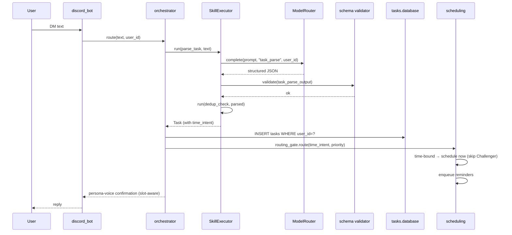

# Workflow: Capture a Task

**Realizes:** [`spec_v3.md` §1.1 Active Task Capture](../reference-specs/spec-v3.md),
[`§5.5.1 Natural Language Task Parsing`](../reference-specs/spec-v3.md).

## Scenario

Nick sends a Discord DM to Donna:

> "Remind me to review the quarterly plan tomorrow at 10am, high priority."

Donna parses the message, classifies priority, deduplicates against
existing tasks, persists the row, schedules reminders, and replies.

## Path Through the Code

1. **Inbound.**
   [`donna.integrations.discord_bot`](../reference/donna/integrations/discord_bot.md)
   receives `on_message` and forwards `(text, user_id, channel_id)` to the
   orchestrator.
2. **Orchestrator intent routing.**
   [`donna.orchestrator`](../reference/donna/orchestrator/index.md)
   identifies this as a *task-capture* intent and invokes the
   `parse_task` skill.
3. **Skill execution.**
   [`donna.skills.executor.SkillExecutor`](../reference/donna/skills/executor.md)
   runs the YAML-defined `parse_task` skill step-by-step.
4. **Model call.**
   [`donna.models.router.ModelRouter.complete`](../reference/donna/models/router.md)
   routes to the configured model for `task_parse`
   (see [`config/donna_models.yaml`](../config/donna_models.md)) and logs
   an invocation row via
   [`donna.logging.invocation_logger`](../reference/donna/logging/invocation_logger.md).
5. **Schema validation.** The structured output is validated against
   [`schemas/task_parse_output.json`](../schemas/task_parse_output.md).
   The parser emits a structured `time_intent` (the *when* of the task); if
   the model omits it, an LLM-free fallback re-extracts common date phrasings.
   See [Task System → Time Intent](../domain/task-system.md#time-intent).
6. **Dedup.**
   [`donna.tasks.dedup`](../reference/donna/tasks/index.md) runs
   deduplication (`spec_v3.md §5.3` — fuzzy title match + LLM
   semantic comparison).
7. **Persist.** [`donna.tasks.database`](../reference/donna/tasks/index.md)
   writes the row (including `time_intent_json`, from which `deadline` /
   `deadline_type` are derived);
   [`donna.integrations.supabase_sync`](../reference/donna/integrations/supabase_sync.md)
   mirrors it.
8. **Route.** The
   [routing gate](../domain/scheduling.md#routing-gate) inspects the
   `time_intent`. Because this task is time-bound (`exact`, "tomorrow at
   10am"), it goes to the **Scheduler immediately** — it is *not* deferred
   for the Challenger. An undated task would instead stay in `backlog`; a
   recurring one goes to the automation pipeline.
9. **Schedule.**
   [`donna.scheduling`](../reference/donna/scheduling/index.md) places the
   task and enqueues reminder cadence (T-24h, T-1h, T). If no slot exists
   before the deadline, the task transitions to `needs_scheduling`
   (per [`config/task_states.yaml`](../config/task_states.md)) instead of
   stranding in backlog.
10. **Reply.** The Discord bot confirms back with slot-aware,
    persona-voice copy generated by
    [`donna.integrations.confirmation_copy`](../reference/donna/integrations/confirmation_copy.md)
    — e.g. the confirmed time for a scheduled task, a "couldn't find a slot"
    message when unplaceable, or a backlog note for undated tasks. (This
    replaces the old static "Scheduled: pending." reply.)

## Sequence

## Observability

Every hop emits a structured log line with `correlation_id`, `user_id`,
`task_id`. See [Domain → Observability](../domain/observability.md).

## Related

- [Workflow: Run a Skill](run-a-skill.md)
- [Domain: Task System](../domain/task-system.md)
