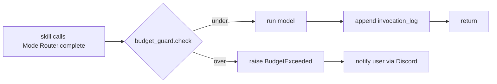

# Workflow: Handle Budget Breach

**Realizes:** [`spec_v3.md` §4.3 Structured Invocation Logging](../reference-specs/spec-v3.md)
and the `$20/day` pause policy in [`CLAUDE.md`](../start-here/conventions.md).

> **Roadmap:** the pause-only behavior described below is being replaced
> by the four-button over-budget decision tree (`Approve $X / Manual /
> Pause / Cancel`) defined in
> [`docs/superpowers/specs/manual-escalation.md`](../superpowers/specs/manual-escalation.md).
> Slices `slice_17_escalation_core.md` through
> `slice_24_escalation_hardening.md` ship the decision tree, manual
> handoff modes (chat / claude_code), and dashboard escalation
> workspace. This page reflects current behavior until those slices
> land; rows will be updated per-slice as the canonical spec dictates.

## Policy

- **Hard monthly cap:** $100 on Claude API.
- **Daily soft pause:** $20/day — all autonomous agent work stops
  (replaced by the decision tree above when slice 17 lands).
- Every API call is logged to `invocation_log` with cost in USD.

## Detection Path (current — pause-only)



## What Happens When the Gate Trips (current)

1. [`donna.cost.budget.BudgetGuard`](../reference/donna/cost/index.md) rejects
   the call before it hits a provider.
2. Autonomous paths short-circuit; interactive paths surface a message.
3. A Discord DM summarizes spend and tells Nick what got paused.
4. Pauses clear automatically at UTC midnight (daily) or at month rollover.

## Manually Unsticking

- Inspect recent spend:
    ```sql
    SELECT date(ts), SUM(cost_usd), COUNT(*)
    FROM invocation_log
    GROUP BY 1 ORDER BY 1 DESC LIMIT 14;
    ```
- Temporarily raise the daily threshold in
  [`config/donna_models.yaml`](../config/donna_models.md) (with explicit
  reason — safety-first dial, not a default).
- Route the offending task type to a cheaper alias (Ollama) by editing
  the router config. See [Domain → Model Layer](../domain/model-layer.md).

## Related

- [Operations → Budget & Cost](../operations/budget-and-cost.md)
- [`donna.cost.budget.BudgetGuard`](../reference/donna/cost/index.md)
- [`donna.logging.invocation_logger`](../reference/donna/logging/invocation_logger.md)
