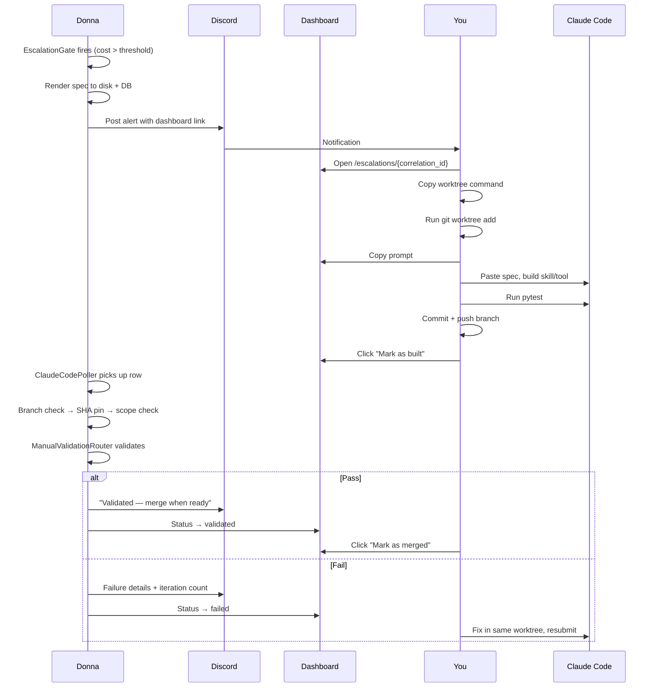

# Workflow: Handle a Claude Code Escalation

When a task's estimated cost exceeds the budget threshold and the task
type supports manual builds, Donna generates a spec and hands it off to
you. You paste the spec into Claude Code, build the skill or tool in an
isolated worktree, submit, and Donna validates. This page walks through
the full cycle.

**Realizes:** [`manual-escalation.md` §5.3](../superpowers/specs/manual-escalation.md)
(claude_code mode protocol).

## Prerequisites

- Host repo path mounted (env `DONNA_HOST_REPO_PATH`)
- `modes.claude_code.enabled: true` in
  [`config/manual_escalation.yaml`](../config/manual_escalation.md)
  or via the [Escalation Settings](../domain/management-gui/pages.md)
  dashboard page
- The task type declares `manual_escalation.mode: claude_code` in
  [`config/task_types.yaml`](../config/task_types.md)

## Flow



## Step by Step

### 1. Receive the escalation

Donna posts a Discord message with a short summary and a link to the
dashboard. The spec file is also written to disk at
`$DONNA_WORKSPACE_PATH/escalations/<correlation_id>.md` in case you
prefer reading it locally.

### 2. Open the dashboard

Navigate to `/escalations/<correlation_id>`. The detail page shows:

- **Prompt panel** — the full spec with acceptance criteria, target
  paths, forbidden patterns, and reference module path.
- **Build & submit section** — copyable worktree command, branch name,
  base SHA, and target paths.
- **Details sidebar** — cost estimate, daily remaining budget, iteration
  count, priority, offered modes.
- **Timeline** — lifecycle events as they happen.

### 3. Set up the worktree

Copy the pre-filled `git worktree add` command from the dashboard and
run it:

```bash
git worktree add -b escalation/abcd1234-my_skill \
  "/path/to/worktrees/correlation-id" abc123def
```

This creates an isolated working tree branching from the pinned base
SHA so your build doesn't drift against moving `main`.

### 4. Build in Claude Code

Open Claude Code in the new worktree directory. Paste the copied spec
as your prompt. Build the skill or tool following the acceptance
criteria.

For **skills**, the branch must contain:

- `skills/<capability>/skill.yaml` — skill definition
- Step prompts and output schemas referenced by the YAML
- `fixtures/<capability>/` — at least one fixture JSON case

For **tools**, the branch must contain:

- The tool module under `src/donna/skills/tools/<tool_name>.py`
- A test file at `tests/skills/tools/test_<tool_name>.py`
- An allowlist entry for the tool

### 5. Test and commit

```bash
cd /path/to/worktrees/correlation-id
pytest
git add <your files>
git commit -m "feat(<capability>): manual build for <correlation_id>"
git push -u origin escalation/abcd1234-my_skill
```

The branch must only touch files within the declared `target_paths`
globs. Out-of-scope changes (including dotfiles) will be rejected by
the diff validator.

### 6. Submit

**Dashboard (primary):** Click **Mark as built** on the escalation
detail page. Enter the branch name (pre-filled) and optionally the
tip SHA to lock validation to that exact commit.

**Discord (fallback):** If you don't have a browser handy:

```
/donna_submit_built correlation_id:<id> branch:escalation/abcd1234-my_skill
```

### 7. Wait for validation

The `ClaudeCodePoller` picks up submitted rows within 60 seconds and
runs the validation pipeline:

1. **Branch existence** — is the branch pushed?
2. **SHA pin** — if you supplied a SHA, does the tip still match?
   (Force-push protection.)
3. **Scope check** — did the branch only touch declared target paths?
4. **Validation** — for skills: fixture pass rate >= 80%. For tools:
   six-rule lint pipeline + import smoke test.

Results appear in the dashboard's **Validation** panel and on Discord.

### 8. Handle the outcome

**Validated:** The skill enters `sandbox` state. The dashboard shows
a merge command and a **Mark as merged** button:

```bash
git checkout main && git merge --no-ff escalation/abcd1234-my_skill && git push
```

**Failed:** Fix the issues in the same worktree, commit, push, and
resubmit. You get up to 3 iterations (configurable via
`manual_iteration_limit`). After the cap, the escalation is cancelled
and flagged for human review.

### 9. Clean up

After merging, remove the worktree:

```bash
git worktree remove /path/to/worktrees/correlation-id
```

## Troubleshooting

| Problem | Cause | Fix |
|---------|-------|-----|
| "Branch not found" after submit | Branch not pushed to remote | `git push -u origin <branch>` |
| "SHA changed since submission" | Force-push between submit and validation | Resubmit to validate the new tip |
| Out-of-scope files rejected | Branch touched files outside `target_paths` | Revert the extra changes, recommit |
| Fixture pass rate below threshold | Skill output doesn't match expected shape | Check fixture JSON, fix prompt/schema |
| Import smoke test failed | Tool module has missing dependencies or syntax errors | Run `python -c 'import donna.skills.tools.<name>'` locally |
| Iteration cap reached | 3 failed attempts | Escalation auto-cancels; review manually or open a new one |

## Where the Code Lives

| Layer | Module |
|-------|--------|
| Escalation gate (creation) | [`donna.cost.escalation_gate`](../reference/donna/cost/escalation_gate.md) |
| Spec rendering | [`donna.cost.claude_code_spec`](../reference/donna/cost/claude_code_spec.md) |
| Submission service | [`donna.cost.escalation_submit_service`](../reference/donna/cost/escalation_submit_service.md) |
| Branch validation poller | [`donna.cost.claude_code_poller`](../reference/donna/cost/claude_code_poller.md) |
| Diff scope check | [`donna.cost.diff_validator`](../reference/donna/cost/diff_validator.md) |
| Skill/tool validation | [`donna.cost.manual_validation_router`](../reference/donna/cost/manual_validation_router.md) |
| Dashboard UI | `donna-ui/src/pages/Escalations/EscalationDetail.tsx` |
| Mark as built modal | `donna-ui/src/pages/Escalations/MarkAsBuiltModal.tsx` |
| Discord submit fallback | [`donna.integrations.discord_submit_command`](../reference/donna/integrations/discord_submit_command.md) |

## Related

- [Domain: Cost & Escalation](../domain/cost.md) — architecture and config reference
- [Domain: Management GUI — Escalation Surfaces](../domain/management-gui/pages.md) — dashboard page details
- [Domain: Skill System](../domain/skill-system/reference.md) — lifecycle states and manual build path
- [Workflow: Handle Budget Breach](handle-budget-breach.md) — the budget-guard trigger that leads to escalation
