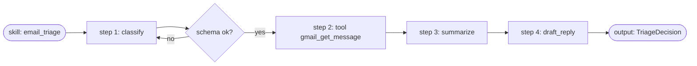

# Workflow: Run a Skill

Walk through the generic skill runtime — how one YAML file becomes a
validated, logged, multi-step call sequence.

**Realizes:** the skill executor described across
[`spec_v3.md` §4 Model Layer](../reference-specs/spec-v3.md) and the
skill-system spec in [Domain → Skill System](../domain/skill-system.md).

## Anatomy of a Skill

A skill is a YAML file under [`skills/`](https://github.com/nfeuer/donna/tree/main/skills)
declaring:

- `name`, `version`, `model_alias`
- `steps`: an ordered list of LLM and tool steps
- `output_schema`: reference into [`schemas/`](../schemas/)

See [`schemas/skill.json`](../schemas/skill.md) for the skill-definition
schema itself.

## Runtime Path

1. **Load.** The orchestrator loads the skill definition.
2. **Validate.** Each step is validated against
   [`donna.skills.validation`](../reference/donna/skills/validation.md).
3. **Execute.**
   [`SkillExecutor`](../reference/donna/skills/executor.md) iterates steps:
    - **LLM step:** rendered prompt → `ModelRouter.complete` → schema
      validation → bind to step output variable.
    - **Tool step:** proposed tool call → [`ToolDispatcher`](../reference/donna/skills/tool_dispatch.md)
      validates permissions and arguments → executes → binds result.
4. **Log.** Each invocation appends to `invocation_log` (model, tokens,
   latency, cost).
5. **Return.** Final step's output (validated against `output_schema`)
   becomes the skill result.

## Invariants

- **Models never execute tools directly.** They only propose.
  `ToolDispatcher` is the single execution gate.
- **No step runs if the budget guard is tripped.** See
  [Workflow → Handle Budget Breach](handle-budget-breach.md).
- **Every structured output is schema-validated.** If validation fails,
  the step is retried with a corrective reprompt per
  `spec_v3.md §3.6.4`.

## Example

## Related

- [Add a New Skill](add-a-new-skill.md)
- [`donna.skills.executor`](../reference/donna/skills/executor.md)
- [`donna.skills.tool_dispatch`](../reference/donna/skills/tool_dispatch.md)
